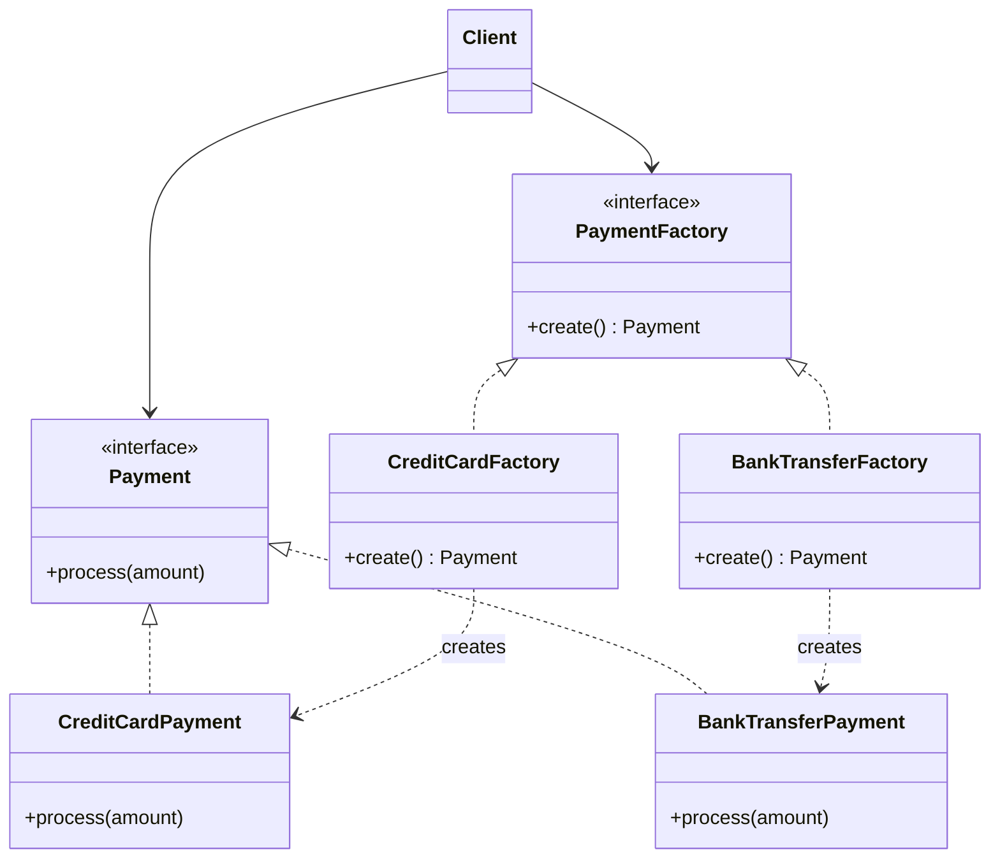

# Factory Method

> Nesne yaratma işini bir metoda hapset, hangi somut sınıfın döneceği kararını alt sınıfa (veya konfigürasyona) bırak.

---

## 1. Problem

Bir ödeme servisi yazıyorsun. Başta tek yöntem var:

```java
public class PaymentService {
    public void pay(String type, BigDecimal amount) {
        CreditCardPayment payment = new CreditCardPayment();
        payment.process(amount);
    }
}
```

Sonra havale geliyor:

```java
if (type.equals("CREDIT_CARD")) {
    new CreditCardPayment().process(amount);
} else if (type.equals("BANK_TRANSFER")) {
    new BankTransferPayment().process(amount);
}
```

Sonra cüzdan, sonra kripto, sonra BNPL. Altı ay sonra bu `if` bloğu 200 satır ve **beş farklı sınıfta kopyası var** — çünkü iade akışında da, raporlamada da aynı karar tekrar veriliyor.

Asıl dert `if` değil. Dert şu: `PaymentService` artık her somut ödeme sınıfını **import etmek zorunda**. Yeni ödeme tipi eklemek = çalışan sınıfı açıp değiştirmek = Open/Closed ihlali.

---

## 2. Çözüm

Yaratma kararını tek bir yere topla ve arkasına arayüz koy. Çağıran taraf `Payment` görür, `CreditCardPayment` görmez.

İki yaygın biçimi var:

**a) Klasik GoF biçimi** — alt sınıf karar verir:

```java
abstract class PaymentProcessor {
    protected abstract Payment createPayment();   // Factory Method

    public void execute(BigDecimal amount) {      // ortak akış
        Payment p = createPayment();
        p.validate();
        p.process(amount);
        p.notifyUser();
    }
}
```

**b) Pratikte gördüğün biçim** — "Simple Factory" / registry:

```java
Payment payment = paymentFactory.create(PaymentType.CREDIT_CARD);
```

GoF puristleri (b)'ye Factory Method demez ama sektörde ikisi de bu isimle anılır. Mülakatta farkı bilmek yeterli.

---

## 3. Yapı



Önemli olan çizgi: `Client` somut sınıflara hiç ok atmıyor.

---

## 4. Kod

### Ürün arayüzü

```java
public interface Payment {
    PaymentType getType();
    PaymentResult process(BigDecimal amount);
}
```

```java
public class CreditCardPayment implements Payment {

    @Override
    public PaymentType getType() {
        return PaymentType.CREDIT_CARD;
    }

    @Override
    public PaymentResult process(BigDecimal amount) {
        // 3D Secure, POS çağrısı vs.
        return PaymentResult.success();
    }
}
```

### Factory

Enum-key'li registry, Spring'de en temiz hali:

```java
@Component
public class PaymentFactory {

    private final Map<PaymentType, Payment> registry;

    public PaymentFactory(List<Payment> payments) {
        this.registry = payments.stream()
                .collect(Collectors.toMap(Payment::getType, Function.identity()));
    }

    public Payment create(PaymentType type) {
        Payment payment = registry.get(type);
        if (payment == null) {
            throw new UnsupportedPaymentTypeException(type);
        }
        return payment;
    }
}
```

Spring tüm `Payment` bean'lerini `List<Payment>` olarak enjekte eder. **Yeni ödeme tipi eklemek için hiçbir mevcut dosyaya dokunmuyorsun** — sadece yeni `@Component` yazıyorsun. Open/Closed'ın tam karşılığı bu.

### Kullanım

```java
Payment payment = paymentFactory.create(request.getPaymentType());
PaymentResult result = payment.process(request.getAmount());
```

> Not: Bu registry biçiminde nesneler singleton bean'dir, her çağrıda `new` yapılmaz. Gerçekten her seferinde taze instance gerekiyorsa (state tutan nesneler) factory `Supplier<Payment>` tutmalı:
> ```java
> private final Map<PaymentType, Supplier<Payment>> registry;
> ```

---

## 5. Sektörde nerede geçiyor

| Yer | Örnek |
|---|---|
| JDK | `Calendar.getInstance()` — locale'e göre `GregorianCalendar` veya `BuddhistCalendar` döner |
| JDK | `NumberFormat.getCurrencyInstance(locale)` |
| JDK | `Charset.forName("UTF-8")` |
| JDBC | `DriverManager.getConnection(url)` — URL'e bakıp doğru driver'ın `Connection`'ını döner |
| Spring | `BeanFactory.getBean()` — pattern'in adı zaten sınıf adında |
| Spring | `EntityManagerFactory.createEntityManager()` |
| Slf4j | `LoggerFactory.getLogger(X.class)` — arkada Logback mı Log4j mi olduğunu bilmezsin |
| Jackson | `JsonFactory.createParser()` |

`XxxFactory` gördüğün her yerde bu fikir var.

---

## 6. Ne zaman kullanma

- **Tek implementasyon varsa.** `UserServiceFactory` yazıp tek `UserServiceImpl` döndürmek boş katman. İkinci implementasyon gerçekten geldiğinde ekle.
- **Karar derleme zamanında belliyse.** Tip sabitse `new` yaz, geç.
- **Sadece nesne yaratmak için değil de karmaşık kurulum için lazımsa** → Builder'a bak.
- Factory içine iş mantığı doldurma. Factory'nin işi **seçmek ve yaratmak**; ödeme doğrulaması orada durmaz.

---

## 7. Karışanlar

| Pattern | Fark |
|---|---|
| **Abstract Factory** | Factory Method **tek ürün** yaratır. Abstract Factory birbiriyle uyumlu **ürün ailesi** yaratır (buton + checkbox + menü, hepsi aynı temada). |
| **Builder** | Factory "hangi sınıf?" sorusunu çözer. Builder "bu nesneyi 12 parametreyle nasıl okunur şekilde kurarım?" sorusunu çözer. |
| **Strategy** | Yapısal olarak çok benzer, niyet farklı. Factory bir **nesne döndürür**. Strategy bir **algoritmayı çalıştırır**. Factory'nin döndürdüğü şey çoğu zaman bir Strategy'dir — ikisi birlikte çalışır. |
| **Template Method** | Klasik Factory Method aslında Template Method'un özel halidir: üst sınıf akışı sabitler, alt sınıf tek bir adımı (yaratmayı) doldurur. |

---

## Özet

> Somut sınıf adını kodundan sil, yerine bir soru koy: "bana bunun uygun olanını ver."
