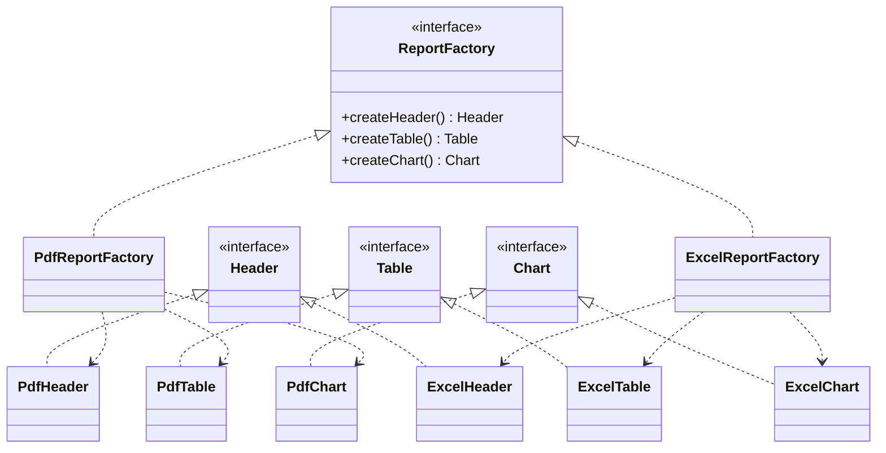

# Abstract Factory

> Birbiriyle **uyumlu olmak zorunda olan** nesne ailelerini tek bir fabrikadan yarat, böylece karıştırmak imkânsız olsun.

---

## 1. Problem

Bir rapor motoru yazıyorsun. Çıktı PDF veya Excel olabiliyor. Her formatın kendi tablo, grafik ve başlık bileşeni var:

```java
if (format == PDF) {
    header = new PdfHeader();
    table  = new PdfTable();
    chart  = new ExcelChart();   // ← gözden kaçtı
}
```

Derleyici bunu yakalamaz. `Chart` arayüzü ortak olduğu için kod derlenir, çalışır, ve PDF'in içine Excel grafiği yazmaya çalışıp runtime'da patlar.

Asıl problem: **bileşenlerin bir arada tutarlı olması gerekiyor ama bu kuralı hiçbir yer zorlamıyor.** Kural sadece geliştiricinin kafasında.

Aynı dert:
- Cross-platform UI: Windows butonu + macOS checkbox
- Çoklu veritabanı desteği: PostgreSQL connection + Oracle dialect
- Test/prod ortamları: gerçek `PaymentGateway` + sahte `NotificationSender`

---

## 2. Çözüm

Her aile için bir fabrika yaz. Fabrika tüm aileyi üretsin. Çağıran taraf **fabrikayı bir kez seçer**, sonra hangi aileden olduğunu bir daha düşünmez.

```java
ReportFactory factory = (format == PDF)
        ? new PdfReportFactory()
        : new ExcelReportFactory();

Header header = factory.createHeader();
Table  table  = factory.createTable();
Chart  chart  = factory.createChart();   // karıştırmak artık imkânsız
```

Karıştırma ihtimali kodun yapısından silindi — bu, "dikkatli ol" demekten çok daha güçlü.

---

## 3. Yapı



Dikkat: **dikey eksen ürün tipi, yatay eksen aile.** Yeni aile eklemek kolay (yeni sütun), yeni ürün tipi eklemek zor (her fabrikayı değiştirmen gerekir). Bu pattern'in bilinen kısıtı.

---

## 4. Kod

### Ürün arayüzleri

```java
public interface Header { byte[] render(String title); }
public interface Table  { byte[] render(List<Row> rows); }
public interface Chart  { byte[] render(Series series); }
```

### Soyut fabrika

```java
public interface ReportFactory {
    Header createHeader();
    Table  createTable();
    Chart  createChart();
}
```

### Somut fabrikalar

```java
public class PdfReportFactory implements ReportFactory {
    @Override public Header createHeader() { return new PdfHeader(); }
    @Override public Table  createTable()  { return new PdfTable();  }
    @Override public Chart  createChart()  { return new PdfChart();  }
}

public class ExcelReportFactory implements ReportFactory {
    @Override public Header createHeader() { return new ExcelHeader(); }
    @Override public Table  createTable()  { return new ExcelTable();  }
    @Override public Chart  createChart()  { return new ExcelChart();  }
}
```

### Client — hangi ailede olduğunu bilmiyor

```java
public class ReportBuilder {

    private final ReportFactory factory;

    public ReportBuilder(ReportFactory factory) {
        this.factory = factory;
    }

    public byte[] build(ReportData data) {
        Header header = factory.createHeader();
        Table  table  = factory.createTable();
        Chart  chart  = factory.createChart();

        return merge(
                header.render(data.title()),
                table.render(data.rows()),
                chart.render(data.series())
        );
    }
}
```

`ReportBuilder` içinde `Pdf` veya `Excel` kelimesi **hiç geçmiyor**. Testte sahte bir `ReportFactory` verip tüm akışı I/O olmadan test edebilirsin.

---

## 5. Sektörde nerede geçiyor

| Yer | Örnek |
|---|---|
| JDK | `DocumentBuilderFactory` → `DocumentBuilder` + `Document` ailesi |
| JDK | `TransformerFactory`, `XMLInputFactory` |
| JDBC | `Connection` bir mini abstract factory'dir: `createStatement()`, `prepareStatement()`, `createBlob()` — hepsi **aynı veritabanının** nesnelerini döner. PostgreSQL connection'dan Oracle statement çıkmaz. |
| Hibernate | `SessionFactory` → `Session`, `Transaction`, `Query` |
| Spring | `BeanFactory` hiyerarşisi |
| AWT/Swing | `Toolkit` — platforma göre peer nesneleri |

JDBC örneği en öğreticisi: `Connection`'ı GoF diyagramı olarak düşünmemişsindir ama tam olarak odur.

---

## 6. Ne zaman kullanma

- **Tek bir ürün varsa.** Aile yoksa Abstract Factory yok, Factory Method yeter.
- **Ürün tipleri sık değişiyorsa.** Yeni bir `Footer` eklemek istediğinde tüm fabrikaları açıp değiştirmen gerekir. Aileler sabit, ürünler değişken bir dünyadaysan bu pattern seni yavaşlatır.
- **DI container zaten varsa.** Spring'de çoğu zaman `@Profile` veya `@ConditionalOnProperty` ile bean seti değiştirmek daha az kod ile aynı sonucu verir. Elle abstract factory yazmadan önce buna bak.
- İki aileden fazlası olmayacaksa maliyeti sorgula — 6 sınıf yerine 2 `if` yeterli olabilir.

---

## 7. Karışanlar

| Pattern | Fark |
|---|---|
| **Factory Method** | Tek ürün üretir, genelde kalıtımla. Abstract Factory ürün ailesi üretir, genelde composition ile. Abstract Factory'nin içindeki her metot bir Factory Method'dur. |
| **Builder** | Abstract Factory ürünü **hemen** döner. Builder adım adım kurar ve sonunda döner. Builder tek karmaşık nesneye, Abstract Factory birden çok basit nesneye odaklanır. |
| **Prototype** | Abstract Factory sınıf hiyerarşisine dayanır. Prototype klonlamaya dayanır — yeni "aile" eklemek için sınıf yazman gerekmez. |
| **Bridge** | Yapıları benzer görünür. Bridge bir soyutlamayı bir implementasyona bağlar; Abstract Factory uyumlu nesne setleri üretir. Bridge'in implementasyon tarafını kurmak için sık sık Abstract Factory kullanılır. |

---

## Özet

> "Bu üç nesne birbirine uymak zorunda" kuralını yoruma bırakma; tek bir fabrikanın arkasına koy.
