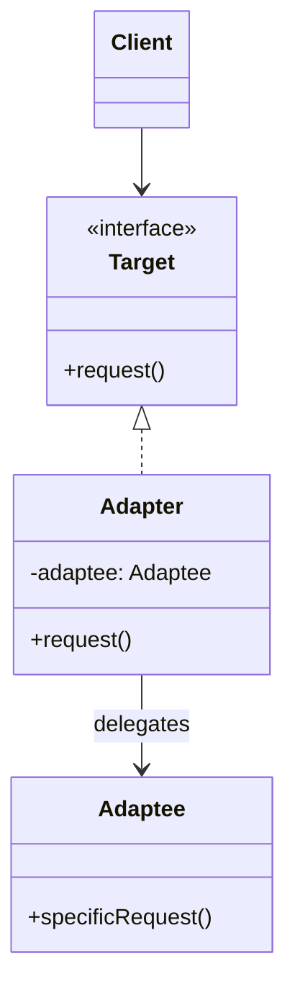
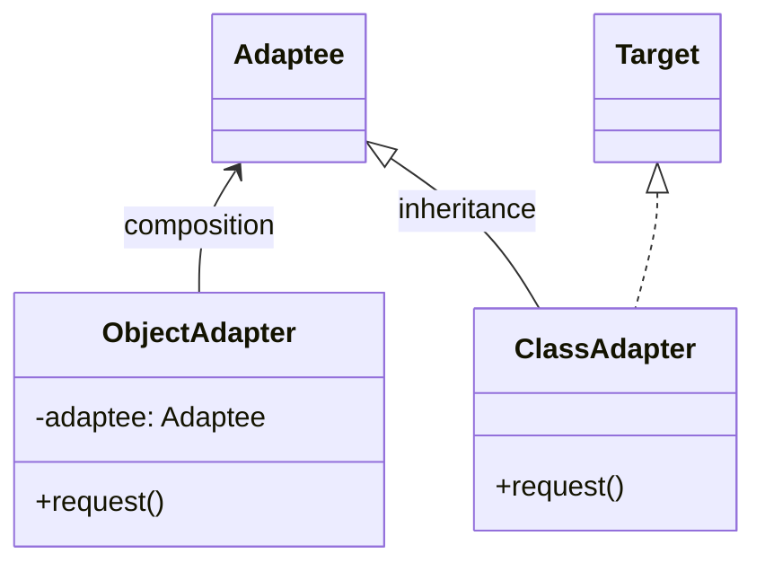

# Adapter

> **Amaç:** Uyumsuz iki arayüzü, ikisini de değiştirmeden birlikte çalıştırmak.
> **Kategori:** Structural

---

## 1. Problem

Sistemin bir arayüz bekliyor, elindeki sınıf başka bir arayüz sunuyor. İkisini de
değiştiremiyorsun: biri senin domain'in, diğeri üçüncü parti bir kütüphane.

```java
// Senin sisteminin beklediği
public interface PaymentProcessor {
    void pay(BigDecimal amount, String currency);
}

// Üçüncü parti kütüphane — kaynak koduna erişimin yok
public class ExternalGateway {
    public void executeTransaction(long amountInCents, int currencyCode) { ... }
}
```

Naif çözüm, dönüşümü çağrı noktalarına serpiştirmektir:

```java
public class CheckoutService {
    public void checkout(Order order) {
        long cents = order.getTotal().multiply(BigDecimal.valueOf(100)).longValue();
        int code = CurrencyCodes.toNumeric(order.getCurrency());
        gateway.executeTransaction(cents, code);
    }
}

public class RefundService {
    public void refund(Order order) {
        long cents = order.getTotal().multiply(BigDecimal.valueOf(100)).longValue();  // tekrar
        int code = CurrencyCodes.toNumeric(order.getCurrency());                       // tekrar
        gateway.executeTransaction(-cents, code);
    }
}
```

Sorunlar:

- Dönüşüm mantığı **her çağıranda tekrarlanıyor** (DRY ihlali)
- İş mantığı, üçüncü parti API'nin detayına bağlanmış (DIP ihlali)
- Sağlayıcı değiştiğinde bütün servisler değişir (Shotgun Surgery)
- `CheckoutService`'i test etmek için gateway'in tuhaf imzasını mock'lamak gerekiyor

---

## 2. Çözüm

Beklenen arayüzü implement eden, içeride uyumsuz sınıfa delegasyon yapan bir **sarmalayıcı**
sınıf yaz. Dönüşüm tek yerde toplanır ve sistemin geri kalanı yabancı API'yi hiç görmez.

```
İstemci ──► «interface» Target ◄── Adapter ──► Adaptee (uyumsuz sınıf)
```

Kritik nokta: adapter **davranış eklemez**, sadece **çeviri yapar**. Bir sarmalayıcıya
yeni yetenek ekliyorsan o Adapter değil, Decorator'dır.

---

## 3. Yapı



### İki varyant



| | Object Adapter | Class Adapter |
|---|---|---|
| Mekanizma | Kompozisyon | Kalıtım |
| Java'da | Tercih edilen | Tek sınıftan miras kısıtı |
| Alt sınıfları da uyarlar | ✅ | ❌ |
| Çalışma zamanında değiştirilebilir | ✅ | ❌ |

**Java'da pratikte Object Adapter kullanılır.** (Bkz. PRINCIPLES.md — Composition over
Inheritance)

---

## 4. Kod

```java
public interface PaymentProcessor {
    void pay(BigDecimal amount, Currency currency);
}

public class ExternalGatewayAdapter implements PaymentProcessor {

    private static final BigDecimal CENTS = BigDecimal.valueOf(100);

    private final ExternalGateway gateway;

    public ExternalGatewayAdapter(ExternalGateway gateway) {
        this.gateway = gateway;
    }

    @Override
    public void pay(BigDecimal amount, Currency currency) {
        long amountInCents = amount.multiply(CENTS).longValueExact();
        int currencyCode = currency.getNumericCode();

        try {
            gateway.executeTransaction(amountInCents, currencyCode);
        } catch (GatewayException e) {
            // Yabancı exception hiyerarşisi de sınırda çevrilir
            throw new PaymentFailedException("Ödeme başarısız", e);
        }
    }
}
```

Artık istemci temizdir ve yabancı API'den habersizdir:

```java
public class CheckoutService {
    private final PaymentProcessor processor;   // sadece kendi soyutlaması

    public void checkout(Order order) {
        processor.pay(order.getTotal(), order.getCurrency());
    }
}
```

### İki yönlü adapter

Bazen dönüşüm çift yönlüdür — dış sistemin cevabını da kendi modeline çevirirsin:

```java
public class WeatherApiAdapter implements WeatherService {

    private final ThirdPartyWeatherClient client;

    @Override
    public Forecast getForecast(City city) {
        RawWeatherResponse raw = client.fetch(city.getCode());
        return new Forecast(
            fahrenheitToCelsius(raw.getTempF()),
            raw.getHumidityPercent() / 100.0,
            parseTimestamp(raw.getTs())
        );
    }
}
```

Adapter'ın gerçek değeri buradadır: **yabancı veri modeli sistemin içine sızmaz.**
Hexagonal mimaride bu sınıflar "adapter" katmanının ta kendisidir.

---

## 5. Sektörde

| Nerede | Nasıl |
|---|---|
| `InputStreamReader` | Byte tabanlı `InputStream`'i karakter tabanlı `Reader`'a uyarlar |
| `OutputStreamWriter` | Aynısının yazma tarafı |
| `Arrays.asList(T...)` | Diziyi `List` arayüzüne uyarlar (sabit boyutlu) |
| `Collections.enumeration()` | `Iterator` ↔ `Enumeration` çevirisi |
| SLF4J binding'leri | Tek loglama API'sini Logback/Log4j/JUL implementasyonlarına uyarlar |
| Spring `HandlerAdapter` | Farklı controller tiplerini tek çağrı arayüzüne uyarlar |

`InputStreamReader` en net örnektir:

```java
// InputStream (byte) → Reader (char)
Reader reader = new InputStreamReader(inputStream, StandardCharsets.UTF_8);
```

`InputStream` ile `Reader` iki ayrı hiyerarşidir ve birbirini tanımaz. Adapter ikisini
birleştirir.

---

## 6. Ne zaman kullanılmaz

| Durum | Neden |
|---|---|
| İki arayüzü de sen kontrol ediyorsan | Adapter yazma — arayüzü düzelt |
| Tek bir metot uyarlanıyorsa | Lambda veya metot referansı yeterli |
| Sarmalayıcı davranış ekliyorsa | Bu Adapter değil, Decorator'dır |
| Adapter içinde iş kuralı varsa | Sorumluluk kaymış — kural domain'e ait (SRP) |
| Karmaşık alt sistemi basitleştiriyorsan | Bu Facade'dir |

**En sık hata:** Adapter'ın zamanla iş mantığı toplaması. Adapter sadece çevirir; "eğer
tutar 1000'den büyükse şu alanı doldur" gibi bir kural adapter'a girdiğinde, iş mantığı
altyapı katmanına sızmış demektir (SoC ihlali).

Basit vaka için sınıf açmaya gerek yok:

```java
// Tek metotluk uyarlama için sınıf gereksiz
PaymentProcessor processor = (amount, currency) ->
        gateway.executeTransaction(toCents(amount), currency.getNumericCode());
```

---

## 7. İlgili ve karıştırılan pattern'ler

| Pattern | Fark |
|---|---|
| **Decorator** | Arayüzü **korur**, davranış **ekler**. Adapter arayüzü **değiştirir**, davranış eklemez. |
| **Facade** | Karmaşık bir alt sistemi **basitleştirir**. Adapter tek bir sınıfı **çevirir**. Facade yeni bir arayüz tanımlar, Adapter mevcut bir arayüze uyar. |
| **Proxy** | Aynı arayüzü sunar, erişimi **kontrol eder**. Adapter farklı arayüz sunar. |
| **Bridge** | Baştan tasarlanır (soyutlama ile implementasyonu ayırmak için). Adapter sonradan, uyumsuzluk ortaya çıkınca eklenir. |

Hepsi sarmalayıcıdır; ayrım **niyettedir**:

```
Adapter    → "arayüz uymuyor"        → çevir
Decorator  → "davranış yetmiyor"     → ekle
Proxy      → "erişim kontrol edilsin"→ araya gir
Facade     → "çok karmaşık"          → sadeleştir
Bridge     → "iki eksen bağımsız değişecek" → ayır
```

---

## Prensip bağlantısı

- **DIP** — istemci soyutlamaya bağlanır, yabancı somut sınıfa değil
- **SRP** — çeviri sorumluluğu tek bir sınıfta toplanır
- **OCP** — yeni sağlayıcı = yeni adapter; mevcut kod değişmez
- **Test edilebilirlik** — istemci testinde tuhaf üçüncü parti imzalar yerine kendi
  arayüzünü mock'larsın (Bkz. TESTING.md)
