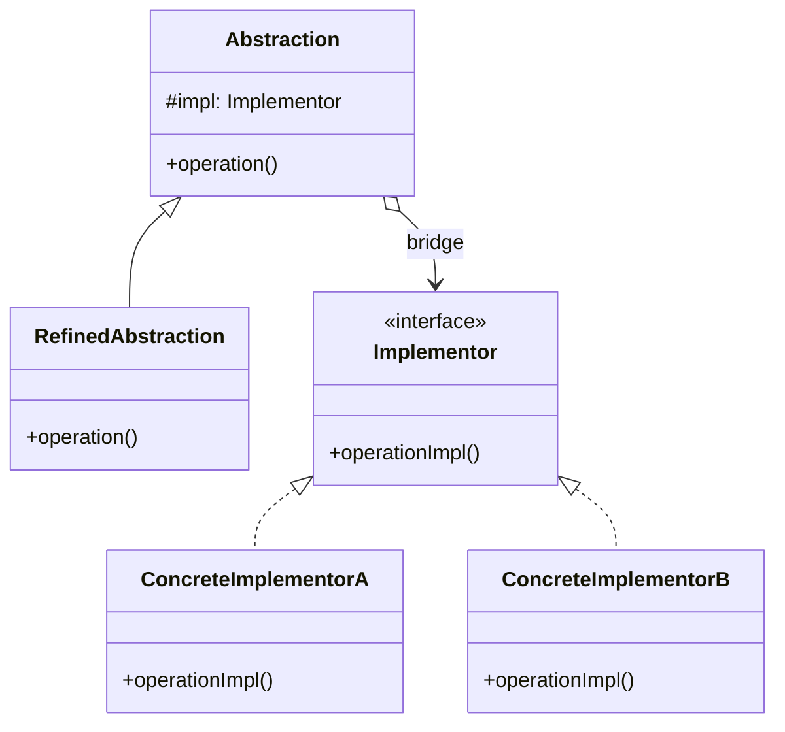

# Bridge

> **Amaç:** Soyutlama ile implementasyonu, ikisi bağımsız değişebilsin diye ayırmak.
> **Kategori:** Structural

---

## 1. Problem

İki boyutta birden değişen bir hiyerarşin var. Kalıtımla çözmeye kalkarsan sınıf sayısı
çarpım tablosu gibi büyür.

Diyelim bildirim gönderiyorsun. İki eksen var: **bildirim türü** (uyarı, hata, rapor) ve
**gönderim kanalı** (e-posta, SMS, push).

```java
class Notification { }

class AlertEmailNotification extends Notification { }
class AlertSmsNotification extends Notification { }
class AlertPushNotification extends Notification { }
class ErrorEmailNotification extends Notification { }
class ErrorSmsNotification extends Notification { }
class ErrorPushNotification extends Notification { }
class ReportEmailNotification extends Notification { }
// ... 3 tür × 3 kanal = 9 sınıf
```

Yeni bir kanal (Slack) eklediğinde **3 sınıf** yazarsın. Yeni bir tür eklediğinde
**4 sınıf** yazarsın. `M × N` patlaması.

Daha kötüsü: e-posta gönderme mantığı 3 sınıfta tekrarlanır. Bir düzeltme üçünü de
gerektirir ve birini kaçırırsın.

---

## 2. Çözüm

İki ekseni **iki ayrı hiyerarşiye** böl, aralarına kompozisyonla köprü kur.

```
Soyutlama (ne)          →  Notification, AlertNotification, ErrorNotification
Implementasyon (nasıl)  →  MessageSender: EmailSender, SmsSender, PushSender
```

Artık `M × N` yerine `M + N` sınıf vardır. Yeni kanal = **1 sınıf**, hiçbir bildirim
türü değişmez.

> Bridge, "kalıtım yerine kompozisyon" prensibinin en saf uygulamasıdır. Kalıtım
> hiyerarşisinin bir eksenini alıp nesne alanına çevirirsin.

---

## 3. Yapı



Diyagramdaki yatay ok "köprü"dür: iki hiyerarşi arasındaki tek bağlantı noktası.

---

## 4. Kod

```java
// ---- Implementor tarafı: "nasıl gönderilir" ----
public interface MessageSender {
    void send(String recipient, String subject, String body);
}

public class EmailSender implements MessageSender {
    public void send(String recipient, String subject, String body) {
        // SMTP detayları
    }
}

public class SmsSender implements MessageSender {
    public void send(String recipient, String subject, String body) {
        // SMS sağlayıcı; subject kullanılmaz, body 160 karaktere kırpılır
    }
}

// ---- Abstraction tarafı: "ne gönderilir" ----
public abstract class Notification {

    protected final MessageSender sender;      // ← köprü

    protected Notification(MessageSender sender) {
        this.sender = sender;
    }

    public abstract void notify(User user, String content);
}

public class AlertNotification extends Notification {

    public AlertNotification(MessageSender sender) {
        super(sender);
    }

    @Override
    public void notify(User user, String content) {
        sender.send(user.getContact(), "[UYARI] Dikkat", content);
    }
}

public class ErrorNotification extends Notification {

    public ErrorNotification(MessageSender sender) {
        super(sender);
    }

    @Override
    public void notify(User user, String content) {
        sender.send(user.getContact(), "[HATA] Acil müdahale", content);
        // Hata bildirimleri ayrıca arşivlenir — türe özgü davranış
    }
}
```

Kullanım — iki eksen çalışma zamanında serbestçe birleşir:

```java
Notification alert = new AlertNotification(new SmsSender());
Notification error = new ErrorNotification(new EmailSender());

alert.notify(user, "Disk %90 dolu");
error.notify(admin, "Ödeme servisi yanıt vermiyor");
```

Yeni kanal eklemek:

```java
public class SlackSender implements MessageSender { ... }
// Tek dosya. Hiçbir Notification sınıfı değişmedi. (OCP)
```

---

## 5. Sektörde

| Nerede | Soyutlama | Implementasyon |
|---|---|---|
| **JDBC** | `Connection`, `Statement` API'si | Veritabanına özgü `Driver` |
| **SLF4J** | `Logger` API'si | Logback, Log4j2, JUL binding'leri |
| **AWT/Swing** | `Component` hiyerarşisi | Platforma özgü `Peer` sınıfları |
| **Spring `Resource`** | Kaynak erişim soyutlaması | Classpath, File, URL implementasyonları |

**JDBC en öğretici örnektir.** Uygulaman `Connection`, `PreparedStatement` gibi
soyutlamalarla konuşur; hangi veritabanı olduğunu bilmez. Sürücü değiştiğinde tek satır
uygulama kodu değişmez — bu tam olarak Bridge'in vaadidir.

SLF4J ise ismini bile bu pattern'den alır: **Simple Logging Facade for Java** aslında bir
Facade değil, klasik bir Bridge'dir. API tarafı (`org.slf4j.Logger`) ile binding tarafı
(`logback-classic`) bağımsız evrilir.

---

## 6. Ne zaman kullanılmaz

| Durum | Neden |
|---|---|
| Tek eksen değişiyorsa | Bridge gereksiz karmaşıklık; sade kalıtım veya Strategy yeterli |
| İkinci eksende tek implementasyon varsa | Speculative Generality — YAGNI ihlali |
| İki eksen gerçekte bağımsız değilse | Her kombinasyon anlamlı olmalı; değilse patlama gizlenir |
| Sonradan uyumsuzluk çözüyorsan | O Adapter'dır, Bridge değil |

**Kritik ayrım:** Bridge **önden tasarlanır**. "İleride başka kanal olabilir" diye
kurulan Bridge çoğu zaman YAGNI ihlalidir. Tetikleyici somut olmalı: elinde gerçekten
2+ tür ve 2+ implementasyon varsa (yani çarpım patlamasını **görüyorsan**) Bridge doğru
karardır.

Bir sayı ile karar verebilirsin:

```
Kalıtım:  M × N sınıf
Bridge:   M + N sınıf

M=2, N=2  →  4 vs 4     → Bridge gereksiz
M=3, N=4  →  12 vs 7    → Bridge kazanıyor
M=5, N=5  →  25 vs 10   → Bridge zorunlu
```

---

## 7. İlgili ve karıştırılan pattern'ler

| Pattern | Fark |
|---|---|
| **Strategy** | Yapısal olarak **neredeyse aynıdır**. Fark niyette: Strategy tek bir davranışı (algoritmayı) değiştirilebilir kılar; Bridge iki **hiyerarşiyi** ayırır ve soyutlama tarafının kendi alt sınıfları vardır. |
| **Adapter** | Sonradan, uyumsuzluk için. Bridge baştan, esneklik için. |
| **Abstract Factory** | Bridge'in implementasyon nesnelerini üretmek için sık birlikte kullanılır. |
| **State** | Yine benzer yapı; State'te nesne kendi durumunu **değiştirir**, Bridge'te implementasyon sabit kalır. |

> Bridge ile Strategy'nin UML'i aynı görünür ve mülakatta sık sorulur. Ayırt edici soru:
> **soyutlama tarafında bir hiyerarşi var mı?** Sadece `Context` + değişen algoritma varsa
> Strategy'dir. İki tarafta da alt sınıflar varsa Bridge'tir.

---

## Prensip bağlantısı

- **Composition over Inheritance** — pattern'in tamamı bu prensibin somutlaşmış hâli
- **OCP** — her iki eksen de eklemeye açık, mevcut kod değişmeden
- **SRP** — "ne gönderileceği" ile "nasıl gönderileceği" ayrı sınıflarda
- **DIP** — soyutlama, somut gönderici sınıflara değil arayüze bağlı
- **DRY** — kanal mantığı tek yerde; tür sayısı kadar tekrarlanmıyor
