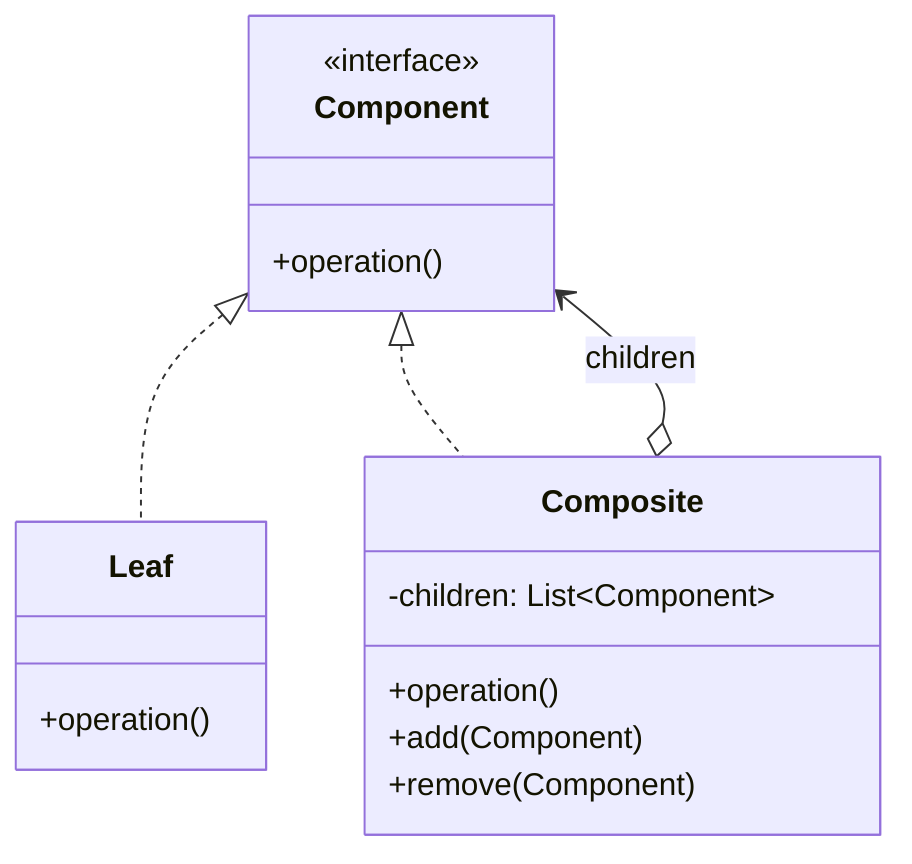

# Composite

> **Amaç:** Parça-bütün hiyerarşilerini ağaç yapısıyla temsil edip, istemcinin tek nesne
> ile nesne grubunu **aynı şekilde** ele almasını sağlamak.
> **Kategori:** Structural

---

## 1. Problem

Ağaç yapısındaki verilerle çalışırken istemci sürekli "bu yaprak mı, dal mı" diye
kontrol etmek zorunda kalır.

```java
public long calculateSize(Object node) {
    if (node instanceof File file) {
        return file.getSize();
    } else if (node instanceof Directory dir) {
        long total = 0;
        for (Object child : dir.getChildren()) {
            total += calculateSize(child);          // özyineleme istemcide
        }
        return total;
    }
    throw new IllegalArgumentException("Bilinmeyen tip");
}
```

Sorunlar:

- `instanceof` ile tip ayrımı — **LSP ve OCP ihlali**
- Aynı `if-else` her işlem için tekrarlanır: boyut, silme, yazdırma, arama...
- Yeni bir düğüm tipi (symlink) eklendiğinde bütün bu metotlar açılır (Shotgun Surgery)
- Özyineleme mantığı istemcide; ağaç yapısının bilgisi dışarı sızmış (Encapsulation ihlali)

---

## 2. Çözüm

Yaprak ve bileşiği **ortak bir arayüz** altında topla. Bileşik, aynı işlemi çocuklarına
delege etsin. Özyineleme yapının kendi içine gömülür.

```
        «interface» Component
                 ▲
        ┌────────┴────────┐
      Leaf            Composite ──► List<Component>
```

İstemci artık ağacın derinliğini, düğüm tiplerini, çocuk sayısını bilmez:

```java
long size = node.getSize();   // yaprak da olabilir, 10 seviyelik ağaç da
```

---

## 3. Yapı



Diyagramdaki özyinelemeli ilişki (`Composite → Component`) pattern'in kalbidir:
bir bileşik, çocuğu olarak başka bir bileşik tutabilir.

---

## 4. Kod

```java
public interface FileSystemNode {
    String getName();
    long getSize();
    void print(String indent);
}

// ---- Yaprak ----
public class FileNode implements FileSystemNode {

    private final String name;
    private final long size;

    public FileNode(String name, long size) {
        this.name = name;
        this.size = size;
    }

    @Override public String getName() { return name; }
    @Override public long getSize()   { return size; }

    @Override
    public void print(String indent) {
        System.out.println(indent + name + " (" + size + " B)");
    }
}

// ---- Bileşik ----
public class DirectoryNode implements FileSystemNode {

    private final String name;
    private final List<FileSystemNode> children = new ArrayList<>();

    public DirectoryNode(String name) {
        this.name = name;
    }

    public DirectoryNode add(FileSystemNode child) {
        children.add(child);
        return this;
    }

    @Override public String getName() { return name; }

    @Override
    public long getSize() {
        return children.stream()
                .mapToLong(FileSystemNode::getSize)    // ← özyineleme burada
                .sum();
    }

    @Override
    public void print(String indent) {
        System.out.println(indent + name + "/");
        children.forEach(c -> c.print(indent + "  "));
    }

    public List<FileSystemNode> getChildren() {
        return Collections.unmodifiableList(children);
    }
}
```

Kullanım:

```java
FileSystemNode root = new DirectoryNode("src")
    .add(new FileNode("Main.java", 1200))
    .add(new DirectoryNode("util")
        .add(new FileNode("StringUtils.java", 800))
        .add(new FileNode("DateUtils.java", 640)));

System.out.println(root.getSize());   // 2640 — istemci hiç tip kontrolü yapmadı
root.print("");
```

İstemci kodunda tek bir `instanceof` yok. Yeni düğüm tipi eklemek, mevcut hiçbir kodu
değiştirmez.

---

## 5. Sektörde

| Nerede | Component | Leaf / Composite |
|---|---|---|
| **AWT / Swing** | `Component` | `Button` / `Container`, `JPanel` |
| **DOM** | `Node` | `Text` / `Element` |
| **Dosya sistemi** | Yol soyutlaması | Dosya / Dizin |
| **Spring `CompositeCacheManager`** | `CacheManager` | Tek yönetici / birden çok yönetici |
| **JSF / XML ağaçları** | Düğüm | Yaprak / kapsayıcı |

Swing'de `JPanel`'e buton eklersin, panele başka panel eklersin, `repaint()` çağırırsın —
çağrı tüm ağaçta özyinelemeli yayılır. Composite'in en tanıdık uygulaması budur.

Spring'de `CompositeCacheManager`, birden çok cache yöneticisini tek bir `CacheManager`
gibi gösterir; kullanan kod kaç tane olduğunu bilmez.

---

## 6. Ne zaman kullanılmaz

| Durum | Neden |
|---|---|
| Veri gerçekten ağaç değilse | Zorla hiyerarşi kurmak modeli bozar |
| Yaprak ile bileşik davranışı çok farklıysa | Ortak arayüz yapaylaşır |
| Tek seviye liste yeterliyse | `List<T>` zaten var, pattern gereksiz |
| Tip güvenliği kritikse | Ortak arayüz, yaprağa `add()` çağrılabilmesine izin verir |

### Şeffaflık vs güvenlik ikilemi

Pattern'in bilinen tasarım gerilimi burasıdır:

```java
// Şeffaf yaklaşım — add/remove Component'te
interface Component {
    void add(Component c);      // FileNode ne yapacak? Exception mı atacak?
}
```

`add()` ortak arayüzdeyse istemci her düğümü aynı şekilde ele alır (**şeffaflık**), ama
yaprak bu metodu desteklemez ve `UnsupportedOperationException` atmak zorunda kalır —
bu bir **LSP ihlalidir**.

```java
// Güvenli yaklaşım — add/remove sadece Composite'te
interface Component { long getSize(); }
class Composite implements Component { void add(Component c) { ... } }
```

Bu sefer istemci çocuk eklemek için tipi bilmek zorundadır (**instanceof geri döner**).

> GoF şeffaflığı önerir; modern pratik genelde güvenliği tercih eder. **Doğru cevap
> kullanıma bağlıdır:** istemci ağacı sadece *okuyorsa* güvenli varyant daha temizdir,
> ağacı genel bir editör gibi *değiştiriyorsa* şeffaf varyant kaçınılmazdır.

---

## 7. İlgili ve karıştırılan pattern'ler

| Pattern | İlişki |
|---|---|
| **Decorator** | Yapısı benzer (ikisi de kendi arayüzünü sarar) ama Decorator **tek** çocuk tutar ve davranış ekler; Composite **çok** çocuk tutar ve delege eder. |
| **Iterator** | Composite ağacında gezinmek için sık birlikte kullanılır |
| **Visitor** | Ağaç üzerinde yeni işlemler eklemeyi, düğüm sınıflarını değiştirmeden sağlar |
| **Chain of Responsibility** | Composite ağacı üzerinde isteği yukarı taşımak için birlikte kullanılabilir |
| **Builder** | Karmaşık ağaçları okunur şekilde kurmak için |

---

## Prensip bağlantısı

- **LSP** — yaprak ve bileşik, ortak arayüzün yerine sorunsuz geçebilmeli (şeffaflık
  ikilemi tam olarak bu prensibin sınavıdır)
- **OCP** — yeni düğüm tipi, istemci kodunu değiştirmeden eklenir
- **Encapsulation** — özyineleme ve ağaç yapısı bilgisi içeride kalır
- **Tell Don't Ask** — istemci ağacı sorgulamak yerine `getSize()` der, ağaç kendi
  içinde halleder
