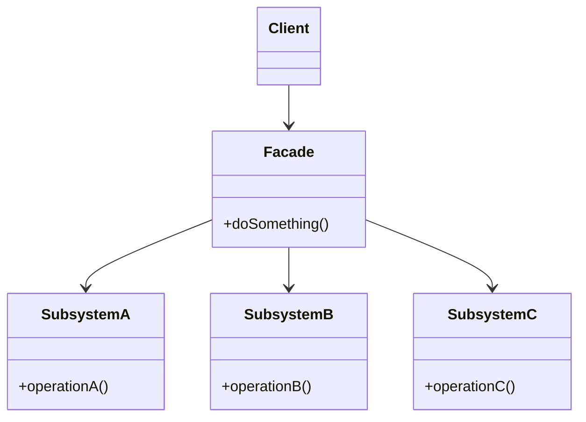

# Facade

> **Amaç:** Karmaşık bir alt sisteme, kullanımı kolay tek bir giriş noktası sunmak.
> **Kategori:** Structural

---

## 1. Problem

Bir işi yapmak için 6 farklı sınıfı doğru sırayla, doğru parametrelerle çağırman
gerekiyor. Bu bilgi her çağıranda tekrarlanıyor.

```java
public class CheckoutController {

    public void checkout(Long orderId) {
        Order order = orderRepository.findById(orderId);

        inventoryService.reserve(order.getItems());
        BigDecimal tax = taxCalculator.calculate(order, order.getCustomer().getRegion());
        BigDecimal shipping = shippingCalculator.calculate(order.getWeight(), order.getAddress());
        Payment payment = paymentGateway.charge(
                order.getCustomer().getCardToken(),
                order.getTotal().add(tax).add(shipping));

        if (!payment.isSuccessful()) {
            inventoryService.release(order.getItems());     // unutulursa stok kilitli kalır
            throw new PaymentFailedException();
        }

        order.markPaid(payment.getId());
        orderRepository.save(order);
        emailService.sendConfirmation(order);
        analyticsClient.track("order_completed", order.getId());
    }
}
```

Sorunlar:

- Controller, **8 farklı alt sistemi tanıyor** — yüksek coupling
- Çağrı sırası ve hata telafisi (stok serbest bırakma) bilgisi burada; başka bir çağıran
  bunu kaçırır
- Aynı akış mobil API'de, admin panelinde, batch işinde tekrarlanır
- Alt sistemlerden biri değişince tüm çağıranlar değişir (Shotgun Surgery)
- Test etmek için 8 mock gerekiyor (Bkz. TESTING.md — mock sayısı koku ölçer)

---

## 2. Çözüm

Alt sistemin önüne, ihtiyaç duyulan işlemleri **basit metotlar** olarak sunan bir sınıf koy.

```java
public class CheckoutFacade {
    public OrderConfirmation checkout(Long orderId) { ... }
}

// İstemci:
OrderConfirmation confirmation = checkoutFacade.checkout(orderId);
```

Facade alt sistemi **gizlemez, kapatmaz** — sadece yaygın kullanım için kolay bir yol
açar. İhtiyacı olan istemci hâlâ alt sistemin sınıflarına doğrudan erişebilir.

---

## 3. Yapı



Facade'siz hâlde her istemci her alt sisteme ok çizerdi — `M × N` bağlantı. Facade ile
bağlantı sayısı `M + N`'e düşer. Bu, Bridge'inkiyle aynı matematiktir ama farklı bir
problem için.

---

## 4. Kod

```java
public class CheckoutFacade {

    private final OrderRepository orderRepository;
    private final InventoryService inventory;
    private final PricingService pricing;
    private final PaymentGateway paymentGateway;
    private final NotificationService notifications;

    public CheckoutFacade(/* bağımlılıklar */) { ... }

    public OrderConfirmation checkout(Long orderId) {
        Order order = orderRepository.findById(orderId)
                .orElseThrow(() -> new OrderNotFoundException(orderId));

        inventory.reserve(order.getItems());
        try {
            Money total = pricing.calculateTotal(order);
            Payment payment = paymentGateway.charge(order.getCustomer(), total);

            order.markPaid(payment.getId());
            orderRepository.save(order);
            notifications.sendConfirmation(order);

            return OrderConfirmation.of(order, payment);

        } catch (RuntimeException e) {
            inventory.release(order.getItems());     // telafi tek yerde, atlanamaz
            throw e;
        }
    }
}
```

İstemci tarafı:

```java
@RestController
public class CheckoutController {

    private final CheckoutFacade checkout;    // tek bağımlılık

    @PostMapping("/orders/{id}/checkout")
    public OrderConfirmation checkout(@PathVariable Long id) {
        return checkout.checkout(id);
    }
}
```

### Facade "kapatmaz"

```java
// Yaygın akış → facade
checkoutFacade.checkout(orderId);

// Özel ihtiyaç → alt sisteme doğrudan erişim hâlâ mümkün
BigDecimal tax = taxCalculator.calculate(order, Region.EU);
```

Bu, Facade'i Proxy'den ayıran özelliklerden biridir: Proxy erişimi kontrol eder ve
genelde tek geçit olur; Facade sadece bir **kolaylık katmanıdır**.

---

## 5. Sektörde

| Nerede | Neyi gizler |
|---|---|
| **Spring `JdbcTemplate`** | `Connection`, `Statement`, `ResultSet`, kaynak kapatma, exception çevirimi |
| **Spring `RestClient` / `RestTemplate`** | HTTP bağlantı yönetimi, serileştirme, hata eşleme |
| **`java.net.URL.openStream()`** | Protokol çözümleme, bağlantı kurulumu, stream açma |
| **`Files` yardımcı sınıfı** | `FileChannel`, `Path`, buffer yönetimi |
| **SLF4J `LoggerFactory`** | Binding çözümleme ve başlatma |

`JdbcTemplate` en öğretici örnektir. Ham JDBC ile 20 satır ve `finally` blokları gerektiren
bir işlem tek satıra iner:

```java
List<Order> orders = jdbcTemplate.query(sql, orderRowMapper, customerId);
```

Alt sistem (`DataSource`, `Connection`, `PreparedStatement`) hâlâ oradadır ve ihtiyaç
duyan doğrudan kullanabilir — klasik Facade davranışı.

---

## 6. Ne zaman kullanılmaz

| Durum | Neden |
|---|---|
| Alt sistem zaten basitse | Gereksiz dolaylılık; sadece çağrı iletiyorsa Middle Man kokusu |
| Facade her şeyi sarmaya başladıysa | God Object'e dönüşür — SRP ihlali |
| İş kuralı facade'e taşınıyorsa | Domain mantığı koordinasyon katmanına sızmış |
| Tek bir sınıfı çeviriyorsan | O Adapter'dır |

### En büyük risk: şişkin facade

```java
// Kokan facade
public class ApplicationFacade {
    public void createUser(...) { }
    public void deleteUser(...) { }
    public void checkout(...) { }
    public void generateReport(...) { }
    public void syncInventory(...) { }
    public void sendNewsletter(...) { }
    // ... 40 metot daha
}
```

Bu artık Facade değil, God Object'tir. Çözüm **birden çok küçük facade**: `CheckoutFacade`,
`ReportingFacade`, `UserManagementFacade`. Her biri tek bir kullanım alanına hizmet eder.

Facade'in kendisi de dolaylılık maliyeti üretir; kazandığı basitlik o maliyeti aşmalıdır.
Sadece tek bir metodu ileten "facade" gerçek bir Middle Man kokusudur.

---

## 7. İlgili ve karıştırılan pattern'ler

| Pattern | Fark |
|---|---|
| **Adapter** | Mevcut ve **belirli** bir arayüze uymak zorundadır. Facade **yeni ve keyfi** bir arayüz tanımlar; kimseye uymaya çalışmaz. Adapter tek sınıfı çevirir, Facade birçok sınıfı koordine eder. |
| **Mediator** | Yapıca benzer. Mediator, bileşenlerin **birbiriyle** iletişimini merkezîleştirir ve bileşenler mediator'ı tanır. Facade tek yönlüdür: alt sistem facade'in varlığından habersizdir. |
| **Proxy** | Aynı arayüzü sunar ve erişimi kontrol eder. Facade farklı (daha basit) arayüz sunar ve erişimi kısıtlamaz. |
| **Singleton** | Facade'ler sık sık tekil yapılır — ama bu zorunlu değil ve genelde DI ile yönetmek daha iyidir. |
| **Abstract Factory** | Alt sistem nesnelerini gizlemek için Facade'e alternatif olabilir |

---

## Prensip bağlantısı

- **Low Coupling** — istemci ile alt sistem arasındaki bağlantı sayısı `M×N`'den `M+N`'e düşer
- **Law of Demeter** — istemci `a.getB().getC()` zincirleri kurmaz, facade'e söyler
- **SRP** — akış koordinasyonu tek bir sınıfın sorumluluğudur (ama o sınıf iş kuralı
  barındırmamalıdır)
- **Test edilebilirlik** — controller testinde 8 mock yerine tek facade mock'lanır
