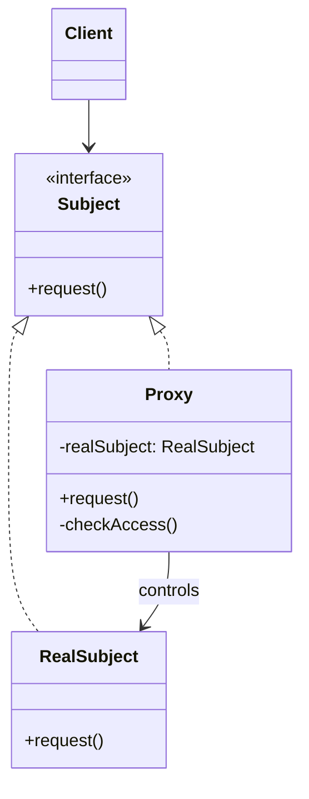

# Proxy

> **Amaç:** Bir nesnenin yerine geçen vekil sunarak, ona erişimi kontrol etmek.
> **Kategori:** Structural

---

## 1. Problem

Bir nesneye erişimin etrafına bir şey eklemen gerekiyor — ama nesnenin kendisini
değiştiremiyorsun veya değiştirmemelisin.

Tipik senaryo: pahalı bir kaynak, gerçekten kullanılana kadar yüklenmemeli.

```java
public class Report {
    private final byte[] pdfContent;    // 50 MB

    public Report(Long id) {
        this.pdfContent = storage.download(id);   // constructor'da 3 saniye
    }

    public String getTitle() { return title; }    // ama çoğu zaman sadece bu lazım
}

// Listeleme ekranı: 100 rapor × 50 MB = 5 GB, hepsi başlık göstermek için
List<Report> reports = ids.stream().map(Report::new).toList();
```

Aynı problem başka biçimlerde de çıkar:

- Her çağrıda yetki kontrolü yapılması gerekiyor, ama kontrolü 40 metoda dağıtmak istemiyorsun
- Uzak bir servise yapılan çağrı yerel bir metot gibi görünmeli
- Pahalı bir sorgunun sonucu önbelleklenmeli, ama iş sınıfı cache'i bilmemeli

Naif çözüm bu kontrolleri sınıfın içine gömmektir — ve doğrudan **SRP ihlali** üretir:
iş mantığı sınıfı artık yetkilendirmeyi, cache'i ve tembel yüklemeyi de biliyordur.

---

## 2. Çözüm

Asıl nesneyle **aynı arayüzü** implement eden bir vekil sınıf koy. İstemci farkı bilmez;
vekil çağrıyı ne zaman, nasıl, hatta ilettip iletmeyeceğine karar verir.

```
İstemci ──► «interface» Subject ◄── Proxy ──► RealSubject
                                      │
                              (erişim kontrolü, tembel yükleme,
                               cache, loglama, uzak çağrı)
```

Decorator ile yapısı aynıdır; ayrım niyettedir. **Proxy çağrıyı yönetir; Decorator
çağrıya ekleme yapar.**

---

## 3. Yapı



### Proxy türleri

| Tür | Ne yapar | Örnek |
|---|---|---|
| **Virtual** | Pahalı nesneyi ihtiyaç anında yükler | Hibernate lazy loading |
| **Protection** | Yetki kontrolü yapar | Spring Security metot güvenliği |
| **Remote** | Uzak nesneyi yerelmiş gibi gösterir | RMI, gRPC stub'ları |
| **Caching** | Sonuçları önbellekler | Spring `@Cacheable` |
| **Smart Reference** | Erişimi sayar, kaynak yönetir | Referans sayımı, kaynak kapatma |
| **Logging** | Çağrıları kaydeder | AOP ile denetim izi |

---

## 4. Kod

### Virtual Proxy — tembel yükleme

```java
public interface Report {
    String getTitle();
    byte[] getContent();
}

public class RealReport implements Report {

    private final String title;
    private final byte[] content;

    public RealReport(Long id) {
        this.title = metadataRepository.findTitle(id);
        this.content = storage.download(id);      // pahalı
    }

    @Override public String getTitle()   { return title; }
    @Override public byte[] getContent() { return content; }
}

public class ReportProxy implements Report {

    private final Long id;
    private final String title;         // ucuz veri hemen yüklenir
    private RealReport delegate;        // pahalı kısım ertelenir

    public ReportProxy(Long id, String title) {
        this.id = id;
        this.title = title;
    }

    @Override
    public String getTitle() {
        return title;                   // asıl nesneye hiç dokunmaz
    }

    @Override
    public byte[] getContent() {
        if (delegate == null) {
            delegate = new RealReport(id);    // ilk gerçek ihtiyaçta yüklenir
        }
        return delegate.getContent();
    }
}
```

Listeleme ekranı artık 5 GB yerine birkaç KB harcar; sadece açılan rapor indirilir.

### Protection Proxy — yetki kontrolü

```java
public class SecuredDocumentService implements DocumentService {

    private final DocumentService delegate;
    private final SecurityContext security;

    @Override
    public Document open(Long id) {
        if (!security.currentUser().canRead(id)) {
            throw new AccessDeniedException("Yetkisiz erişim: " + id);
        }
        return delegate.open(id);
    }

    @Override
    public void delete(Long id) {
        if (!security.currentUser().hasRole(Role.ADMIN)) {
            throw new AccessDeniedException("Silme yetkisi yok");
        }
        delegate.delete(id);
    }
}
```

İş mantığı sınıfı güvenlikten tamamen habersiz kalır (SoC).

### Dinamik proxy — çalışma zamanında üretim

Java, arayüz tabanlı proxy'leri çalışma zamanında üretebilir. Framework'lerin AOP
desteğinin temeli budur:

```java
public class LoggingInvocationHandler implements InvocationHandler {

    private final Object target;

    public LoggingInvocationHandler(Object target) { this.target = target; }

    @Override
    public Object invoke(Object proxy, Method method, Object[] args) throws Throwable {
        long start = System.nanoTime();
        try {
            return method.invoke(target, args);
        } finally {
            log.debug("{} → {} ns", method.getName(), System.nanoTime() - start);
        }
    }
}

DocumentService proxied = (DocumentService) Proxy.newProxyInstance(
        DocumentService.class.getClassLoader(),
        new Class<?>[]{ DocumentService.class },
        new LoggingInvocationHandler(realService));
```

Tek bir handler ile **her** metot sarılır — 40 metot için 40 delegasyon yazmaktan kurtulursun.
Bedeli: derleme zamanı güvenliği kaybolur ve stack trace okunması zorlaşır.

---

## 5. Sektörde

| Nerede | Tür | Ne yapar |
|---|---|---|
| **Spring `@Transactional`** | Proxy + AOP | Metot etrafında transaction açar/kapatır |
| **Spring `@Cacheable`** | Caching | Sonucu cache'ler, ikinci çağrıda metoda hiç girmez |
| **Spring Security `@PreAuthorize`** | Protection | Çağrı öncesi yetki kontrolü |
| **Hibernate lazy loading** | Virtual | İlişkili entity'yi ilk erişimde yükler |
| **`java.lang.reflect.Proxy`** | Dinamik | Arayüz tabanlı çalışma zamanı proxy'si |
| **RMI / gRPC stub** | Remote | Ağ çağrısını yerel metot gibi gösterir |
| **Mockito mock'ları** | Test | Çağrıları yakalayan proxy nesneleri |

### Spring proxy'lerinin bilinen tuzağı

```java
@Service
public class OrderService {

    @Transactional
    public void save(Order order) { ... }

    public void process(Order order) {
        save(order);          // ← proxy devrede DEĞİL, transaction açılmaz
        this.save(order);     // ← aynı sorun
    }
}
```

Proxy dışarıdan gelen çağrıları sarar. Sınıfın **kendi içinden** yapılan çağrı proxy'ye
uğramaz, doğrudan `this` üzerinden gider. Bu, Spring'de en sık karşılaşılan "annotation
çalışmıyor" sebebidir ve doğrudan proxy mekaniğinin sonucudur.

Hibernate'te de benzer bir yüzey vardır: lazy proxy, session kapandıktan sonra erişilirse
`LazyInitializationException` fırlatır.

---

## 6. Ne zaman kullanılmaz

| Durum | Neden |
|---|---|
| Ek kontrol gerçekten gerekmiyorsa | Gereksiz dolaylılık; Middle Man kokusu |
| Gecikme kabul edilemezse | Proxy her çağrıya küçük bir maliyet ekler |
| Debug edilebilirlik kritikse | Stack trace proxy katmanlarıyla dolar |
| Nesnenin kimliği önemliyse | `proxy != realObject`, `instanceof` beklendiği gibi çalışmayabilir |
| Arayüz yoksa ve sınıf `final` ise | JDK dinamik proxy arayüz ister; CGLIB alt sınıf üretir, `final` sınıfla çalışmaz |

### Gizli maliyetler

**1. Kimlik sorunu**

```java
service.getClass();                    // OrderService$$SpringCGLIB$$0
service instanceof OrderService;       // CGLIB'de true, JDK proxy'de arayüz üzerinden
```

Sınıf adına veya tam tipe güvenen kod proxy'lerle bozulur.

**2. Görünmez davranış**

Anotasyonla eklenen proxy davranışı kodda görünmez. Yeni gelen biri `@Transactional`
olmadan çalışan bir metot görüp "burada transaction yok" sonucuna varabilir. Bu,
**Principle of Least Astonishment** ile gerilim yaratır — güç ile şeffaflık arasındaki
klasik takas.

---

## 7. İlgili ve karıştırılan pattern'ler

| Pattern | Fark |
|---|---|
| **Decorator** | Yapısı **aynı**, niyet farklı. Decorator davranış **ekler** ve zincirlenmek üzere tasarlanır; sarılan nesne dışarıdan verilir. Proxy erişimi **yönetir**, çağrıyı engelleyebilir/erteleyebilir ve genelde asıl nesnenin yaşam döngüsünü kendisi kontrol eder. |
| **Adapter** | **Farklı** arayüz sunar. Proxy **aynı** arayüzü sunar. |
| **Facade** | Alt sistemi basitleştirir, yeni arayüz tanımlar. Proxy tek nesnenin önünde durur, arayüzü korur. |
| **Chain of Responsibility** | İstek zincirde ilerler ve bir eleman tarafından ele alınır; proxy tek bir hedefe vekildir. |

Ayırt edici test — sarmalayıcıya bak:

```
Çağrıyı iletmeyebilir mi?        → Proxy   (yetki reddi, cache hit)
Asıl nesneyi kendisi mi yaratıyor? → Proxy   (lazy loading)
Sadece öncesine/sonrasına ekliyor mu? → Decorator
Zincirlenmek için mi tasarlanmış?    → Decorator
```

---

## Prensip bağlantısı

- **SRP** — yetki, cache, loglama iş mantığından ayrı bir sınıfta
- **OCP** — asıl sınıf değişmeden davranış eklenir
- **LSP** — proxy, sarılan tipin yerine sorunsuz geçebilmelidir; geçemiyorsa (beklenmedik
  exception, farklı kimlik davranışı) pattern doğru uygulanmamıştır
- **DIP** — istemci arayüze bağımlıdır, bu yüzden proxy'nin araya girmesi mümkün olur;
  arayüz olmasa Spring bile proxy üretemezdi
