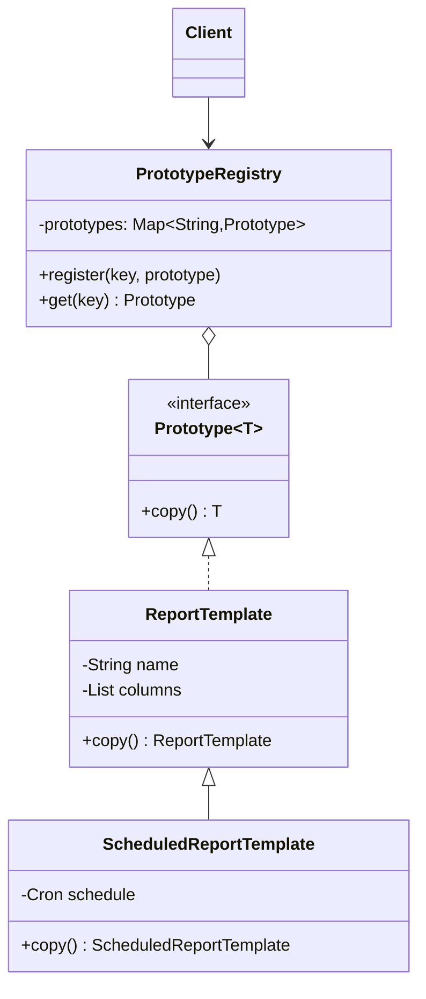

# Prototype

> **Amaç:** Nesneyi sıfırdan kurmak pahalıysa veya somut sınıfını bilmiyorsan,
> var olanı klonlayarak yenisini üretmek.
> **Kategori:** Creational

---

## 1. Problem

Bir rapor şablonu nesnesi var. Kurulması pahalı: veritabanından kolon tanımları çekiliyor, formatlar parse ediliyor, yetki kuralları yükleniyor. 2 saniye sürüyor.

Her kullanıcı bu şablonu alıp **kendine göre ufak değişiklikler yapıyor** — bir kolon çıkarıyor, tarih aralığını değiştiriyor.

```java
ReportTemplate t = templateLoader.load("MONTHLY_SALES");  // 2 saniye, her seferinde
t.removeColumn("cost");
```

İlk çözüm refleksi: elle kopyala.

```java
ReportTemplate copy = new ReportTemplate();
copy.setName(t.getName());
copy.setColumns(t.getColumns());        // ← aynı listeye referans! orijinali bozacak
copy.setFormat(t.getFormat());
// private alanları zaten kopyalayamıyorsun
```

İki ayrı problem birden:
1. Dışarıdan kopyalamak, nesnenin **private state'ine erişemediğin** için hep eksik kalır
2. Elindeki referans `ReportTemplate` ama gerçek nesne `ScheduledReportTemplate` olabilir — kopyalayan kod **somut sınıfı bilmek zorunda kalır**

---

## 2. Çözüm

Kopyalama sorumluluğunu nesnenin kendisine ver. Nesne kendi sınıfını ve kendi private alanlarını zaten bilir.

```java
public interface Prototype<T> {
    T copy();
}
```

```java
ReportTemplate mine = template.copy();   // hangi somut sınıf olduğu umurumda değil
mine.removeColumn("cost");
```

Bu, bir "prototip kayıt defteri" ile birleşince güçlenir: pahalı nesneleri bir kez kur, sonra hep kopyala.

---

## 3. Yapı



---

## 4. Kod

### Shallow vs Deep — pattern'in kalbi burası

```java
public class ReportTemplate implements Prototype<ReportTemplate> {

    private String name;
    private List<Column> columns;
    private DateRange range;

    @Override
    public ReportTemplate copy() {
        ReportTemplate copy = new ReportTemplate();
        copy.name = this.name;                          // String immutable → paylaşmak güvenli
        copy.columns = new ArrayList<>();               // liste kopyalanmalı
        for (Column c : this.columns) {
            copy.columns.add(c.copy());                 // içindekiler de mutable ise onlar da
        }
        copy.range = this.range;                        // DateRange immutable → paylaşılabilir
        return copy;
    }
}
```

Karar kuralı basit:

| Alan tipi | Ne yapmalı |
|---|---|
| Primitive, `String`, `BigDecimal`, `LocalDate`, enum, record | Referans paylaş, güvenli |
| Mutable koleksiyon (`ArrayList`, `HashMap`) | Yeni koleksiyon yarat |
| Mutable nesne | Onun da `copy()`'sini çağır (deep copy) |

**En sık yapılan hata:** `copy.columns = this.columns;` yazıp shallow copy'de kalmak. Kopya üzerinde `removeColumn()` çağırdığında orijinal de bozulur ve bu bug'ı bulmak günler alır.

### Copy constructor — Java'da tercih edilen biçim

```java
public class ReportTemplate {

    private final String name;
    private final List<Column> columns;

    public ReportTemplate(ReportTemplate other) {         // copy constructor
        this.name = other.name;
        this.columns = other.columns.stream()
                .map(Column::new)
                .toList();
    }
}
```

Neden bu daha iyi: `final` alanlarla çalışır, `null` dönemez, cast gerektirmez.

### `Cloneable` — neden kaçınılır

```java
public class ReportTemplate implements Cloneable {
    @Override
    public ReportTemplate clone() {
        try {
            ReportTemplate copy = (ReportTemplate) super.clone();  // shallow!
            copy.columns = new ArrayList<>(this.columns);          // elle düzeltmen gerek
            return copy;
        } catch (CloneNotSupportedException e) {
            throw new AssertionError(e);
        }
    }
}
```

`Cloneable` bozuk bir arayüzdür — Josh Bloch (Effective Java, Item 13) doğrudan "kullanmayın" der:

- `Cloneable` hiçbir metot tanımlamaz, sadece işaret arayüzüdür — `clone()` aslında `Object`'te ve `protected`
- `super.clone()` her zaman shallow copy yapar
- `final` alanlarla çalışmaz
- Checked exception fırlatır ama asla fırlatmaması gerekir

**Yeni kodda `Cloneable` yazma. Copy constructor veya `copy()` metodu yaz.**

### Prototype Registry

```java
@Component
public class TemplateRegistry {

    private final Map<String, ReportTemplate> prototypes = new ConcurrentHashMap<>();

    @PostConstruct
    void loadPrototypes() {
        prototypes.put("MONTHLY_SALES", templateLoader.load("MONTHLY_SALES"));  // pahalı, 1 kez
        prototypes.put("DAILY_STOCK",   templateLoader.load("DAILY_STOCK"));
    }

    public ReportTemplate create(String key) {
        ReportTemplate prototype = prototypes.get(key);
        if (prototype == null) throw new UnknownTemplateException(key);
        return prototype.copy();                                                 // ucuz, N kez
    }
}
```

Spring'in `@Scope("prototype")`'ı **bu pattern değildir** — o her istekte `new` yapar, klonlamaz. İsim benzerliği tuzak.

---

## 5. Sektörde nerede geçiyor

| Yer | Örnek |
|---|---|
| JDK | `Object.clone()` — pattern'in (kötü) resmi desteği |
| JDK | `ArrayList`, `HashMap`, `Date`, `Calendar` hepsi `clone()` uygular |
| JDK | `Arrays.copyOf()`, `List.copyOf()` |
| Java 16+ | Record'lar için `with`-tarzı kopyalama deyimi (`new Point(p.x(), 5)`) |
| Spring | `BeanUtils.copyProperties()` — reflection tabanlı shallow copy |
| Apache Commons | `SerializationUtils.clone()` — serialize/deserialize ile deep copy (yavaş ama pratik) |
| Jackson | `objectMapper.convertValue(obj, Type.class)` — deep copy hilesi olarak yaygın kullanılır |
| Kubernetes / Docker | Container image'dan instance üretmek kavramsal olarak prototiptir |

Deep copy için pratik kestirme:

```java
// JSON round-trip — okunabilir, yavaş, transient/döngüsel referanslarda dikkat
ReportTemplate copy = mapper.readValue(mapper.writeValueAsString(original), ReportTemplate.class);
```

---

## 6. Ne zaman kullanılmaz

- **Nesne immutable ise.** Kopyalamaya gerek yok, paylaş geç. Record'lar, `String`, `LocalDate`.
- **Kurulum ucuzsa.** `new` 3 satırsa builder/factory yeter, klonlama makinesi kurma.
- **Nesne dış kaynak tutuyorsa.** Açık DB connection, dosya handle, socket içeren nesneyi klonlamak tehlikelidir — kopyanın kapattığı kaynak orijinali de öldürür.
- **Deep copy zinciri derinse.** 5 seviye iç içe nesnede elle deep copy yazmak bakım kâbusudur; ya immutable tasarıma geç ya serialization tabanlı kopyaya.
- `BeanUtils.copyProperties()`'i deep copy sanma — shallow'dur ve production'da bu yanılgı çok bug üretir.

---

## 7. İlgili ve karıştırılan pattern'ler

| Pattern | Fark |
|---|---|
| **Factory Method** | Factory yeni nesneyi **sınıftan** üretir. Prototype **var olan bir nesneden** üretir. Prototype, sınıf yazmadan yeni "tip" eklemene izin verir. |
| **Builder** | Builder parçalardan kurar. Prototype hazır olanı çoğaltır. `toBuilder()` ikisinin melezidir. |
| **Memento** | Memento da state'in kopyasını alır ama amacı **geri yükleme**dir ve kopya dışarıya kapalıdır. Prototype'ın kopyası yeni bağımsız bir nesnedir. |
| **Flyweight** | Tam zıttı. Flyweight nesneleri **paylaştırarak** bellek kazanır, Prototype **çoğaltır**. |

---

## Prensip bağlantısı

- **Encapsulation** — kopyalama nesnenin kendi içinde yapılır; private alanlara
  dışarıdan erişme ihtiyacı ortadan kalkar
- **DIP** — istemci `Prototype` arayüzüne bakar, somut sınıfı bilmez
- **Immutability** — nesne zaten immutable ise bu pattern gereksizdir; paylaşmak
  yeterlidir (Bkz. PRINCIPLES.md — Immutability)
- **LSP** — `copy()` gerçek çalışma zamanı tipini döndürmelidir; üst tipe düşen
  bir kopya sözleşmeyi bozar

> Kopyalamayı nesnenin kendisine yaptır — çünkü private alanlarını ve gerçek sınıfını bir tek o bilir. Ve her zaman sor: shallow mu yeter, deep mi lazım?
