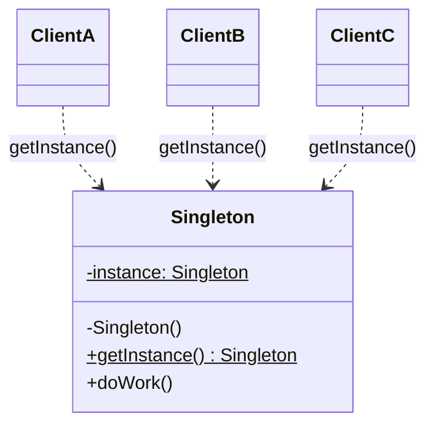

# Singleton

> **Amaç:** Bir sınıftan tek instance olmasını garanti etmek ve ona global erişim vermek.
> **Kategori:** Creational
>
> **Ve muhtemelen buna ihtiyacın yok.** Bu dosyanın yarısı neden kullanmaman gerektiği hakkında.

---

## 1. Problem

Uygulamada tek bir connection pool, tek bir cache, tek bir konfigürasyon olmalı. Her `new` çağrısında yeni pool açılırsa kaynak tükenir.

```java
public class ConnectionPool {
    public ConnectionPool() {
        // 20 bağlantı aç
    }
}
```

Beş farklı serviste beşer kere `new ConnectionPool()` → 100 bağlantı → veritabanı reddediyor.

İhtiyaç gerçek: **tek instance ve ona her yerden erişim.**

---

## 2. Çözüm ve tuzakları

### a) Naif — thread-safe değil

```java
public class ConnectionPool {

    private static ConnectionPool instance;

    private ConnectionPool() {}

    public static ConnectionPool getInstance() {
        if (instance == null) {              // iki thread aynı anda buraya girerse
            instance = new ConnectionPool(); // iki instance yaratılır
        }
        return instance;
    }
}
```

Tek thread'de çalışır, production'da sinsi şekilde bozulur.

### b) `synchronized` — çalışır ama yavaş

```java
public static synchronized ConnectionPool getInstance() {
    if (instance == null) {
        instance = new ConnectionPool();
    }
    return instance;
}
```

Her çağrıda kilit. Instance zaten hazırken bile. Sıcak yolda ölçülebilir maliyet.

### c) Double-Checked Locking — `volatile` şart

```java
public class ConnectionPool {

    private static volatile ConnectionPool instance;   // volatile OLMAZSA bozuk

    private ConnectionPool() {}

    public static ConnectionPool getInstance() {
        if (instance == null) {                        // kilitsiz hızlı yol
            synchronized (ConnectionPool.class) {
                if (instance == null) {                // kilit içinde tekrar kontrol
                    instance = new ConnectionPool();
                }
            }
        }
        return instance;
    }
}
```

**`volatile` neden zorunlu:** `instance = new ConnectionPool()` tek işlem değil — bellek ayır, constructor çalıştır, referansı ata. JIT bu adımları yeniden sıralayabilir. Referans atanıp constructor henüz bitmemişken başka thread `instance != null` görüp **yarı kurulmuş nesneyi** kullanabilir. `volatile` bu yeniden sıralamayı yasaklar (Java 5+ bellek modeli).

Bu mülakatta en çok sorulan Singleton detayıdır.

### d) Bill Pugh / Holder idiom — sade ve doğru

```java
public class ConnectionPool {

    private ConnectionPool() {}

    private static class Holder {
        private static final ConnectionPool INSTANCE = new ConnectionPool();
    }

    public static ConnectionPool getInstance() {
        return Holder.INSTANCE;
    }
}
```

JVM sınıf yükleme mekanizması zaten thread-safe. `Holder` sınıfı ilk `getInstance()` çağrısına kadar yüklenmez → lazy. Kilit yok, `volatile` yok. **Klasik Singleton yazacaksan bunu yaz.**

### e) Enum — Effective Java'nın önerdiği

```java
public enum ConnectionPool {

    INSTANCE;

    private final DataSource dataSource;

    ConnectionPool() {
        this.dataSource = buildDataSource();
    }

    public Connection getConnection() {
        return dataSource.getConnection();
    }
}
```

Kullanım: `ConnectionPool.INSTANCE.getConnection()`

Tek yöntem ki **reflection ve serialization saldırılarına da dayanıklı**:

```java
// Diğer tüm yöntemler buna karşı savunmasız:
Constructor<ConnectionPool> c = ConnectionPool.class.getDeclaredConstructor();
c.setAccessible(true);
ConnectionPool second = c.newInstance();   // ikinci instance! garanti bozuldu
```

Enum'da JVM bunu engeller. Dezavantajı: lazy değil ve sınıf genişletemez.

---

## 3. Yapı



Bu diyagramın kendisi problemi anlatıyor: **üç istemci de aynı global nesneye gizli bağımlı.** Bu bağımlılık constructor'da görünmüyor, imzada görünmüyor, sadece metot gövdesinin içinde saklı.

---

## 4. Neden "anti-pattern" diye anılıyor

### Test edilemezlik

```java
public class OrderService {
    public void placeOrder(Order order) {
        ConnectionPool.getInstance().getConnection();     // gizli bağımlılık
        PaymentGateway.getInstance().charge(order);       // gerçek para çeker
    }
}
```

Bu sınıfı unit test edemezsin. `PaymentGateway`'i mock'layamazsın çünkü bağımlılık dışarıdan verilmiyor, içeriden alınıyor. Test için ya PowerMock gibi ağır araçlara ya `setInstanceForTesting()` gibi çirkin kapılara mecbur kalırsın.

### Gizli bağlantı (hidden coupling)

`OrderService`'in constructor'ına bakınca hiçbir bağımlılık göremezsin. Gerçekte 2 tanesi var. Bağımlılık grafiği yalan söylüyor.

### Global mutable state

Singleton state tutuyorsa, uygulamanın herhangi bir yerinden değiştirilebilen global değişkendir. Global değişkenlerin neden kötü olduğunu 1970'lerde öğrendik.

### "Tek instance" garantisi zaten kırılgan

- Birden fazla classloader → her birinde ayrı instance (uygulama sunucuları, OSGi)
- Reflection → garanti kırılır (enum hariç)
- Serialization → deserialize edilince ikinci instance (`readResolve()` yazmazsan)
- Birden çok JVM / pod → zaten "tek" değil

Yani "tek instance" ihtiyacın gerçekten kritikse Singleton pattern onu vermiyor bile.

---

## 5. Doğru çözüm: DI container

Spring kullanıyorsan **zaten singleton'ın var**:

```java
@Component                                    // varsayılan scope = singleton
public class ConnectionPool {
    // ...
}
```

```java
@Service
public class OrderService {

    private final ConnectionPool pool;        // bağımlılık görünür
    private final PaymentGateway gateway;

    public OrderService(ConnectionPool pool, PaymentGateway gateway) {
        this.pool = pool;
        this.gateway = gateway;
    }
}
```

Aynı sonucu alıyorsun — container tek instance yönetiyor — ama:

| | GoF Singleton | Spring singleton bean |
|---|---|---|
| Test | Mock'lamak zor | Constructor'a mock ver, bitti |
| Bağımlılık görünür mü | Hayır | Evet, imzada |
| Lifecycle | Elle | Container yönetir |
| Farklı ortamda farklı impl | Zor | `@Profile` ile trivial |
| Kapsam | JVM global | Container scope'u |

**Modern Java uygulamasında elle Singleton yazmanın nedeni neredeyse hiç yok.** Framework yoksa (küçük kütüphane, util sınıfı) o zaman enum veya Holder idiom.

---

## 6. Sektörde nerede geçiyor

| Yer | Örnek |
|---|---|
| JDK | `Runtime.getRuntime()` |
| JDK | `Desktop.getDesktop()`, `Toolkit.getDefaultToolkit()` |
| JDK | `System.out` — statik singleton referansı |
| JDK | `Collections.emptyList()` — paylaşılan immutable instance |
| Spring | Varsayılan bean scope — ama container yönetimli, GoF değil |
| Slf4j / Logback | `LoggerContext` |
| Hibernate | `SessionFactory` — uygulama başına tek |

Dikkat: `Math`, `Collections`, `Arrays` gibi sınıflar Singleton **değildir** — onlar sadece statik metot topluluğu (utility class). Onlarda private constructor amacı instance yaratmayı **tamamen engellemektir**, tek instance vermek değil.

---

## 7. Ne zaman gerçekten kullan

Kısa liste:

- **Gerçekten global, immutable ve state'siz** bir şey (sabitler, kayıt defteri)
- **Framework'süz küçük kütüphane** yazıyorsun ve DI yok
- Enum ile yazabiliyorsan yaz
- Ve her seferinde önce sor: *"Bunu constructor'dan geçiremez miyim?"* Cevap genelde "geçirebilirim"dir.

Kesin kullanma:
- State tutuyorsa
- Test etmen gerekecekse (yani her zaman)
- Spring/CDI/Guice zaten varsa

---

## 8. İlgili ve karıştırılan pattern'ler

| Pattern / kavram | Fark |
|---|---|
| **Utility class** (`Math`, `Collections`) | Instance yok, sadece static metot. Singleton'da instance **var** ve polymorphic olabilir. |
| **Monostate** | Farklı instance'lar ama paylaşılan static state. Aynı etkiyi verir, daha da sinsi. |
| **Factory** | Factory nesne üretir (çoğu zaman yenisini). Singleton hep aynısını verir. `getInstance()` bir Factory Method'dur aslında. |
| **Spring singleton scope** | Container başına tek, JVM başına değil. Ve bağımlılık enjekte edilir, çekilmez. Kavramsal olarak farklı şeydir. |
| **Object Pool** | Sınırlı sayıda (1 değil, N) instance yönetir, ödünç verir ve geri alır. |

---

## Prensip bağlantısı

Bu pattern, prensipleri **uygulamaktan çok ihlal ettiği için** öğreticidir:

- **DIP ihlali** — bağımlılık enjekte edilmez, içeriden çekilir; imzada görünmez
- **SRP ihlali** — sınıf hem kendi işini yapar hem kendi yaşam döngüsünü yönetir
- **Test edilebilirlik** — gizli bağımlılık mock'lanamaz
  (Bkz. TESTING.md — Mock ne zaman tasarım kokusudur)
- **Immutability** — pattern yalnızca state'siz/immutable durumda savunulabilir;
  mutable global state en tehlikeli hâlidir
- **Encapsulation** — `private` constructor doğru bir araçtır; sorun erişimin
  global olmasıdır, kurulumun gizlenmesi değil

---

## Özet

> Singleton çözdüğü problemden daha fazlasını yaratır. İhtiyaç gerçekse cevap dependency injection'dır; DI yoksa cevap `enum`'dur. `private static instance` yazmadan önce iki kere düşün.
