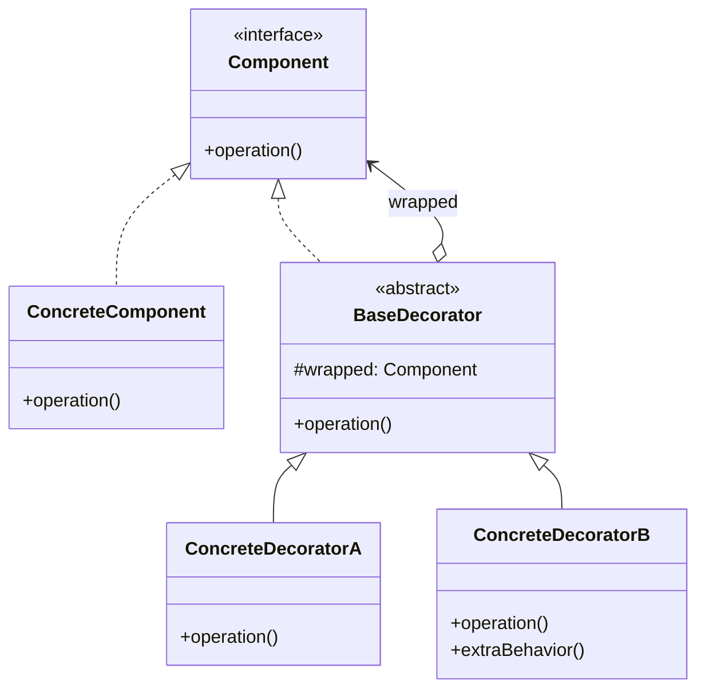

# Decorator

> **Amaç:** Bir nesneye, sınıfını değiştirmeden ve alt sınıf üretmeden, **çalışma
> zamanında** yeni sorumluluklar eklemek.
> **Kategori:** Structural

---

## 1. Problem

Bir davranışın üzerine ek yetenekler bindirmek istiyorsun: loglama, önbellekleme,
sıkıştırma, şifreleme, yeniden deneme. Kalıtımla çözersen kombinasyon patlaması olur.

```java
class DataSource { }
class EncryptedDataSource extends DataSource { }
class CompressedDataSource extends DataSource { }
class EncryptedCompressedDataSource extends DataSource { }
class LoggedEncryptedDataSource extends DataSource { }
class LoggedCompressedEncryptedDataSource extends DataSource { }
// n özellik → 2^n sınıf
```

Alternatif olarak hepsini tek sınıfa doldurursun ve boolean bayraklarla yönetirsin:

```java
public class DataSource {
    public void write(String data, boolean encrypt, boolean compress, boolean log) {
        if (log) log(data);
        if (compress) data = compress(data);
        if (encrypt) data = encrypt(data);
        ...
    }
}
```

Bu da farklı bir felakettir: **boolean trap**, SRP ihlali, sıranın kodda sabitlenmesi,
yeni bir yetenek eklerken sınıfın sürekli açılması.

Asıl kısıt şudur: kalıtımla seçim **derleme zamanında** yapılır. Çalışma zamanında
"bu istek için sıkıştırma da uygula" diyemezsin.

---

## 2. Çözüm

Aynı arayüzü implement eden, içinde **aynı arayüzden bir nesne tutan** sarmalayıcılar yaz.
Her sarmalayıcı kendi işini yapar ve sarılana delege eder.

```
Client ──► Logging ──► Compression ──► Encryption ──► FileDataSource
              (decorator)  (decorator)    (decorator)      (asıl nesne)
```

Katmanlar çalışma zamanında, istediğin sırada dizilir. `n` yetenek için `n` sınıf yeter —
`2^n` değil.

---

## 3. Yapı



Kritik nokta: `BaseDecorator` hem `Component`'i **implement eder** hem de bir `Component`
**tutar**. Bu ikili ilişki, katmanların sınırsız zincirlenmesini sağlar.

---

## 4. Kod

```java
public interface DataSource {
    void write(String data);
    String read();
}

// ---- Asıl nesne ----
public class FileDataSource implements DataSource {

    private final Path path;

    public FileDataSource(Path path) { this.path = path; }

    @Override
    public void write(String data) { /* dosyaya yaz */ }

    @Override
    public String read() { /* dosyadan oku */ return ""; }
}

// ---- Temel decorator ----
public abstract class DataSourceDecorator implements DataSource {

    protected final DataSource wrapped;

    protected DataSourceDecorator(DataSource wrapped) {
        this.wrapped = wrapped;
    }

    @Override
    public void write(String data) { wrapped.write(data); }

    @Override
    public String read() { return wrapped.read(); }
}
```

Bu ara sınıf zorunlu değildir ama her decorator'ın tüm metotları tekrar yazmasını önler —
özellikle arayüzde 5+ metot varsa değeri büyüktür.

```java
// ---- Somut decorator'lar ----
public class CompressionDecorator extends DataSourceDecorator {

    public CompressionDecorator(DataSource wrapped) { super(wrapped); }

    @Override
    public void write(String data) {
        super.write(compress(data));            // önce kendi işi, sonra delegasyon
    }

    @Override
    public String read() {
        return decompress(super.read());
    }
}

public class EncryptionDecorator extends DataSourceDecorator {

    public EncryptionDecorator(DataSource wrapped) { super(wrapped); }

    @Override
    public void write(String data) { super.write(encrypt(data)); }

    @Override
    public String read() { return decrypt(super.read()); }
}

public class LoggingDecorator extends DataSourceDecorator {

    public LoggingDecorator(DataSource wrapped) { super(wrapped); }

    @Override
    public void write(String data) {
        long start = System.nanoTime();
        super.write(data);
        log.debug("write tamamlandı: {} ns", System.nanoTime() - start);
    }
}
```

Kullanım — katmanlar çalışma zamanında dizilir:

```java
DataSource source = new LoggingDecorator(
                        new EncryptionDecorator(
                            new CompressionDecorator(
                                new FileDataSource(path))));

source.write("hassas veri");
```

Konfigürasyona göre dinamik zincir:

```java
DataSource source = new FileDataSource(path);
if (config.isCompressionEnabled()) source = new CompressionDecorator(source);
if (config.isEncryptionEnabled())  source = new EncryptionDecorator(source);
if (config.isLoggingEnabled())     source = new LoggingDecorator(source);
```

Kalıtımla bunu yapmak imkânsızdır — sınıf seçimi derleme zamanında sabitlenir.

### Sıra önemlidir

<!-- component:DecoratorChain -->

```java
// Önce sıkıştır, sonra şifrele → küçük ve güvenli
new EncryptionDecorator(new CompressionDecorator(source));

// Önce şifrele, sonra sıkıştır → şifreli veri sıkışmaz, boyut düşmez
new CompressionDecorator(new EncryptionDecorator(source));
```

Decorator zincirinde sıra **davranışsal bir karardır** ve dokümante edilmelidir. Esnekliğin
bedeli budur: yanlış sıra sessizce yanlış sonuç üretir.

---

## 5. Sektörde

| Nerede | Nasıl |
|---|---|
| **`java.io`** | `new BufferedReader(new InputStreamReader(new FileInputStream(f)))` |
| **`Collections.unmodifiableList()`** | Listeyi sarar, yazma metotlarını engeller |
| **`Collections.synchronizedMap()`** | Her metodu senkronize bir katmanla sarar |
| **`HttpServletRequestWrapper`** | İsteği sarıp header/parametre davranışını değiştirir |
| **Spring `TransactionAwareCacheDecorator`** | Cache'i transaction'a duyarlı hâle getirir |
| **`BufferedInputStream`** | Tamponlama davranışı ekler, arayüz aynı kalır |

`java.io` GoF kitabındaki kanonik örnektir ve tasarımın hem gücünü hem maliyetini gösterir:
üç seviyeli `new` zinciri okunması zor bir API üretir. Java 8'de gelen `Files.newBufferedReader()`
gibi yardımcı metotlar tam olarak bu okunabilirlik sorununu çözmek için eklenmiştir.

---

## 6. Ne zaman kullanılmaz

| Durum | Neden |
|---|---|
| Katman sayısı azsa ve sabitse | Basit kalıtım veya doğrudan kod daha okunur |
| Arayüz çok genişse | Her decorator 15 metot delege etmek zorunda kalır |
| Sıra bağımlılığı çok karmaşıksa | Hata ayıklaması zor, sessiz hatalar üretir |
| Sarmalayıcı arayüzü değiştiriyorsa | O Adapter'dır |
| Sarmalayıcı erişimi kontrol ediyorsa | O Proxy'dir |

### Bilinen maliyetleri

**1. Debug zorluğu.** Stack trace 5 katman decorator içinden geçer; hangi katmanın veriyi
bozduğunu bulmak zaman alır.

**2. Kimlik kaybı.** Sarılmış nesne artık `==` ile veya `instanceof` ile aslıyla eşleşmez:

```java
DataSource original = new FileDataSource(path);
DataSource decorated = new LoggingDecorator(original);

decorated == original;                        // false
decorated instanceof FileDataSource;          // false
```

Bu, Spring AOP proxy'lerinde sık karşılaşılan sorunun da kaynağıdır.

**3. Kurulum karmaşası.** İç içe `new` çağrıları okunmaz hâle gelebilir; Builder veya
fabrika metotlarıyla gizlenmesi genelde iyi fikirdir.

---

## 7. İlgili ve karıştırılan pattern'ler

| Pattern | Fark |
|---|---|
| **Proxy** | Yapısı **aynıdır**, niyet farklıdır. Proxy erişimi **kontrol eder** (lazy yükleme, yetki, uzak çağrı) ve genelde sarılan nesneyi kendisi yaratır. Decorator davranış **ekler** ve nesneyi dışarıdan alır. |
| **Adapter** | Arayüzü **değiştirir**. Decorator arayüzü **korur** — bu yüzden zincirlenebilir. |
| **Composite** | Yapısı benzer ama Composite **çok** çocuk tutar ve ağaç kurar; Decorator **tek** çocuk tutar ve zincir kurar. |
| **Strategy** | Nesnenin **içini** değiştirir (algoritma değişimi); Decorator **dışını** sarar. |
| **Chain of Responsibility** | Zincirdeki bir eleman isteği **durdurabilir**; Decorator'da her katman genelde delege eder. |

> Decorator ve Proxy ayrımı mülakatta en sık sorulan structural sorularından biridir.
> Ayırt edici soru: **sarmalayıcı, sarılan nesnenin ne zaman/ne kadar çağrılacağına mı
> karar veriyor (Proxy), yoksa çağrının etrafına bir şey mi ekliyor (Decorator)?**

---

## Prensip bağlantısı

- **OCP** — yeni yetenek = yeni decorator; mevcut sınıflar değişmez
- **SRP** — her yetenek kendi sınıfında; tek sınıfta bayrak yığını yok
- **Composition over Inheritance** — `2^n` sınıf yerine `n` sınıf
- **LSP** — decorator, sardığı tipin yerine sorunsuz geçebilmelidir; geçemiyorsa
  pattern yanlış uygulanmıştır
