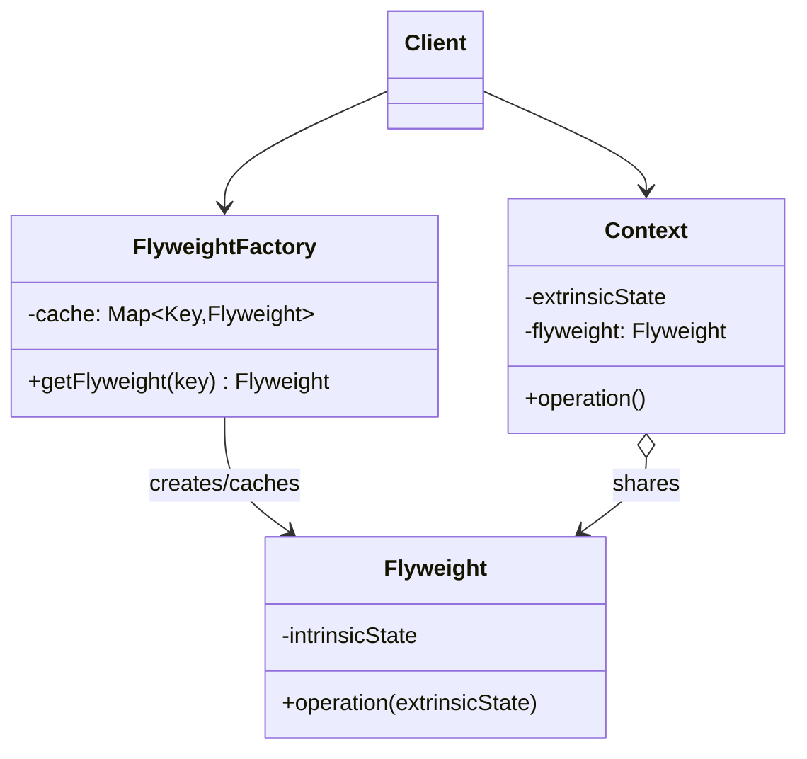

# Flyweight

> **Amaç:** Çok sayıda benzer nesnenin ortak (değişmeyen) durumunu paylaştırarak bellek
> tüketimini düşürmek.
> **Kategori:** Structural

---

## 1. Problem

Milyonlarca küçük nesne oluşturuyorsun ve büyük kısmı **aynı veriyi tekrar tekrar**
taşıyor.

```java
public class Particle {
    private double x, y;              // her parçacığa özgü — 16 byte
    private double velocityX, velocityY;

    private String sprite;            // "bullet.png" — 1 milyon kopya
    private Color color;              // aynı renk nesnesi tekrar tekrar
    private byte[] textureData;       // 4 KB × 1.000.000 = 4 GB
}

List<Particle> particles = new ArrayList<>();
for (int i = 0; i < 1_000_000; i++) {
    particles.add(new Particle(x, y, vx, vy, "bullet.png", RED, loadTexture()));
}
```

Gerçekte farklı olan tek şey konum ve hız. Doku verisi ise 1 milyon kez kopyalanıyor.
Sonuç: `OutOfMemoryError`, ağır GC baskısı, düşen cache verimliliği.

Aynı sorun daha sıradan yerlerde de görülür: bir tabloda 500.000 satırın `country` alanı
için 500.000 ayrı `String` nesnesi tutmak gibi.

---

## 2. Çözüm

Nesnenin durumunu ikiye ayır:

| Durum | Adı | Nerede tutulur |
|---|---|---|
| Tüm örneklerde **aynı** olan | **Intrinsic** (içsel) | Paylaşılan flyweight nesnesinde |
| Her örneğe **özgü** olan | **Extrinsic** (dışsal) | Çağıran tarafından dışarıda tutulur veya parametre olarak geçilir |

```
1.000.000 Particle nesnesi (x, y, vx, vy)
              │
              └──► 3 adet ParticleType nesnesi (sprite, color, texture)
                     paylaşılıyor
```

Flyweight nesneleri **immutable olmak zorundadır** — paylaşılan bir nesneyi biri
değiştirirse hepsi etkilenir. (Bkz. PRINCIPLES.md — Immutability)

---

## 3. Yapı



Fabrika zorunludur: istemci `new` çağırabiliyorsa paylaşım garanti edilemez.

---

## 4. Kod

```java
// ---- Flyweight: paylaşılan, değişmez içsel durum ----
public final class ParticleType {

    private final String spriteName;
    private final Color color;
    private final byte[] texture;

    ParticleType(String spriteName, Color color, byte[] texture) {
        this.spriteName = spriteName;
        this.color = color;
        this.texture = texture;
    }

    // Dışsal durum parametre olarak gelir — nesnede saklanmaz
    public void draw(Canvas canvas, double x, double y) {
        canvas.drawSprite(texture, color, x, y);
    }
}

// ---- Fabrika: paylaşımı garanti eder ----
public final class ParticleTypeFactory {

    private static final Map<String, ParticleType> CACHE = new ConcurrentHashMap<>();

    public static ParticleType get(String spriteName, Color color) {
        String key = spriteName + "|" + color;
        return CACHE.computeIfAbsent(key,
                k -> new ParticleType(spriteName, color, TextureLoader.load(spriteName)));
    }
}

// ---- Context: dışsal durumu tutar ----
public class Particle {

    private double x, y, velocityX, velocityY;
    private final ParticleType type;          // paylaşılan referans

    public Particle(double x, double y, double vx, double vy, ParticleType type) {
        this.x = x; this.y = y;
        this.velocityX = vx; this.velocityY = vy;
        this.type = type;
    }

    public void draw(Canvas canvas) {
        type.draw(canvas, x, y);              // dışsal durum parametre olarak geçer
    }
}
```

Kullanım:

```java
ParticleType bullet = ParticleTypeFactory.get("bullet.png", Color.RED);

for (int i = 0; i < 1_000_000; i++) {
    particles.add(new Particle(rx(), ry(), vx(), vy(), bullet));
}
// Doku artık 1 milyon kez değil, 1 kez tutuluyor:
// 1.000.000 × (nesne başlığı + 4 double + 1 referans) + 1 × 4 KB doku
// GB mertebesinden onlarca MB mertebesine iner
```

### Thread-safety uyarısı

```java
// Yanlış — flyweight mutable olursa paylaşım felakete döner
public void setColor(Color c) { this.color = c; }   // ← 1 milyon parçacık etkilenir
```

Flyweight sınıfı `final` alanlar ve setter'sız tasarlanmalıdır. Cache de eşzamanlı
erişime uygun olmalıdır (`ConcurrentHashMap.computeIfAbsent`).

---

## 5. Sektörde

| Nerede | Nasıl |
|---|---|
| **`Integer.valueOf()`** | -128..127 arası değerler önceden oluşturulup paylaşılır |
| **String pool** | Aynı literal, aynı nesne referansına çözülür |
| **`Boolean.valueOf()`** | Sadece iki nesne var: `TRUE`, `FALSE` |
| **`Character.valueOf()`** | 0..127 arası cache |
| **`String.intern()`** | Çalışma zamanında havuza katma |
| **Font/glyph render** | Karakter başına glyph nesnesi paylaşılır |

`Integer` cache'i mülakatta en sık sorulan Flyweight örneğidir:

```java
Integer a = 127, b = 127;
Integer c = 128, d = 128;

a == b;   // true  — cache'ten aynı nesne
c == d;   // false — cache dışı, yeni nesne
```

Bu davranış tam olarak Flyweight'tir ve aynı zamanda `==` ile `equals()` farkının
neden önemli olduğunun kanıtıdır. (Bkz. JAVA.md — Integer Cache)

---

## 6. Ne zaman kullanılmaz

| Durum | Neden |
|---|---|
| Nesne sayısı az | Fabrika + cache karmaşıklığı, kazandığından fazlasını götürür |
| Ölçüm yapılmadıysa | Premature optimization — önce profil, sonra karar |
| Durum mutable olmak zorundaysa | Paylaşım güvenli değil |
| Dışsal durum içselden büyükse | Kazanç yok; context nesneleri zaten şişkin |
| Cache sınırsız büyüyorsa | Bellek tasarrufu yerine bellek sızıntısı |

### En yaygın hata: erken uygulama

Flyweight, GoF kataloğunun **en dar kullanım alanlı** pattern'idir. Modern donanımda
bellek ucuzdur; kodu okunmaz hâle getiren bir optimizasyon çoğu zaman zarardır.

Uygulama kriteri net olmalı:

```
✓ Nesne sayısı yüz binler mertebesinde
✓ Profiler bu nesnelerin heap'te ilk sıralarda olduğunu gösteriyor
✓ İçsel/dışsal ayrımı doğal olarak yapılabiliyor
✓ İçsel durum gerçekten immutable
```

Dördü birden yoksa uygulama.

### Cache sızıntısı

```java
// Tehlikeli — anahtar çeşitliliği yüksekse cache sonsuz büyür
private static final Map<String, Flyweight> CACHE = new HashMap<>();
```

Sınırlı ve öngörülebilir bir anahtar kümesi yoksa (`String.intern()` gibi keyfi
değerlerde), boyut sınırlı bir cache veya zayıf referanslar gerekir.

---

## 7. İlgili ve karıştırılan pattern'ler

| Pattern | İlişki |
|---|---|
| **Singleton** | Singleton **tek** örnek zorunlu kılar; Flyweight **sınırlı sayıda paylaşılan** örnek tutar. Flyweight fabrikası çoğu zaman singleton'dır ama flyweight'in kendisi değildir. |
| **Factory Method / Abstract Factory** | Flyweight'lerin oluşturulup cache'lenmesi için kullanılır — pattern'in zorunlu parçasıdır |
| **Object Pool** | İkisi de nesne yeniden kullanır ama pool'dan alınan nesne **mutable** ve **geçici tahsis edilmiştir** (kullanan geri verir); flyweight **immutable** ve **sürekli paylaşılır**. |
| **Composite** | Flyweight'ler çoğu zaman bir Composite ağacının yapraklarıdır |
| **Prototype** | Prototype nesneyi **kopyalar**, Flyweight **paylaşır** — zıt yaklaşımlar |

---

## Prensip bağlantısı

- **Immutability** — paylaşılan durum değişmez olmak zorundadır, bu pazarlık konusu değil
- **Encapsulation** — istemci `new` çağıramamalı, fabrika tek giriş noktası olmalı
- **KISS / Premature Optimization** — bu pattern'in en büyük riski gereksiz uygulanmasıdır;
  ölçüm olmadan başlama
