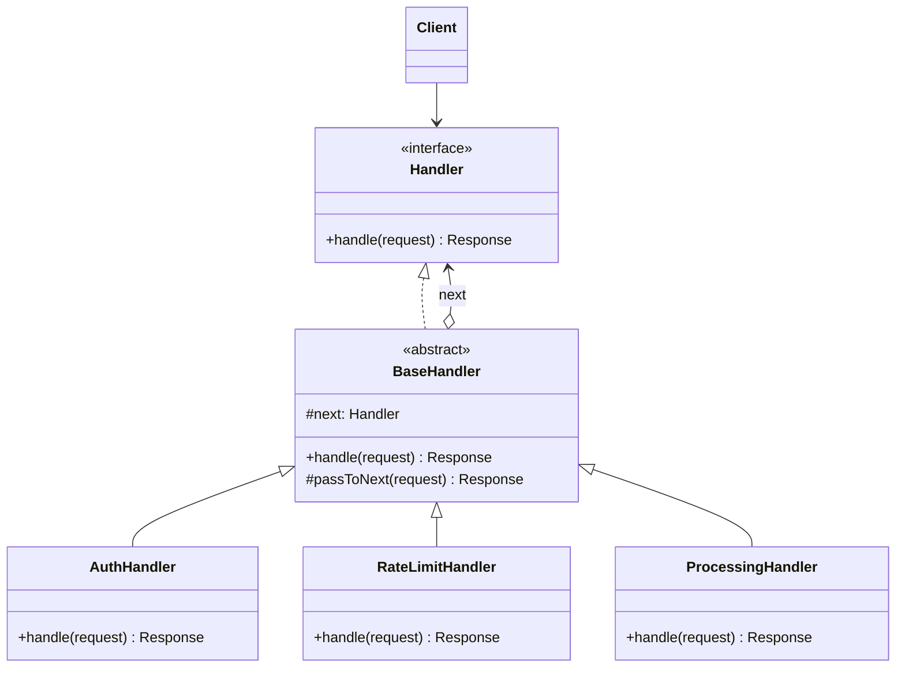

# Chain of Responsibility

> **Amaç:** Bir isteği, onu işleyebilecek nesneyi önceden bilmeden, birbirine
> bağlı handler'lardan oluşan bir zincire vermek.
> **Kategori:** Behavioral

---

## 1. Problem

Gelen bir isteğin işlenmeden önce birkaç kontrolden geçmesi gerekiyor: kimlik
doğrulama, yetki, hız sınırı, önbellek, doğrulama. Hepsini tek yere yazarsan
şu ortaya çıkar:

```java
public Response handle(Request request) {
    if (!isAuthenticated(request)) return Response.unauthorized();

    if (!hasPermission(request)) return Response.forbidden();

    if (isRateLimited(request)) return Response.tooManyRequests();

    Response cached = cache.get(request);
    if (cached != null) return cached;

    if (!isValid(request)) return Response.badRequest();

    return process(request);
}
```

Sorunlar:

- Beş farklı sorumluluk tek metotta — **SRP ihlali**
- Sıra kodda sabit; "hız sınırını önbellekten önce çalıştıralım" demek metodu açmayı gerektirir
- Bir adımı belirli bir uç nokta için atlamak imkânsız; `if` içinde `if` büyür
- Her yeni kontrol bu metodu değiştirir — **OCP ihlali**
- Test etmek için beşini birden kurman gerekir

---

## 2. Çözüm

Her kontrolü kendi nesnesine al. Her nesne ya isteği işler ya da bir sonrakine
devreder. Zincirin kendisi çalışma zamanında kurulur.

```
İstek ──► Auth ──► Yetki ──► HızSınırı ──► Önbellek ──► İşleyici
             │        │           │            │
             └────────┴───────────┴────────────┴──► erken dönüş
```

Kritik nokta: **her handler zinciri durdurabilir.** Bu, Decorator'dan ayrıldığı
yerdir — Decorator'da her katman genelde delege etmek zorundadır.

```java
Handler chain = new AuthHandler(
        new PermissionHandler(
            new RateLimitHandler(
                new ProcessingHandler())));

Response response = chain.handle(request);
```

---

## 3. Yapı



Diyagramdaki `next` oku Decorator'ınkiyle aynı görünür; fark davranıştadır:
burada `next` çağrılmayabilir.

---

## 4. Kod

```java
public interface Handler {
    Response handle(Request request);
}

public abstract class BaseHandler implements Handler {

    private final Handler next;

    protected BaseHandler(Handler next) {
        this.next = next;
    }

    /** Zincirin sonundaysak istek işlenmemiş demektir. */
    protected Response passToNext(Request request) {
        if (next == null) {
            throw new IllegalStateException("Zincirin sonunda işleyici yok");
        }
        return next.handle(request);
    }
}
```

```java
public class AuthHandler extends BaseHandler {

    private final TokenVerifier verifier;

    public AuthHandler(TokenVerifier verifier, Handler next) {
        super(next);
        this.verifier = verifier;
    }

    @Override
    public Response handle(Request request) {
        if (!verifier.isValid(request.token())) {
            return Response.unauthorized();      // zincir burada biter
        }
        return passToNext(request);
    }
}

public class RateLimitHandler extends BaseHandler {

    private final RateLimiter limiter;

    public RateLimitHandler(RateLimiter limiter, Handler next) {
        super(next);
        this.limiter = limiter;
    }

    @Override
    public Response handle(Request request) {
        if (!limiter.tryAcquire(request.clientId())) {
            return Response.tooManyRequests();
        }
        return passToNext(request);
    }
}

/** Zincirin sonu: devretmez, işi yapar. */
public class ProcessingHandler implements Handler {
    @Override
    public Response handle(Request request) {
        return Response.ok(service.process(request));
    }
}
```

Kurulum tek yerde ve okunur:

```java
Handler chain =
    new AuthHandler(verifier,
        new RateLimitHandler(limiter,
            new ProcessingHandler()));
```

### Liste biçimi — daha yönetilebilir

İç içe `new` zinciri uzayınca okunmaz olur. Handler'ları sıralı bir listede
tutmak hem sırayı görünür kılar hem konfigürasyondan yönetilebilir yapar:

```java
public class HandlerChain {

    private final List<Handler> handlers;

    public Response handle(Request request) {
        for (Handler handler : handlers) {
            Response response = handler.tryHandle(request);
            if (response != null) {
                return response;     // ilk cevap veren zinciri bitirir
            }
        }
        throw new IllegalStateException("Hiçbir handler isteği karşılamadı");
    }
}
```

Spring'de bu liste doğrudan enjekte edilebilir; `@Order` ile sıra verilir.

---

## 5. Sektörde

| Nerede | Nasıl |
|---|---|
| **Servlet `Filter`** | `doFilter(request, response, chain)` — `chain.doFilter()` çağrılmazsa istek durur |
| **Spring Security** | Güvenlik filtre zinciri; her filtre isteği reddedebilir |
| **Spring `HandlerInterceptor`** | `preHandle()` `false` dönerse akış kesilir |
| **`java.util.logging`** | Logger hiyerarşisi; kayıt üst logger'lara doğru ilerler |
| **Netty `ChannelPipeline`** | Her handler mesajı işler veya ilerletir |
| **JVM exception yayılımı** | Kavramsal olarak aynı: yakalayan bulunana kadar yukarı gider |

Servlet filtresi en öğretici örnektir, çünkü zinciri durdurma yetkisi kodda
görünür: `chain.doFilter()` satırını yazmazsan istek asla hedefe ulaşmaz.

---

## 6. Ne zaman kullanılmaz

| Durum | Neden |
|---|---|
| İsteği hangi nesnenin işleyeceği baştan belliyse | Doğrudan çağır; zincir gereksiz dolaylılık |
| Zincirdeki her adım mutlaka çalışacaksa | Bu Decorator'dır, CoR değil |
| Adım sayısı iki ise | `if` daha okunur |
| Sıra kritik ve gizliyse | Yanlış sıralama sessiz hatalara yol açar; sıra dokümante edilmeli |
| Bir isteğin işlenmemesi kabul edilemezse | Zincirin sonu için açık bir kural gerekir |

### En sinsi hata: sessizce düşen istek

```java
// Zincirin sonundaki handler devretmeye çalışırsa ve `next` null'sa,
// istek hiçbir cevap üretmeden kaybolur.
protected Response passToNext(Request request) {
    return next == null ? null : next.handle(request);   // ❌ sessiz null
}
```

Zincirin sonu **açıkça** tanımlanmalı: ya her zaman cevap üreten bir son
handler koy, ya da yukarıdaki gibi gürültülü şekilde patla (Fail Fast).

### Debug maliyeti

Bir isteğin neden reddedildiğini bulmak için zinciri elle takip etmek gerekir.
Her handler'ın kararını loglaması pratikte zorunludur.

---

## 7. İlgili ve karıştırılan pattern'ler

| Pattern | Fark |
|---|---|
| **Decorator** | Yapısı **aynıdır**. Decorator'da her katman sarılana delege eder ve davranış ekler; CoR'da bir handler zinciri **durdurabilir** ve genelde tek bir handler isteği üstlenir. |
| **Command** | CoR isteği *kimin* işleyeceğini çözer; Command isteğin *kendisini* nesneye çevirir. İkisi birlikte sık kullanılır: zincirde dolaşan şey bir Command olabilir. |
| **Composite** | Bir Composite ağacında istek yaprakta karşılanmazsa üst düğüme taşınabilir — bu, ağaç üzerine kurulmuş bir zincirdir. |
| **Mediator** | CoR'da nesneler sıralı bir hat oluşturur; Mediator'da hepsi merkezî bir aracıya konuşur. |
| **Observer** | Observer'da bildirim **tüm** dinleyicilere gider; CoR'da istek genelde **ilk** karşılayanda durur. |

---

## Prensip bağlantısı

- **SRP** — her kontrol kendi sınıfında; tek metotta beş sorumluluk kalmaz
- **OCP** — yeni kontrol = yeni handler; mevcut zincir kodu değişmez
- **Low Coupling** — gönderen, isteği kimin karşılayacağını bilmez
- **Fail Fast** — zincirin sonunda karşılıksız kalan istek sessizce kaybolmamalı,
  gürültüyle patlamalı

> Zincir, "bu isteği kim işleyecek?" sorusunu çağıranın üzerinden alır. Bedeli
> şudur: cevabı artık kod okuyarak değil, zinciri izleyerek bulursun.
