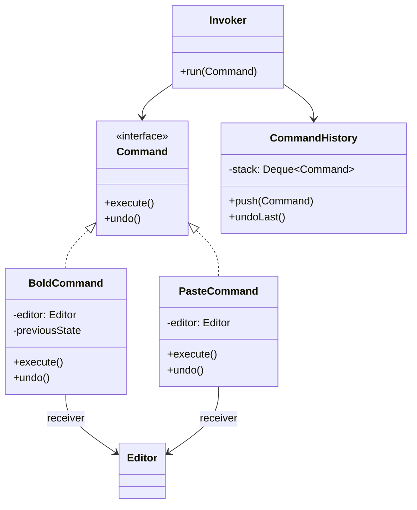

# Command

> **Amaç:** Bir işlemi, parametreleriyle birlikte nesneye çevirmek; böylece
> saklanabilir, kuyruğa alınabilir, kaydedilebilir ve geri alınabilir hâle gelsin.
> **Kategori:** Behavioral

---

## 1. Problem

Bir metin düzenleyici yazıyorsun. Araç çubuğundaki her düğme bir işlem yapıyor:

```java
public class Toolbar {

    public void onClick(String buttonId) {
        switch (buttonId) {
            case "copy"  -> editor.copy();
            case "paste" -> editor.paste();
            case "bold"  -> editor.applyBold();
            case "save"  -> {
                editor.save();
                statusBar.show("Kaydedildi");
            }
            // ... 30 düğme daha
        }
    }
}
```

Sonra "geri al" isteniyor. Şimdi ne olacak?

- Hangi işlemin ne yaptığını ve nasıl geri alınacağını bu `switch` bilmiyor
- İşlemi kaydetmek (audit), kuyruğa almak veya zamanlamak istersen elinde
  **çağrılabilir bir şey yok** — sadece dallanma var
- Aynı işlem klavye kısayolundan da tetiklenecek: `switch` ikinci kez yazılır
- `Toolbar`, `editor` ve `statusBar`'ı tanımak zorunda — sıkı bağlılık

Asıl eksik şu: **işlem bir değer değil.** Saklanamıyor, geçirilemiyor.

---

## 2. Çözüm

Her işlemi, tek metotlu bir nesneye çevir. Çağıran taraf ne yapıldığını değil,
sadece "çalıştır" demeyi bilir.

```java
public interface Command {
    void execute();
}
```

İşlem nesneleşince bedava gelen yetenekler:

| İhtiyaç | Nasıl karşılanır |
|---|---|
| Geri alma | Arayüze `undo()` ekle, çalıştırılanları yığında tut |
| Kuyruğa alma | `Queue<Command>` |
| Zamanlama | `scheduler.schedule(command, delay)` |
| Kayıt / audit | Çalıştırmadan önce komutu serileştir |
| Tekrar deneme | Aynı nesneyi yeniden `execute()` et |
| Makro | Komut listesi tutan bir komut |

---

## 3. Yapı



Üç rol vardır: **Invoker** (tetikleyen), **Command** (işlem), **Receiver**
(asıl işi yapan). Invoker, Receiver'ı hiç tanımaz.

---

## 4. Kod

```java
public interface Command {
    void execute();
    void undo();
}
```

```java
public class BoldCommand implements Command {

    private final Editor editor;
    private final TextRange range;
    private boolean wasAlreadyBold;      // geri almak için gereken durum

    public BoldCommand(Editor editor, TextRange range) {
        this.editor = editor;
        this.range = range;
    }

    @Override
    public void execute() {
        wasAlreadyBold = editor.isBold(range);
        editor.setBold(range, true);
    }

    @Override
    public void undo() {
        editor.setBold(range, wasAlreadyBold);
    }
}
```

Geri alma için gereken durum **komutun içinde** tutulur — editörün geçmişi
bilmesine gerek kalmaz.

```java
public class CommandHistory {

    private final Deque<Command> executed = new ArrayDeque<>();

    public void run(Command command) {
        command.execute();
        executed.push(command);
    }

    public void undoLast() {
        Command command = executed.poll();
        if (command != null) {
            command.undo();
        }
    }
}
```

Araç çubuğu artık ne yapıldığını bilmiyor:

```java
Button boldButton = new Button("B", () -> history.run(new BoldCommand(editor, selection)));
Button undoButton = new Button("↶", history::undoLast);
```

### Makro — komutlardan oluşan komut

```java
public class MacroCommand implements Command {

    private final List<Command> commands;

    @Override
    public void execute() {
        commands.forEach(Command::execute);
    }

    @Override
    public void undo() {
        // Geri alma TERS sırada yapılır — aksi hâlde durum tutarsız kalır.
        for (int i = commands.size() - 1; i >= 0; i--) {
            commands.get(i).undo();
        }
    }
}
```

Bu, aynı zamanda Composite'in Command üzerindeki uygulamasıdır: tek komut ile
komut grubu aynı arayüzden kullanılır.

### Java'da hazır komut arayüzleri

Kendi arayüzünü yazmadan önce şunlara bak — çoğu durumda yeterlidir:

```java
Runnable task = () -> editor.save();          // parametresiz, dönüşsüz
Callable<Report> job = () -> buildReport();   // sonuç döndürür, exception atabilir
Consumer<Order> action = order -> ship(order);
```

`undo()` gerekmiyorsa `Runnable` zaten bir Command'dır. Ayrı bir arayüz açmak,
yalnızca ek davranış (geri alma, ad, yetki bilgisi) gerektiğinde anlamlıdır.

---

## 5. Sektörde

| Nerede | Nasıl |
|---|---|
| **`Runnable` / `Callable`** | Dilin içindeki en yaygın Command; `ExecutorService` bir Invoker'dır |
| **`ExecutorService.submit()`** | Komut kuyruğa alınır, başka bir thread çalıştırır |
| **Swing `Action`** | Düğme, menü ve kısayol aynı Action nesnesini paylaşır |
| **Spring `TransactionCallback`** | Transaction içinde çalıştırılacak işlem nesnesi |
| **JDBC `PreparedStatement`** | Parametreleriyle paketlenmiş, tekrar çalıştırılabilir işlem |
| **Mesaj kuyrukları** | Kuyruğa yazılan her mesaj serileştirilmiş bir komuttur |
| **Event sourcing** | Sistem durumu, sırayla uygulanmış komutların sonucudur |

`ExecutorService` en net örnektir: `submit(Runnable)` derken işlemi bir değer
gibi geçiriyorsun — Command'ın tanımı budur.

---

## 6. Ne zaman kullanılmaz

| Durum | Neden |
|---|---|
| İşlem doğrudan çağrılabiliyorsa | `service.save(order)` yeterli; sarmalamak gürültü |
| Geri alma, kuyruk, kayıt gerekmiyorsa | Pattern'in kazandırdığı şeylerin hiçbirine ihtiyaç yok |
| `Runnable` yetiyorsa | Kendi arayüzünü açma |
| Komut sayısı çok azsa | Her işlem için bir sınıf, dosya sayısını şişirir |

### Geri alma göründüğünden zordur

`undo()` yazmak çoğu zaman sanıldığından karmaşıktır:

```java
// Naif — "tersini yap"
public void undo() {
    editor.setBold(range, false);   // ❌ ya metin zaten kalınsa?
}
```

Doğru yaklaşım **önceki durumu saklamaktır**, ters işlemi tahmin etmek değil.
Durum büyükse Memento devreye girer. Bazı işlemlerin geri alması ise imkânsızdır
(e-posta gönderildi, ödeme çekildi) — bunlar için telafi işlemi tasarlanır,
geri alma değil.

---

## 7. İlgili ve karıştırılan pattern'ler

| Pattern | Fark |
|---|---|
| **Strategy** | İkisi de davranışı nesneye alır. Strategy **nasıl** yapılacağını değiştirir ve genelde tekrar tekrar çağrılır; Command **ne** yapılacağını paketler ve çoğu zaman bir kez çalışır, saklanır. |
| **Memento** | Command'ın `undo()`'su için gereken durumu saklamanın yolu Memento'dur. Sık birlikte kullanılırlar. |
| **Composite** | `MacroCommand` bir Composite'tir: komut grubu tek komut gibi davranır. |
| **Chain of Responsibility** | CoR isteği *kimin* karşılayacağını çözer; Command isteği nesneye çevirir. Zincirde dolaşan nesne bir Command olabilir. |
| **Observer** | Observer olay **olduktan sonra** haber verir; Command bir işlemin **yapılmasını** ister. |

---

## Prensip bağlantısı

- **SRP** — her işlem kendi sınıfında; tetikleyen taraf sadece tetikler
- **OCP** — yeni işlem = yeni komut; Invoker değişmez
- **Low Coupling** — Invoker, Receiver'ı tanımaz
- **Encapsulation** — geri almak için gereken durum komutun içinde saklanır,
  dışarı sızmaz
- **Tell Don't Ask** — nesneye ne yapacağı söylenir; durumu sorgulanıp dışarıda
  karar verilmez

> İşlemi bir değere çevirdiğin an, onu saklayabilir, taşıyabilir, sıraya
> koyabilir ve geri alabilirsin. Command'ın tamamı bu cümlenin sonuçlarıdır.
