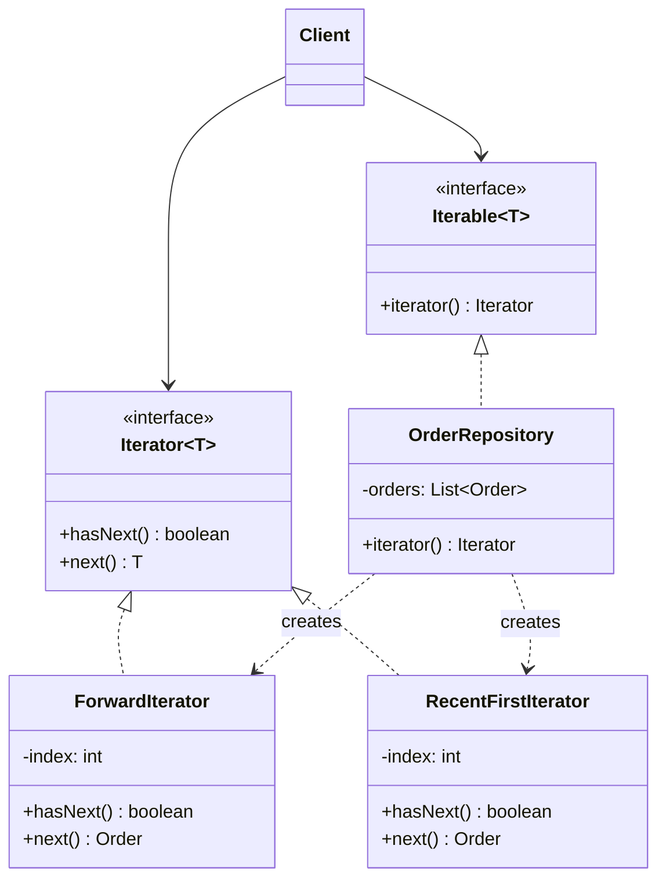

# Iterator

> **Amaç:** Bir koleksiyonun elemanlarını, iç yapısını açığa çıkarmadan sırayla
> gezmek.
> **Kategori:** Behavioral

---

## 1. Problem

Elinde farklı yapılarda koleksiyonlar var: bir dizi, bir bağlı liste, bir ağaç.
Hepsini gezen kod, her birinin iç yapısını bilmek zorunda kalıyor:

```java
// Dizi
for (int i = 0; i < array.length; i++) {
    process(array[i]);
}

// Bağlı liste
Node current = list.getHead();
while (current != null) {
    process(current.getValue());
    current = current.getNext();
}

// Ağaç — özyineleme çağıranda
void walk(TreeNode node) {
    if (node == null) return;
    walk(node.getLeft());
    process(node.getValue());
    walk(node.getRight());
}
```

Sorunlar:

- Gezme mantığı **istemcide**; koleksiyonun iç yapısı dışarı sızmış (Encapsulation ihlali)
- `getHead()`, `getNext()`, `getLeft()` gibi metotlar sırf gezinmek için public açılmış
- Yapı değişirse (bağlı listeden diziye geçiş) **tüm çağıranlar** kırılır
- Aynı koleksiyonu iki farklı sırayla gezmek istersen ikinci bir mekanizma gerekir

---

## 2. Çözüm

Gezme sorumluluğunu ayrı bir nesneye ver. İstemci yalnızca iki şey bilsin:
"başka eleman var mı" ve "sıradakini ver".

```java
public interface Iterator<T> {
    boolean hasNext();
    T next();
}
```

Koleksiyon kendi iterator'ını üretir; iç yapısını yalnızca o bilir.

```java
Iterator<Order> it = orders.iterator();
while (it.hasNext()) {
    process(it.next());
}
```

Aynı koleksiyon **birden çok iterator** verebilir: ileri, geri, filtreli,
derinlemesine, genişlemesine. Her biri kendi konumunu tutar; birbirini etkilemez.

---

## 3. Yapı



İki iterator aynı veriyi farklı sırayla verir; koleksiyonun kendisi değişmez.

---

## 4. Kod

Java'da `Iterable` implement etmek yeterlidir — dilin `for-each` sözdizimi
doğrudan bunun üzerine kuruludur:

```java
public class OrderHistory implements Iterable<Order> {

    private final List<Order> orders = new ArrayList<>();

    @Override
    public Iterator<Order> iterator() {
        return orders.iterator();          // en basit hâli: devret
    }

    /** İkinci bir gezinme sırası — en yeniden eskiye. */
    public Iterable<Order> recentFirst() {
        return () -> new Iterator<>() {
            private int index = orders.size() - 1;

            @Override
            public boolean hasNext() {
                return index >= 0;
            }

            @Override
            public Order next() {
                if (!hasNext()) throw new NoSuchElementException();
                return orders.get(index--);
            }
        };
    }
}
```

Kullanım — istemci hiçbir iç yapı bilmiyor:

```java
for (Order order : history) { ... }               // doğal sıra
for (Order order : history.recentFirst()) { ... } // ters sıra
```

### Kendi yapını gezerken

İç yapı gerçekten farklıysa iterator o farkı gizler. Aşağıda ağaç, düz bir
diziymiş gibi geziliyor:

```java
public class TreeIterator<T> implements Iterator<T> {

    private final Deque<TreeNode<T>> stack = new ArrayDeque<>();

    public TreeIterator(TreeNode<T> root) {
        pushLeftSpine(root);
    }

    @Override
    public boolean hasNext() {
        return !stack.isEmpty();
    }

    @Override
    public T next() {
        if (!hasNext()) throw new NoSuchElementException();
        TreeNode<T> node = stack.pop();
        pushLeftSpine(node.right());
        return node.value();
    }

    private void pushLeftSpine(TreeNode<T> node) {
        for (TreeNode<T> current = node; current != null; current = current.left()) {
            stack.push(current);
        }
    }
}
```

Özyineleme yığına çevrildi ve **koleksiyonun içinde** kaldı. İstemci hâlâ
`while (it.hasNext())` yazıyor.

### Fail-fast davranışı

Java'nın koleksiyon iterator'ları, gezerken koleksiyon dışarıdan değiştirilirse
patlar:

```java
List<String> list = new ArrayList<>(List.of("a", "b", "c"));

for (String value : list) {
    if (value.equals("b")) {
        list.remove(value);      // ❌ ConcurrentModificationException
    }
}

// Doğrusu: silmeyi iterator'ın kendisi yapar
Iterator<String> it = list.iterator();
while (it.hasNext()) {
    if (it.next().equals("b")) {
        it.remove();             // ✅
    }
}
```

Bu bir kusur değil, bilinçli tasarımdır: sessizce yanlış sonuç üretmek yerine
gürültüyle patlamak (Fail Fast).

---

## 5. Sektörde

| Nerede | Nasıl |
|---|---|
| **`java.util.Iterator`** | Pattern'in dile girmiş hâli; `for-each` bunun üzerine kurulu |
| **`Iterable`** | Bir sınıfı `for-each` ile gezilebilir yapan sözleşme |
| **`ListIterator`** | Çift yönlü gezinme, gezerken değiştirme |
| **`Spliterator`** (Java 8+) | Bölünebilir iterator; paralel akışların temeli |
| **`Stream`** | Gezinmeyi tersine çevirir: sen çekmezsin, akış iter (internal iteration) |
| **`Scanner`, `BufferedReader.lines()`** | Kaynağı satır satır gezme |
| **JDBC `ResultSet`** | `next()` ile satır satır ilerleme — aynı fikir |

`Stream` özellikle öğreticidir: klasik iterator'da döngüyü **sen** yazarsın
(external iteration), akışta ise ne yapılacağını verirsin, gezmeyi kütüphane
yapar (internal iteration). İkisi de aynı problemi farklı uçtan çözer.

---

## 6. Ne zaman kullanılmaz

| Durum | Neden |
|---|---|
| Standart koleksiyon kullanıyorsan | `List`, `Set`, `Map` zaten iterator veriyor; yenisini yazma |
| Rastgele erişim gerekiyorsa | `get(i)` daha uygun; iterator sıralı erişim içindir |
| Yalnızca dönüştürme/filtreleme yapılacaksa | `Stream` daha okunur |
| Koleksiyon gezinme sırasında değişecekse | Fail-fast patlar; `CopyOnWriteArrayList` veya açık kopya gerekir |

### Kendi iterator'ını yazmanın maliyeti

Elle yazılan iterator'lar sessiz hata üretmeye açıktır:

```java
@Override
public T next() {
    return items[index++];      // ❌ sınır kontrolü yok
}
```

Sözleşme nettir: eleman kalmadıysa `next()` **`NoSuchElementException`**
atmalıdır, `null` dönmemeli veya dizi hatası vermemelidir. `hasNext()` ise
yan etkisiz olmalıdır — çağırmak akışı ilerletmemelidir.

---

## 7. İlgili ve karıştırılan pattern'ler

| Pattern | Fark |
|---|---|
| **Composite** | Composite ağaç kurar; Iterator o ağacı gezer. Sık birlikte kullanılırlar. |
| **Visitor** | Iterator elemanları **verir**, ne yapılacağına istemci karar verir. Visitor işlemi elemanlara **taşır** ve tipe göre ayrışır. |
| **Stream / internal iteration** | Aynı problem, ters yön: iterator'da döngüyü sen yazarsın, akışta kütüphane. |
| **Memento** | Iterator'ın konumu da bir durumdur; kaydedilip geri yüklenmesi gerekirse Memento devreye girer. |
| **Factory Method** | `iterator()` bir Factory Method'dur: hangi somut iterator döneceğini koleksiyon seçer. |

---

## Prensip bağlantısı

- **Encapsulation** — iç yapı (dizi mi, ağaç mı, bağlı liste mi) dışarı sızmaz
- **SRP** — gezinme sorumluluğu koleksiyondan ayrılır
- **OCP** — yeni bir gezinme sırası = yeni iterator; koleksiyon değişmez
- **Fail Fast** — gezerken yapılan dış değişiklik sessizce tolere edilmez
- **Law of Demeter** — istemci `list.getHead().getNext()` zinciri kurmaz

> Iterator o kadar başarılı oldu ki artık bir pattern gibi görünmüyor: `for-each`
> yazdığın her satırda onu kullanıyorsun.
