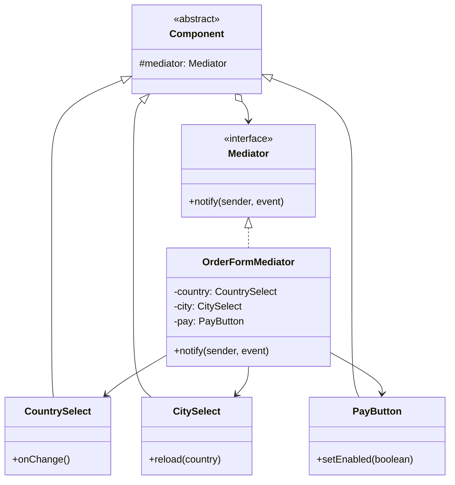

# Mediator

> **Amaç:** Birbirine doğrudan bağlı nesneleri ayırmak; iletişimi merkezî bir
> aracı üzerinden yürütmek.
> **Kategori:** Behavioral

---

## 1. Problem

Bir sipariş formu düşün: ülke seçimi şehir listesini dolduruyor, kargo tipi
teslimat tarihini değiştiriyor, kupon alanı toplamı güncelliyor, toplam sıfırsa
ödeme düğmesi kapanıyor.

Her bileşen diğerlerini doğrudan tanıyınca şu ortaya çıkar:

```java
public class CountrySelect {

    private final CitySelect citySelect;
    private final ShippingPanel shippingPanel;
    private final TotalLabel totalLabel;
    private final PayButton payButton;

    public void onChange(Country country) {
        citySelect.reload(country);
        shippingPanel.updateOptions(country);
        totalLabel.recalculate();
        payButton.setEnabled(totalLabel.value() > 0);
    }
}
```

Sorunlar:

- Her bileşen diğer dördünü tanıyor: `N` bileşen için `N × (N-1)` bağlantı
- `CountrySelect` tek başına test edilemez; dört bağımlılık kurman gerekir
- Yeni bir kural ("KDV muaf ülkede vergi satırı gizlensin") **hangi sınıfa**
  yazılacağı belirsiz — mantık bileşenlere dağılır
- Aynı bileşeni başka bir formda yeniden kullanmak imkânsız; komşularına çivili

Bu, **Big Ball of Mud**'un küçük ölçekli hâlidir: herkes herkesi tanıyor.

---

## 2. Çözüm

Bileşenler birbirini değil, tek bir **aracıyı** tanısın. Bileşen "bende şu
oldu" der; ne olacağına aracı karar verir.

```
ÖNCE                          SONRA
────────────────────          ────────────────────
 A ─── B                       A     B
 │ ╲ ╱ │                        ╲   ╱
 │  ╳  │                         ╲ ╱
 │ ╱ ╲ │                      Mediator
 C ─── D                         ╱ ╲
                                ╱   ╲
 N×(N-1) bağlantı              C     D
                               N bağlantı
```

Etkileşim kuralları tek yerde toplanır: forma bakan biri "ülke değişince ne
olur" sorusunu tek dosyada okur.

---

## 3. Yapı



Dikkat: oklar **tek yönlü değil**. Bileşen aracıyı tanır, aracı da bileşenleri
tanır. Bu, Facade'den ayrıldığı yerdir — orada alt sistem facade'i bilmez.

---

## 4. Kod

```java
public interface FormMediator {
    void notify(Component sender, String event);
}

public abstract class Component {

    protected final FormMediator mediator;

    protected Component(FormMediator mediator) {
        this.mediator = mediator;
    }
}
```

Bileşen yalnızca kendi işini yapar ve olanı bildirir:

```java
public class CountrySelect extends Component {

    private Country selected;

    public CountrySelect(FormMediator mediator) {
        super(mediator);
    }

    public void select(Country country) {
        this.selected = country;
        mediator.notify(this, "countryChanged");   // sonuçlarını bilmiyor
    }

    public Country selected() {
        return selected;
    }
}
```

Kurallar tek yerde:

```java
public class OrderFormMediator implements FormMediator {

    private final CountrySelect country;
    private final CitySelect city;
    private final ShippingPanel shipping;
    private final TotalLabel total;
    private final PayButton payButton;

    @Override
    public void notify(Component sender, String event) {
        switch (event) {
            case "countryChanged" -> {
                city.reload(country.selected());
                shipping.updateOptions(country.selected());
                recalculate();
            }
            case "couponApplied", "shippingChanged" -> recalculate();
            default -> { /* ilgilenmediğimiz olaylar sessizce geçer */ }
        }
    }

    private void recalculate() {
        total.recalculate();
        payButton.setEnabled(total.value().signum() > 0);
    }
}
```

`CountrySelect` artık tek başına test edilebilir: sahte bir mediator verip
"countryChanged" bildiriminin gönderildiğini doğrulamak yeterli.

### Olay tabanlı biçim — Spring'de yaygın hâli

`switch` büyüdükçe okunmaz olur. Aynı fikir olay nesneleriyle kurulduğunda
aracı da genelleşir:

```java
@Component
public class InventoryListener {

    @EventListener
    public void onOrderPaid(OrderPaidEvent event) {
        inventory.reserve(event.orderId());
    }
}

// Yayıncı, kimin dinlediğini bilmez:
publisher.publishEvent(new OrderPaidEvent(order.id()));
```

Burada `ApplicationEventPublisher` aracıdır. Bileşenler birbirini tanımaz;
bağlantı olay tipi üzerinden kurulur.

> Bu biçim Observer'a çok yaklaşır. Ayrım niyettedir: **Mediator koordinasyon
> kuralını sahiplenir** ("bu olduysa şunlar yapılır"), Observer yalnızca haber
> dağıtır ve dinleyicilerin ne yaptığıyla ilgilenmez.

---

## 5. Sektörde

| Nerede | Aracı ne yapar |
|---|---|
| **Spring `ApplicationEventPublisher`** | Yayıncı ile dinleyiciyi birbirinden habersiz kılar |
| **Spring MVC `DispatcherServlet`** | İsteği doğru controller, view resolver ve converter'a yönlendirir |
| **MVC / MVP'de Controller** | View ile model arasındaki koordinasyonu üstlenir |
| **Mesaj brokerleri (Kafka, RabbitMQ)** | Servisler arası Mediator; üretici tüketiciyi tanımaz |
| **`ExecutorService`** | Görev üretenlerle çalıştıran thread'ler arasında aracıdır |
| **UI dialog / form denetleyicileri** | Widget'lar arası kuralları merkezde tutar |

`DispatcherServlet` en tanıdık örnektir: controller'lar birbirini tanımaz,
hepsi merkezden çağrılır.

---

## 6. Ne zaman kullanılmaz

| Durum | Neden |
|---|---|
| İki bileşen varsa | Doğrudan bağlantı daha basit; aracı gereksiz katman |
| İlişkiler basit ve sabitse | Karmaşıklığı taşımaya değmez |
| Bileşenler zaten bağımsızsa | Ortada çözülecek bir düğüm yok |
| Aracı her şeyi bilmeye başladıysa | God Object'e dönüşür — asıl risk budur |

### Asıl risk: aracının şişmesi

```java
// Kokan aracı
public class AppMediator implements Mediator {
    public void notify(Component sender, String event) {
        // 400 satır, 30 case
    }
}
```

Bağlantı karmaşası ortadan kalkmaz, **tek bir sınıfa taşınır**. Sağlıklı sınır:
her aracı **tek bir ekranın veya tek bir akışın** kurallarını tutar. Uygulama
genelinde tek aracı, düğümü çözmek yerine adresini değiştirmektir.

Ayrıca dolaylılık bedeli vardır: "bu düğmeye basınca ne oluyor" sorusunun
cevabı artık düğmenin kodunda değildir.

---

## 7. İlgili ve karıştırılan pattern'ler

| Pattern | Fark |
|---|---|
| **Facade** | Facade **tek yönlüdür**: istemci facade'i tanır, alt sistem onun varlığından habersizdir. Mediator'da bileşenler aracıyı **bilir** ve ona bildirim gönderir. Facade sadeleştirir, Mediator koordine eder. |
| **Observer** | Observer haber dağıtır, sonuçla ilgilenmez; Mediator "bu olduysa şu yapılır" kuralını sahiplenir. Mediator sık sık Observer üzerine kurulur. |
| **Chain of Responsibility** | CoR'da nesneler sıralı bir hat oluşturur ve isteği devreder; Mediator'da hepsi merkeze konuşur. |
| **Command** | Aracının aldığı bildirimler komut nesneleri olarak modellenebilir. |
| **Singleton** | Aracılar sık sık tekil yapılır; gerekli değildir ve DI ile yönetmek daha iyidir. |

---

## Prensip bağlantısı

- **Low Coupling** — pattern'in varlık sebebi: `N × (N-1)` bağlantı `N`'e iner
- **SRP** — bileşen kendi işini yapar, koordinasyon kuralı ona ait değildir
- **High Cohesion** — bir akışın kuralları dağılmak yerine tek yerde toplanır
- **God Object riski** — aynı prensipler aracının sınırsız büyümesine karşı da uyarır

> Mediator bağlantı karmaşasını yok etmez, onu görünür ve tek bir yerde
> yönetilebilir kılar. Bu yüzden aracının kendisini küçük tutmak pattern'in
> parçasıdır, ayrıntısı değil.
