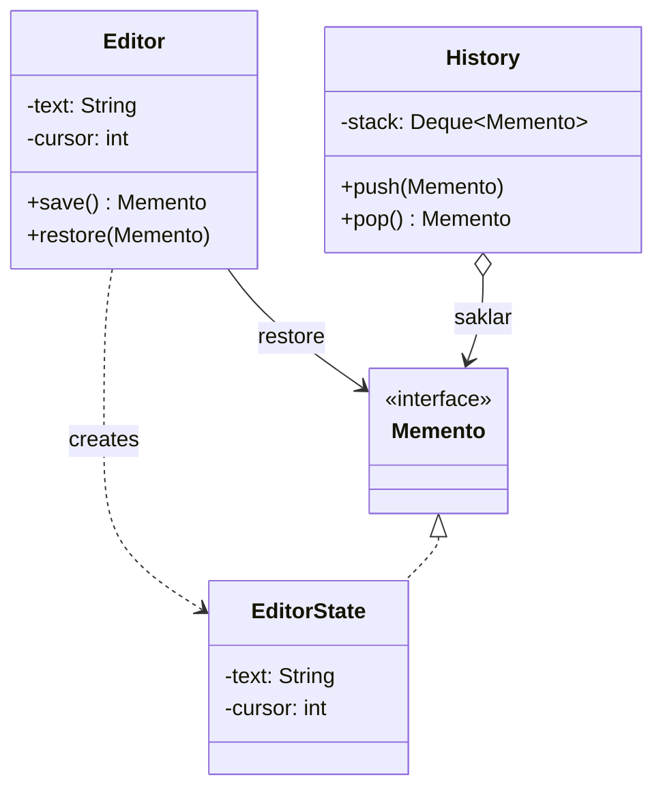

# Memento

> **Amaç:** Bir nesnenin durumunu, kapsüllemesini bozmadan dışarıda saklamak ve
> gerektiğinde geri yüklemek.
> **Kategori:** Behavioral

---

## 1. Problem

Bir metin düzenleyicide "geri al" isteniyor. İlk refleks, durumu dışarıdan
okuyup saklamaktır:

```java
public class Editor {
    private String text;
    private int cursorPosition;
    private Set<TextRange> selections;
    private Map<TextRange, Style> styles;

    // Geri alma için hepsini dışarı açmak zorunda kaldık
    public String getText() { return text; }
    public int getCursorPosition() { return cursorPosition; }
    public Set<TextRange> getSelections() { return selections; }
    public Map<TextRange, Style> getStyles() { return styles; }

    public void setText(String text) { this.text = text; }
    public void setCursorPosition(int position) { ... }
    // ... her alan için setter
}
```

```java
// Geçmişi tutan sınıf
Snapshot snapshot = new Snapshot(
        editor.getText(),
        editor.getCursorPosition(),
        editor.getSelections(),      // ← mutable koleksiyon referansı sızdı
        editor.getStyles());
```

Sorunlar:

- Kapsülleme çöktü: durum sırf yedeklemek için tamamen public oldu
- `History` sınıfı, `Editor`'ın **iç yapısını** bilmek zorunda; alan eklenirse
  iki sınıf birden değişir
- Koleksiyon referansları paylaşıldığı için "yedek" sonradan değişebilir —
  geri alınca yanlış duruma dönersin
- Editörün geçerlilik kuralları (`cursorPosition` metin uzunluğunu aşamaz)
  dışarıdan `set` ile bozulabilir

---

## 2. Çözüm

Durumu **nesnenin kendisi** paketlesin. Dışarıya kapalı bir "anlık görüntü"
üretsin; geçmişi tutan taraf onun içine bakamasın, yalnızca saklayıp geri
verebilsin.

Üç rol vardır:

| Rol | Sorumluluk |
|---|---|
| **Originator** | Durumu olan nesne; snapshot üretir ve ondan geri yüklenir |
| **Memento** | Durumun kapalı kutusu; dışarıya anlamlı bir yüzey açmaz |
| **Caretaker** | Memento'ları saklar; içeriğine **bakmaz** |

```java
Memento snapshot = editor.save();   // içine bakamıyorum
history.push(snapshot);
...
editor.restore(history.pop());      // ne olduğunu bilmeden geri yükledim
```

Kapsülleme korunur: `Editor` alan ekleyip çıkarabilir, `History` hiç değişmez.

---

## 3. Yapı



`EditorState` sınıfı `Editor`'ın içinde tanımlanır; `History` yalnızca boş
`Memento` arayüzünü görür. İçeriğe erişim yoktur.

---

## 4. Kod

```java
public interface Memento {
    /** Kullanıcıya gösterilecek etiket — durumun kendisi değil. */
    String label();
}
```

```java
public class Editor {

    private String text = "";
    private int cursor = 0;
    private final List<TextRange> selections = new ArrayList<>();

    /** Anlık görüntü: dışarıdan okunamaz, yalnızca Editor açabilir. */
    private final class EditorState implements Memento {

        private final String text;
        private final int cursor;
        private final List<TextRange> selections;
        private final Instant takenAt = Instant.now();

        private EditorState() {
            this.text = Editor.this.text;
            this.cursor = Editor.this.cursor;
            // Savunmacı kopya — yedek sonradan değişmesin
            this.selections = List.copyOf(Editor.this.selections);
        }

        @Override
        public String label() {
            return takenAt + " · " + text.length() + " karakter";
        }
    }

    public Memento save() {
        return new EditorState();
    }

    public void restore(Memento memento) {
        if (!(memento instanceof EditorState state)) {
            throw new IllegalArgumentException("Bu editöre ait olmayan anlık görüntü");
        }
        this.text = state.text;
        this.cursor = state.cursor;
        this.selections.clear();
        this.selections.addAll(state.selections);
    }
}
```

İki nokta kritik:

1. **`EditorState` iç sınıftır** — dışarıdan alanlarına erişilemez, ama `Editor`
   kendi iç sınıfının private alanlarını okuyabilir.
2. **Savunmacı kopya** — `List.copyOf` olmadan yedek, canlı listeyle aynı
   nesneyi paylaşırdı ve "yedek" anlamını kaybederdi.

Caretaker hiçbir şey bilmiyor:

```java
public class History {

    private final Deque<Memento> undoStack = new ArrayDeque<>();
    private final int limit;

    public void save(Editor editor) {
        if (undoStack.size() >= limit) {
            undoStack.removeLast();      // sınırsız büyümesin
        }
        undoStack.push(editor.save());
    }

    public void undo(Editor editor) {
        Memento previous = undoStack.poll();
        if (previous != null) {
            editor.restore(previous);
        }
    }

    /** Kullanıcıya geçmiş listesi — içeriğe değil etikete bakar. */
    public List<String> labels() {
        return undoStack.stream().map(Memento::label).toList();
    }
}
```

### Record ile sadeleşen hâl

Durum küçük ve zaten immutable ise ayrı bir arayüze gerek kalmayabilir:

```java
public record EditorSnapshot(String text, int cursor, List<TextRange> selections) {
    public EditorSnapshot {
        selections = List.copyOf(selections);   // compact constructor'da kopya
    }
}
```

Bu, kapsüllemeyi biraz gevşetir (alanlar okunabilir) ama çoğu uygulamada kabul
edilebilir bir takastır. Kapalılık gerçekten önemliyse iç sınıf biçimine dön.

---

## 5. Sektörde

| Nerede | Nasıl |
|---|---|
| **Veritabanı transaction / savepoint** | `rollback()` bir Memento geri yüklemesidir |
| **Hibernate dirty checking** | Yüklenen entity'nin ilk hâli saklanır, değişiklik onunla karşılaştırılır |
| **`Serializable` ile derin kopya** | Nesne durumunun bayt dizisine alınması |
| **IDE / editör undo yığınları** | Pattern'in kanonik kullanım alanı |
| **Git commit** | Çalışma ağacının anlık görüntüsü — kavramsal olarak aynı fikir |
| **React/Redux "time travel"** | Durum anlık görüntülerinin listesi |

JDK'da doğrudan bir `Memento` arayüzü yoktur; pattern daha çok tasarım
düzeyinde uygulanır.

---

## 6. Ne zaman kullanılmaz

| Durum | Neden |
|---|---|
| Durum zaten immutable ise | Nesnenin kendisi bir anlık görüntüdür; kopyalamaya gerek yok |
| Durum çok büyükse | Her adımda tam kopya bellek tüketir; fark (delta) tutmak gerekir |
| Geri alma ters işlemle mümkünse | Command'ın `undo()`'su yeterli olabilir |
| Durum dış kaynak içeriyorsa | Açık dosya, soket veya bağlantı geri yüklenemez |
| Anlık görüntü dışarıya sızacaksa | Kapsülleme kazancı kaybolur; pattern anlamsızlaşır |

### Bellek: asıl maliyet

```java
// Her tuş vuruşunda tam kopya — 10 MB'lık belgede felaket
editor.onKeyPress(key -> history.save(editor));
```

Pratik çözümler: anlık görüntüyü **anlamlı sınırlarda** almak (kelime sonu,
satır sonu, kaydetme), yığını sınırlamak ve büyük belgelerde tam durum yerine
**değişiklik farkını** saklamak.

---

## 7. İlgili ve karıştırılan pattern'ler

| Pattern | Fark |
|---|---|
| **Command** | Command işlemi paketler; Memento durumu. `undo()` için gereken durumu saklamanın doğru yolu Memento'dur — sık birlikte kullanılırlar. |
| **Prototype** | İkisi de nesnenin kopyasını üretir. Prototype'ın kopyası **yeni, bağımsız ve kullanılabilir** bir nesnedir; Memento dışarıya kapalıdır ve tek amacı geri yüklemedir. |
| **State** | State davranışı durum nesnesine devreder; Memento durumu yalnızca saklar, davranışı yoktur. |
| **Iterator** | Bir iterator'ın konumu da saklanacak bir durumdur; Memento ile dondurulabilir. |

---

## Prensip bağlantısı

- **Encapsulation** — pattern'in tamamı bu prensip için vardır: durumu yedeklemek
  uğruna alanları public yapmak zorunda kalmazsın
- **SRP** — durumu üretmek Originator'ın, saklamak Caretaker'ın işidir
- **Immutability** — anlık görüntü değişmez olmalı; savunmacı kopya olmadan
  "yedek" sözü tutulmaz (Bkz. PRINCIPLES.md — Immutability)
- **Information Hiding** — Caretaker sakladığı şeyin ne olduğunu bilmez

> Memento'nun ölçüsü şudur: geçmişi tutan sınıf, durum alanlarından birinin adını
> bile biliyorsa kapsülleme sızmış demektir.
