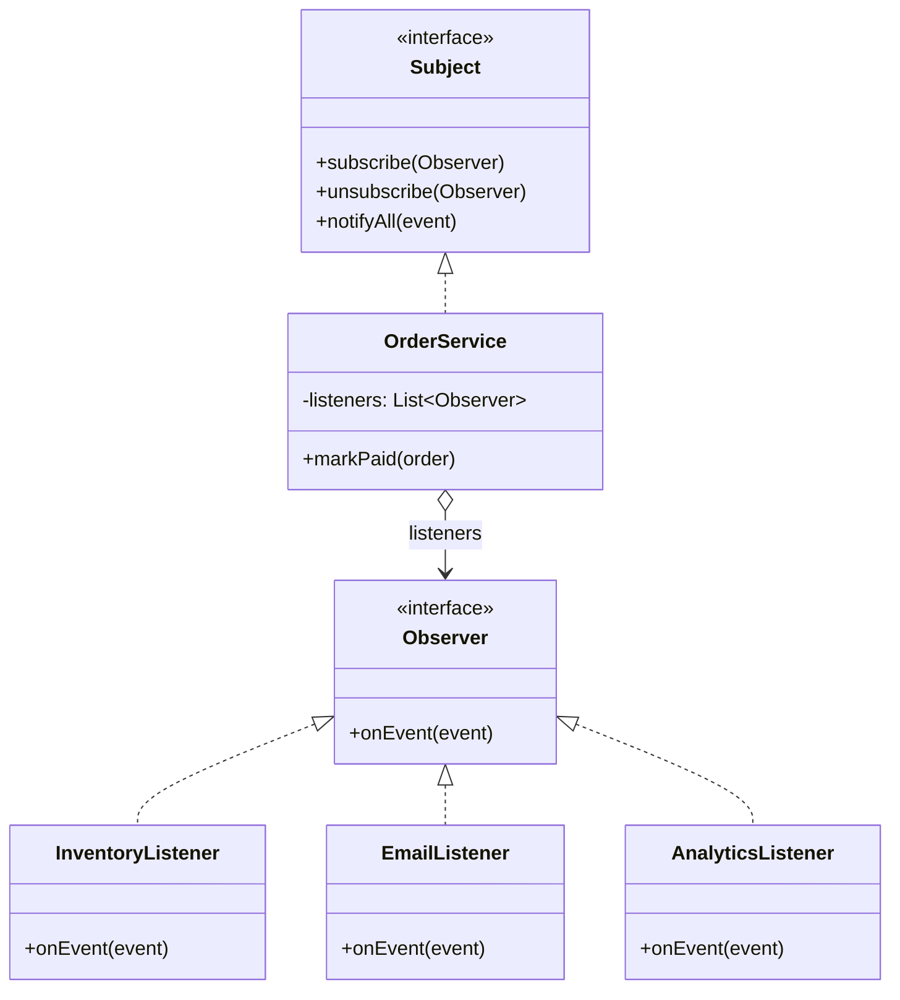

# Observer

> **Amaç:** Bir nesnenin durumu değiştiğinde, ona bağımlı nesnelerin
> kendiliğinden haberdar olmasını sağlamak.
> **Kategori:** Behavioral

---

## 1. Problem

Sipariş ödendiğinde birkaç şey olması gerekiyor: stok düşülecek, fatura
kesilecek, müşteriye e-posta gidecek, analitiğe olay yazılacak.

```java
public class OrderService {

    private final InventoryService inventory;
    private final InvoiceService invoices;
    private final EmailService email;
    private final AnalyticsClient analytics;
    private final LoyaltyService loyalty;      // dün eklendi
    private final WarehouseClient warehouse;   // bugün eklendi

    public void markPaid(Order order) {
        order.setStatus(PAID);
        repository.save(order);

        inventory.reduce(order.items());
        invoices.create(order);
        email.sendReceipt(order);
        analytics.track("order_paid", order.id());
        loyalty.addPoints(order);
        warehouse.schedulePickup(order);
    }
}
```

Sorunlar:

- `OrderService` altı ayrı alt sistemi tanıyor ve sayı büyüyor
- Her yeni yan etki bu **çalışan, test edilmiş** metodu açtırıyor — OCP ihlali
- Sipariş ödeme mantığını test etmek için altı mock gerekiyor
- Analitik servisi patlarsa ödeme akışı da patlıyor; oysa ikisi aynı önemde değil
- Aynı olay başka yerlerde de oluyor (admin panelinden ödeme işaretleme) —
  liste orada da tekrarlanıyor

Asıl mesele: `OrderService` **kimin ilgilendiğini** bilmek zorunda olmamalı.

---

## 2. Çözüm

Olayı duyur; kimin dinlediğiyle ilgilenme.

```java
public interface OrderListener {
    void onOrderPaid(Order order);
}
```

```java
public class OrderService {

    private final List<OrderListener> listeners;   // dışarıdan verilir

    public void markPaid(Order order) {
        order.setStatus(PAID);
        repository.save(order);

        for (OrderListener listener : listeners) {
            listener.onOrderPaid(order);
        }
    }
}
```

Artık yeni bir yan etki eklemek, **yeni bir dinleyici sınıfı yazmaktır**;
`OrderService` bir daha açılmaz.

İki yönlü kazanç:

- Yayıncı dinleyicileri tanımaz (gevşek bağlılık)
- Dinleyiciler birbirini tanımaz (bağımsız eklenip çıkarılabilir)

---

## 3. Yapı



Ok yönü kritik: yayıncı yalnızca `Observer` **arayüzünü** tanır, somut
dinleyicileri değil.

---

## 4. Kod

```java
public record OrderPaidEvent(String orderId, Money total, Instant occurredAt) { }

public interface OrderListener {
    void onOrderPaid(OrderPaidEvent event);
}
```

Olayı bir **record** olarak modellemek, dinleyicinin siparişin tamamını (ve
onun mutable hâlini) görmesini engeller — yalnızca gereken veri taşınır.

```java
public class OrderService {

    private final List<OrderListener> listeners;

    public OrderService(List<OrderListener> listeners) {
        this.listeners = List.copyOf(listeners);
    }

    public void markPaid(Order order) {
        order.markPaid();
        repository.save(order);

        publish(new OrderPaidEvent(order.id(), order.total(), Instant.now()));
    }

    private void publish(OrderPaidEvent event) {
        for (OrderListener listener : listeners) {
            try {
                listener.onOrderPaid(event);
            } catch (RuntimeException exception) {
                // Bir dinleyicinin hatası diğerlerini ve asıl akışı düşürmemeli.
                log.error("Dinleyici hata verdi: {}", listener.getClass().getSimpleName(), exception);
            }
        }
    }
}
```

> Bu `try-catch` bilinçli bir karardır ve genel "exception yutma" kuralının
> istisnasıdır: analitik servisinin çökmesi ödemeyi geri almamalıdır. Ama hata
> **loglanır**; sessizce yutulmaz. Kritik yan etkiler (fatura kesme) dinleyici
> değil, akışın kendisi olmalıdır.

Dinleyiciler bağımsız ve tek başına test edilebilir:

```java
public class InventoryListener implements OrderListener {

    private final InventoryService inventory;

    @Override
    public void onOrderPaid(OrderPaidEvent event) {
        inventory.reduceFor(event.orderId());
    }
}
```

### Spring'de hazır hâli

Spring bu mekanizmayı kutudan verir; kendi listeni yönetmene gerek kalmaz:

```java
@Service
public class OrderService {

    private final ApplicationEventPublisher publisher;

    public void markPaid(Order order) {
        order.markPaid();
        repository.save(order);
        publisher.publishEvent(new OrderPaidEvent(order.id(), order.total(), Instant.now()));
    }
}

@Component
public class EmailListener {

    @EventListener
    public void on(OrderPaidEvent event) {
        email.sendReceipt(event.orderId());
    }
}
```

`@TransactionalEventListener` ile dinleyicinin **transaction commit edildikten
sonra** çalışması sağlanabilir — "e-posta gitti ama sipariş kaydedilmedi"
sınıfını ortadan kaldırır.

---

## 5. Sektörde

| Nerede | Nasıl |
|---|---|
| **Spring `ApplicationEvent` / `@EventListener`** | Uygulama içi olay yayını |
| **`PropertyChangeListener`** | JavaBeans'in klasik observer altyapısı |
| **Swing / AWT listener'ları** | `addActionListener`, `addMouseListener` |
| **Reactive Streams (`Flow.Publisher`)** | Java 9+; observer'ın geri-basınçlı (backpressure) hâli |
| **Mesaj kuyrukları** | Süreçler arası observer; dinleyici ayrı bir uygulamadır |
| **`java.util.Observer`** | Pattern'in JDK'daki ilk hâli — **Java 9'da deprecated edildi** |

`java.util.Observer` neden bırakıldı: olayları tiplendirmiyordu (`Object`
taşıyordu), bildirim sırası garanti değildi, serileştirme ve thread güvenliği
sorunluydu. Bugün yerine `PropertyChangeListener`, framework olay altyapıları
veya Reactive Streams kullanılır.

---

## 6. Ne zaman kullanılmaz

| Durum | Neden |
|---|---|
| Dinleyici tek ve sabitse | Doğrudan çağır; dolaylılık kazanç getirmez |
| Yan etkinin **sırası** önemliyse | Observer sıra garantisi vermez; akışı açıkça yaz |
| Yan etki kritikse ve başarısızlığı kabul edilemezse | Dinleyici değil, ana akışın parçası olmalı |
| Akışı izlemek zorlaşıyorsa | "Bu olaydan sonra ne oluyor" sorusunun cevabı kodda görünmez hâle gelir |

### Bilinen tuzaklar

**1. Bellek sızıntısı.** Kaydolan ama hiç çıkmayan dinleyici, yayıncı yaşadığı
sürece toplanamaz:

```java
service.subscribe(this);     // ❌ karşılığı olmayan kayıt
// ...nesne artık kullanılmıyor ama listede duruyor
```

Uzun ömürlü yayıncılarda `unsubscribe` çağrısı zorunludur; UI çerçevelerinde bu
en sık görülen sızıntı sebebidir.

**2. Görünmez akış.** Anotasyonla bağlanan dinleyiciler kodda görünmez. Yeni
gelen biri `publishEvent` satırına bakıp ne olduğunu anlayamaz — bu, Principle
of Least Astonishment ile gerilim yaratır.

**3. Zincirleme olaylar.** Dinleyici içinde yeni olay yayınlamak, izlenmesi çok
zor döngülere yol açabilir.

---

## 7. İlgili ve karıştırılan pattern'ler

| Pattern | Fark |
|---|---|
| **Mediator** | Mediator koordinasyon **kuralını** sahiplenir ("bu olduysa şunlar yapılır"); Observer yalnızca haber dağıtır ve sonucuyla ilgilenmez. Mediator sık sık Observer üzerine kurulur. |
| **Chain of Responsibility** | CoR'da istek genelde **ilk** karşılayanda durur; Observer'da bildirim **herkese** gider. |
| **Command** | Command bir işlemin yapılmasını **ister**; Observer bir şeyin olduğunu **bildirir**. |
| **Publish-Subscribe** | Observer'ın süreç sınırlarını aşan hâli: araya bir broker girer, yayıncı ile abone birbirinden tamamen habersizdir. |
| **Strategy** | İkisi de dışarıdan verilen nesnelere delege eder; Strategy tek bir davranışı seçer, Observer birden çok tarafa haber verir. |

---

## Prensip bağlantısı

- **OCP** — yeni yan etki = yeni dinleyici; yayıncı kodu değişmez
- **Low Coupling** — yayıncı, kimin dinlediğini bilmez
- **SRP** — her yan etki kendi sınıfında yaşar
- **Test edilebilirlik** — ana akış tek başına, dinleyiciler tek tek test edilir
  (Bkz. TESTING.md — Mock ne zaman tasarım kokusudur)
- **PoLA ile gerilim** — akış kodda görünmez hâle geldiği için olay adları ve
  dinleyici konumları özenle seçilmelidir

> Observer, "kim ilgileniyor" sorusunu yayıncının üzerinden alır. Bedeli şudur:
> programın akışı artık tek bir dosyada okunmuyor.
