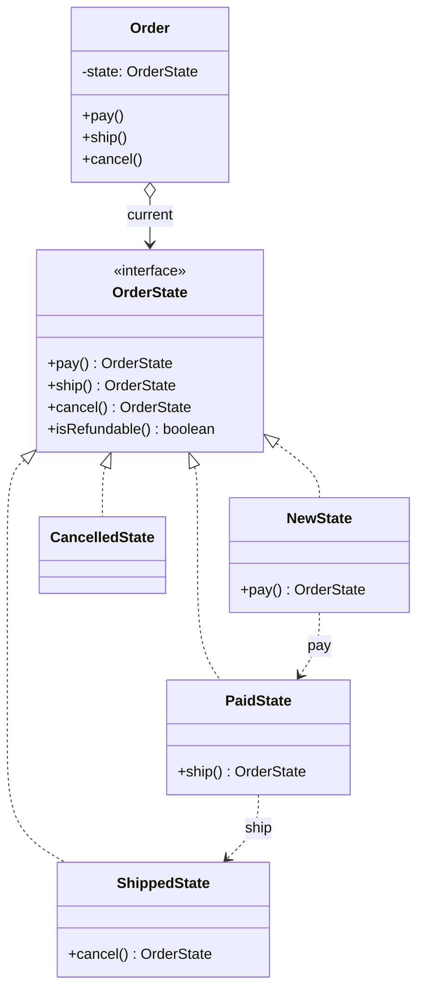

# State

> **Amaç:** Bir nesnenin davranışını, iç durumu değiştiğinde sanki sınıfı
> değişmiş gibi değiştirmek.
> **Kategori:** Behavioral

---

## 1. Problem

Bir siparişin yaşam döngüsü var: `NEW → PAID → SHIPPED → DELIVERED`, araya da
`CANCELLED` giriyor. Her işlem hangi durumda yapılabileceğini kendisi kontrol
ediyor:

```java
public class Order {

    private OrderStatus status;

    public void pay() {
        if (status != NEW) {
            throw new IllegalStateException("Sadece yeni sipariş ödenebilir");
        }
        status = PAID;
    }

    public void ship() {
        if (status != PAID) {
            throw new IllegalStateException("Ödenmemiş sipariş kargolanamaz");
        }
        status = SHIPPED;
    }

    public void cancel() {
        if (status == SHIPPED || status == DELIVERED) {
            throw new IllegalStateException("Kargolanmış sipariş iptal edilemez");
        }
        if (status == CANCELLED) {
            throw new IllegalStateException("Zaten iptal edilmiş");
        }
        status = CANCELLED;
    }

    public boolean isRefundable() {
        return status == PAID || status == SHIPPED;
    }
    // ... her metotta aynı durum kontrolü tekrar
}
```

Sorunlar:

- Aynı durum ayrımı **her metotta** yeniden yazılıyor
- Yeni bir durum (`RETURNED`) eklemek, sınıftaki bütün metotları açtırıyor — OCP ihlali
- Hangi geçişin mümkün olduğu tek bir yerde görünmüyor; kuralları okumak için
  bütün metotları taramak gerek
- Bir metotta unutulan kontrol, geçersiz duruma sessizce izin verir

---

## 2. Çözüm

Her durumu kendi nesnesine al. Nesne, o durumda **hangi davranışın mümkün
olduğunu** kendisi bilsin; geçiş kararını da o versin.

```java
public interface OrderState {
    OrderState pay();
    OrderState ship();
    OrderState cancel();
    boolean isRefundable();
}
```

`Order` artık karar vermez, devreder:

```java
public void pay() {
    state = state.pay();
}
```

Kazanç: bir durumun **bütün kuralları tek dosyada** toplanır. "Kargolanmış
sipariş ne yapabilir?" sorusunun cevabı `ShippedState` sınıfıdır.

---

## 3. Yapı



Kesikli oklar geçişleri gösterir: bir durum, hangi duruma geçileceğini kendisi
belirler.

---

## 4. Kod

```java
public interface OrderState {

    String name();

    default OrderState pay() {
        throw new IllegalStateException(name() + " durumunda ödeme yapılamaz");
    }

    default OrderState ship() {
        throw new IllegalStateException(name() + " durumunda kargolama yapılamaz");
    }

    default OrderState cancel() {
        throw new IllegalStateException(name() + " durumunda iptal edilemez");
    }

    default boolean isRefundable() {
        return false;
    }
}
```

`default` metotlar burada önemli bir iş yapar: **varsayılan "yapılamaz"dır.**
Her durum yalnızca izin verdiği geçişi yazar; unutulan bir metot sessizce
izin vermek yerine anlamlı bir hata verir (Fail Fast).

```java
public final class NewState implements OrderState {
    @Override public String name() { return "NEW"; }

    @Override public OrderState pay()    { return new PaidState(); }
    @Override public OrderState cancel() { return new CancelledState(); }
}

public final class PaidState implements OrderState {
    @Override public String name() { return "PAID"; }

    @Override public OrderState ship()   { return new ShippedState(); }
    @Override public OrderState cancel() { return new CancelledState(); }
    @Override public boolean isRefundable() { return true; }
}

public final class ShippedState implements OrderState {
    @Override public String name() { return "SHIPPED"; }

    @Override public boolean isRefundable() { return true; }
    // pay, ship, cancel yazılmadı → hepsi anlamlı hata verir
}
```

Bağlam sınıfı sadeleşir:

```java
public class Order {

    private OrderState state = new NewState();

    public void pay()    { state = state.pay(); }
    public void ship()   { state = state.ship(); }
    public void cancel() { state = state.cancel(); }

    public boolean isRefundable() { return state.isRefundable(); }
    public String status() { return state.name(); }
}
```

`Order` içinde tek bir `if` kalmadı.

### Enum ile — Java'da en pratik biçim

Durumlar durumsuzsa (alan tutmuyorsa) enum daha az dosya ve daha az nesne
üretir:

```java
public enum OrderState {

    NEW {
        @Override public OrderState pay()    { return PAID; }
        @Override public OrderState cancel() { return CANCELLED; }
    },
    PAID {
        @Override public OrderState ship()   { return SHIPPED; }
        @Override public OrderState cancel() { return CANCELLED; }
        @Override public boolean isRefundable() { return true; }
    },
    SHIPPED {
        @Override public boolean isRefundable() { return true; }
    },
    CANCELLED;

    public OrderState pay()    { throw new IllegalStateException(this + " → pay"); }
    public OrderState ship()   { throw new IllegalStateException(this + " → ship"); }
    public OrderState cancel() { throw new IllegalStateException(this + " → cancel"); }
    public boolean isRefundable() { return false; }
}
```

Bu biçim veritabanına yazmayı da kolaylaştırır: durum zaten adlandırılmış bir
sabittir. Durum nesnesinin kendi alanları olacaksa (ör. `ShippedState` kargo
takip numarası tutuyorsa) sınıf biçimine dönmek gerekir.

---

## 5. Sektörde

| Nerede | Nasıl |
|---|---|
| **Spring State Machine** | Durum ve geçişleri açıkça tanımlayan ayrı bir proje |
| **TCP bağlantı durumları** | `LISTEN`, `SYN_SENT`, `ESTABLISHED` — kanonik durum makinesi |
| **`Thread.State`** | Durumları adlandırır (pattern'in kendisi değil, ama aynı model) |
| **İş akışı motorları** | Sipariş, başvuru, onay süreçleri |
| **Oyun karakteri davranışı** | Yürüyor / koşuyor / düşüyor durumlarına göre farklı girdi işleme |
| **Ödeme sağlayıcı entegrasyonları** | `pending`, `authorized`, `captured`, `refunded` |

JDK'da doğrudan bir State altyapısı yoktur; pattern uygulama düzeyinde kurulur.

---

## 6. Ne zaman kullanılmaz

| Durum | Neden |
|---|---|
| İki durum ve tek geçiş varsa | `boolean` alan yeterli; sınıf açmak gürültü |
| Durumlar davranışı değiştirmiyorsa | Yalnızca etiketse `enum` sabiti yeter |
| Geçişler serbestse | Kısıtlanacak bir kural yoksa pattern'in kazancı yok |
| Durum sayısı çok fazlaysa | Sınıf patlaması; tablo tabanlı geçiş tanımı daha yönetilebilir |

### En sık yapılan hata: durumu iki yerde tutmak

```java
public class Order {
    private OrderState state;
    private String status;          // ❌ ikinci kaynak

    public void pay() {
        state = state.pay();
        status = "PAID";            // el ile senkron — er ya da geç kayar
    }
}
```

Durumun **tek bir doğruluk kaynağı** olmalıdır. Görüntülenecek metin de o
kaynaktan türetilir (`state.name()`), ayrı tutulmaz.

### Geçiş yan etkileri nereye yazılır

Durum değişince e-posta gitmesi gerekiyorsa bu kodu durum sınıfına koymak
cazip gelir; ama o zaman durum nesnesi altyapıyı tanımaya başlar. Daha temizi:
geçişi yapan bağlam bir olay yayınlar, yan etkileri dinleyiciler üstlenir
(Bkz. 18-observer.md — Çözüm).

---

## 7. İlgili ve karıştırılan pattern'ler

| Pattern | Fark |
|---|---|
| **Strategy** | Yapıları **neredeyse aynıdır**. Strategy'de algoritmayı **dışarıdan istemci** seçer ve nesne kendini değiştirmez; State'te geçişe **durumun kendisi** karar verir ve bağlamın davranışı zaman içinde değişir. |
| **Bridge** | Yine benzer yapı; Bridge'te implementasyon çalışma boyunca sabit kalır, State'te sürekli değişir. |
| **Command** | Command bir işlemi paketler; State bir nesnenin o anki davranış kümesini temsil eder. |
| **Observer** | Durum geçişlerinin yan etkileri genelde Observer ile yayılır — birlikte iyi çalışırlar. |
| **Memento** | Durum makinesinin geçmiş durumlarını geri almak gerekirse Memento devreye girer. |

> Strategy mi State mi ayrımı için tek soru yeter: **nesne kendi davranışını
> kendisi mi değiştiriyor?** Evetse State, hayırsa Strategy.

---

## Prensip bağlantısı

- **OCP** — yeni durum = yeni sınıf; mevcut durumlar ve bağlam değişmez
- **SRP** — her durumun kuralları tek dosyada
- **Replace Conditional with Polymorphism** — pattern, bu refactoring'in varış
  noktasıdır (Bkz. REFACTORING.md — Replace Conditional with Polymorphism)
- **Fail Fast** — tanımlanmamış geçiş sessizce izin verilmek yerine hata verir
- **Single Source of Truth** — durum tek yerde tutulur, kopyalanmaz

> `if (status == ...)` kontrolünü kodun üçüncü yerinde yazdığında State'i düşün.
> İkinci yerde henüz erken, dördüncüde çoktan geç kalmışsındır.
