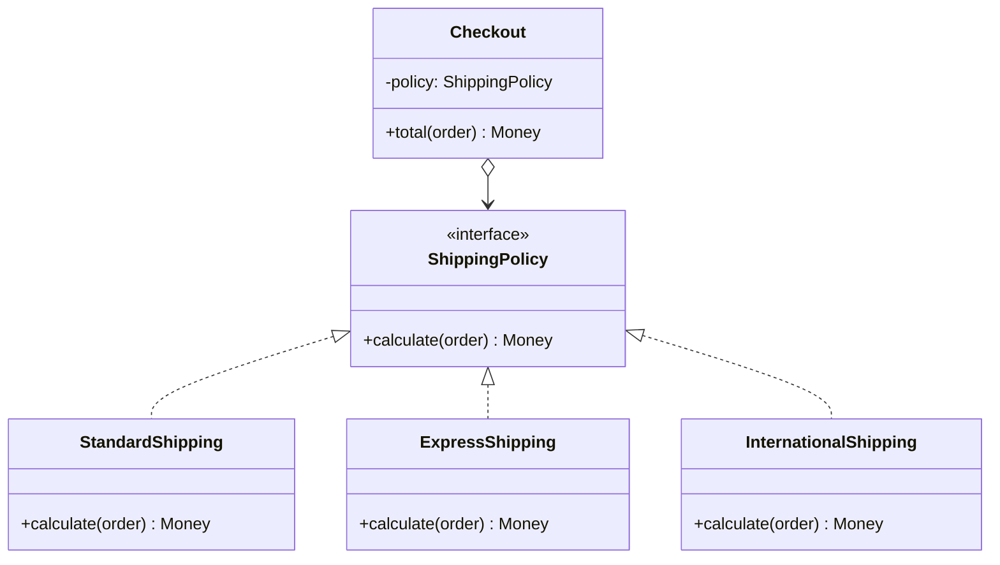

# Strategy

> **Amaç:** Birbirinin yerine geçebilen algoritmaları ayrı sınıflara koyup,
> hangisinin kullanılacağını çalışma zamanında seçilebilir kılmak.
> **Kategori:** Behavioral

---

## 1. Problem

Kargo ücreti hesaplanıyor. Yöntem sayısı zamanla artıyor:

```java
public class ShippingCalculator {

    public Money calculate(Order order, ShippingType type) {
        if (type == STANDARD) {
            return Money.of(order.weight() * 2.5);

        } else if (type == EXPRESS) {
            return Money.of(order.weight() * 2.5 * 1.8 + 15);

        } else if (type == PICKUP) {
            return Money.ZERO;

        } else if (type == INTERNATIONAL) {
            Money base = Money.of(order.weight() * 6);
            return order.destination().isEU() ? base : base.multiply(1.4);
        }
        throw new IllegalArgumentException("Bilinmeyen kargo tipi: " + type);
    }
}
```

Sorunlar:

- Her yeni yöntem bu **çalışan** metodu açtırıyor — OCP ihlali
- Metot büyüdükçe okunmaz oluyor; dört algoritma tek gövdede
- Bir yöntemi tek başına test edemiyorsun; hepsi aynı sınıfta
- Aynı `if-else` başka yerlerde de beliriyor (teslimat süresi tahmini, iade
  ücreti) ve biri güncellenince diğeri unutuluyor — **Shotgun Surgery**

---

## 2. Çözüm

Her algoritmayı kendi sınıfına al; ortak bir arayüzün arkasına koy.

```java
public interface ShippingPolicy {
    Money calculate(Order order);
}
```

Çağıran taraf hangi hesabın yapıldığını bilmez:

```java
public class ShippingCalculator {

    private final ShippingPolicy policy;      // dışarıdan verilir

    public Money calculate(Order order) {
        return policy.calculate(order);
    }
}
```

Yeni yöntem eklemek = yeni sınıf yazmak. Mevcut hiçbir dosya değişmez.

---

## 3. Yapı



`Checkout` yalnızca arayüze bakar; somut sınıflara hiç ok çıkmaz.

---

## 4. Kod

```java
public interface ShippingPolicy {
    ShippingType type();
    Money calculate(Order order);
}
```

```java
public class StandardShipping implements ShippingPolicy {

    private static final BigDecimal RATE = new BigDecimal("2.50");

    @Override public ShippingType type() { return STANDARD; }

    @Override
    public Money calculate(Order order) {
        return Money.of(RATE.multiply(order.weight()));
    }
}

public class InternationalShipping implements ShippingPolicy {

    private static final BigDecimal RATE = new BigDecimal("6.00");
    private static final BigDecimal OUTSIDE_EU_SURCHARGE = new BigDecimal("1.40");

    @Override public ShippingType type() { return INTERNATIONAL; }

    @Override
    public Money calculate(Order order) {
        Money base = Money.of(RATE.multiply(order.weight()));
        return order.destination().isEU() ? base : base.multiply(OUTSIDE_EU_SURCHARGE);
    }
}
```

Her politika tek başına test edilir — dört satırlık bir test, dört mock değil.

### Seçimi kim yapar?

Strategy'nin çözmediği tek şey **hangi stratejinin seçileceğidir**. Bu iş
Factory'nindir:

```java
@Component
public class ShippingPolicyFactory {

    private final Map<ShippingType, ShippingPolicy> policies;

    public ShippingPolicyFactory(List<ShippingPolicy> allPolicies) {
        this.policies = allPolicies.stream()
                .collect(toMap(ShippingPolicy::type, identity()));
    }

    public ShippingPolicy forType(ShippingType type) {
        ShippingPolicy policy = policies.get(type);
        if (policy == null) {
            throw new UnsupportedShippingTypeException(type);
        }
        return policy;
    }
}
```

Spring bütün `ShippingPolicy` bean'lerini listeye enjekte eder; yeni bir
politika eklemek için **hiçbir mevcut dosyaya dokunulmaz**. Factory Method ile
Strategy'nin birlikte çalıştığı yer tam olarak burasıdır.

### Lambda ile — sınıf açmaya değmeyen durumlar

Strateji tek metotluysa ve durumsuzsa, ayrı sınıf gereksizdir:

```java
Comparator<Order> byTotal = Comparator.comparing(Order::total);
Comparator<Order> byDateDesc = Comparator.comparing(Order::createdAt).reversed();

orders.sort(byTotal.thenComparing(byDateDesc));
```

`Comparator` JDK'nın içindeki en yaygın Strategy'dir: `sort` hiç değişmeden
sıralama davranışı dışarıdan verilir.

### Enum ile — sabit ve sınırlı küme

Strateji sayısı sabitse enum hem seçimi hem uygulamayı tek yerde toplar:

```java
public enum Rounding {
    HALF_UP   { public BigDecimal apply(BigDecimal v) { return v.setScale(2, RoundingMode.HALF_UP); } },
    FLOOR     { public BigDecimal apply(BigDecimal v) { return v.setScale(2, RoundingMode.FLOOR); } };

    public abstract BigDecimal apply(BigDecimal value);
}
```

---

## 5. Sektörde

| Nerede | Strateji ne |
|---|---|
| **`Comparator`** | Sıralama algoritması; `Collections.sort` değişmeden davranış değişir |
| **`ThreadPoolExecutor` `RejectedExecutionHandler`** | Kuyruk dolduğunda ne yapılacağı |
| **Spring `PasswordEncoder`** | BCrypt, Argon2, PBKDF2 — uygulama kodu bilmez |
| **Spring `Resource` / `ViewResolver`** | Kaynak çözümleme ve görünüm seçme yöntemleri |
| **`java.util.zip` sıkıştırma seviyeleri** | Aynı arayüz, farklı sıkıştırma davranışı |
| **Jackson `PropertyNamingStrategy`** | Alan adlarının nasıl dönüştürüleceği |

`RejectedExecutionHandler` öğreticidir: `AbortPolicy`, `CallerRunsPolicy`,
`DiscardPolicy` aynı arayüzün dört ayrı stratejisidir ve havuz kodu hiçbirini
tanımaz.

---

## 6. Ne zaman kullanılmaz

| Durum | Neden |
|---|---|
| Tek algoritma varsa | Speculative Generality; ikincisi gelince ekle |
| Algoritmalar hiç değişmiyorsa | Sabit `if` daha okunur |
| Fark yalnızca bir sabitse | Parametre geç, sınıf açma |
| Strateji, bağlamın iç durumuna derinden bağımlıysa | Arayüz şişer; her metot için parametre eklenir |

### Parametre şişmesi

```java
// Koku: strateji, bağlamın yarısını parametre olarak istiyor
Money calculate(Order order, Customer customer, Warehouse warehouse, Clock clock);
```

Bu, sınırın yanlış çizildiğinin işaretidir. Ya strateji fazla şey biliyordur
(sorumluluk kaymış), ya da geçilen parametreler tek bir nesne olmalıdır
(Introduce Parameter Object).

### Strateji patlaması

Her küçük varyasyon için yeni sınıf açmak, `if`'ten daha kötü bir sonuç verir:
20 dosyada gezinerek okunan bir mantık. Kural yine aynı: **üçüncü tekrarda**
soyutla.

---

## 7. İlgili ve karıştırılan pattern'ler

| Pattern | Fark |
|---|---|
| **State** | Yapıları **neredeyse aynı**. Strategy'yi **istemci** seçer, nesne kendini değiştirmez; State'te geçişe durumun kendisi karar verir ve davranış zaman içinde kayar. |
| **Bridge** | UML'leri benzer. Bridge iki **hiyerarşiyi** ayırır ve soyutlama tarafının kendi alt sınıfları vardır; Strategy tek bir davranışı değiştirilebilir kılar. |
| **Factory Method** | Strategy "nasıl yapılacağını" çözer, Factory "hangisinin kullanılacağını". Factory'nin döndürdüğü şey çoğu zaman bir Strategy'dir. |
| **Template Method** | Template Method iskeleti sabitler, adımları alt sınıfa bırakır (kalıtım, derleme zamanı); Strategy tüm algoritmayı dışarıdan alır (kompozisyon, çalışma zamanı). |
| **Decorator** | Decorator nesnenin **dışını** sarar; Strategy **içindeki** algoritmayı değiştirir. |

---

## Prensip bağlantısı

- **OCP** — yeni algoritma = yeni sınıf; çağıran kod değişmez
- **Composition over Inheritance** — davranış kalıtımla değil, nesne vererek değişir
- **SRP** — her algoritma kendi sınıfında
- **DIP** — bağlam somut hesaplayıcıya değil arayüze bağlıdır
- **Replace Conditional with Polymorphism** — pattern bu refactoring'in doğal
  varış noktasıdır (Bkz. REFACTORING.md — Replace Conditional with Polymorphism)

> Strategy, GoF kataloğunun en sade fikridir ve muhtemelen en çok kullanılanıdır:
> her `Comparator` yazdığında bir strateji geçiriyorsun.
