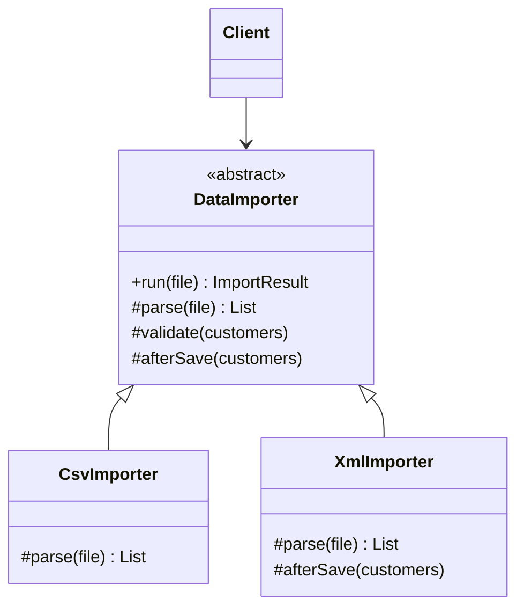

# Template Method

> **Amaç:** Bir algoritmanın iskeletini üst sınıfta sabitleyip, değişen adımları
> alt sınıflara bırakmak.
> **Kategori:** Behavioral

---

## 1. Problem

Farklı kaynaklardan veri içe aktarıyorsun: CSV, XML, veritabanı. Akış hep aynı:
bağlan, oku, doğrula, dönüştür, kaydet, kapat. Değişen yalnızca okuma ve
ayrıştırma.

```java
public class CsvImporter {
    public ImportResult run(Path file) {
        log.info("İçe aktarma başladı: {}", file);
        long start = System.nanoTime();

        List<String[]> rows = readCsv(file);          // ← farklı olan
        List<Customer> customers = parseCsv(rows);    // ← farklı olan

        validate(customers);
        repository.saveAll(customers);

        log.info("Bitti: {} kayıt, {} ms", customers.size(), elapsed(start));
        return ImportResult.of(customers.size());
    }
}

public class XmlImporter {
    public ImportResult run(Path file) {
        log.info("İçe aktarma başladı: {}", file);      // aynı
        long start = System.nanoTime();                 // aynı

        Document document = readXml(file);              // ← farklı olan
        List<Customer> customers = parseXml(document);  // ← farklı olan

        validate(customers);                            // aynı
        repository.saveAll(customers);                  // aynı

        log.info("Bitti: {} kayıt, {} ms", customers.size(), elapsed(start));
        return ImportResult.of(customers.size());
    }
}
```

Sorunlar:

- Akışın **%70'i kopyalanmış** — DRY ihlali
- Ortak bir adım değişince (ör. doğrulamadan sonra audit kaydı eklenecek)
  bütün importer'lar tek tek güncellenir; biri unutulur
- Sıra her sınıfta yeniden yazıldığı için biri yanlış sıralayabilir:
  kaydettikten sonra doğrulamak gibi

---

## 2. Çözüm

Akışı **tek bir metotta** sabitle; değişen adımları soyut bırak.

```java
public abstract class DataImporter {

    /** Template method — akış burada, alt sınıflar sırayı değiştiremez. */
    public final ImportResult run(Path file) {
        long start = System.nanoTime();
        log.info("İçe aktarma başladı: {}", file);

        List<Customer> customers = parse(file);   // alt sınıf doldurur

        validate(customers);
        repository.saveAll(customers);

        log.info("Bitti: {} kayıt, {} ms", customers.size(), elapsed(start));
        return ImportResult.of(customers.size());
    }

    protected abstract List<Customer> parse(Path file);
}
```

`final` anahtar kelimesi pattern'in kalbidir: **iskelet override edilemez.**
Alt sınıf yalnızca boşlukları doldurur, akışı yeniden yazamaz.

---

## 3. Yapı



`run()` üst sınıfta ve `final`; `parse()` zorunlu, `afterSave()` isteğe bağlı
(hook).

---

## 4. Kod

```java
public abstract class DataImporter {

    protected final CustomerRepository repository;

    protected DataImporter(CustomerRepository repository) {
        this.repository = repository;
    }

    /** Akış sabittir; alt sınıflar override EDEMEZ. */
    public final ImportResult run(Path file) {
        long start = System.nanoTime();

        List<Customer> customers = parse(file);
        List<Customer> valid = customers.stream().filter(this::isValid).toList();

        repository.saveAll(valid);
        afterSave(valid);                          // hook

        return new ImportResult(valid.size(), customers.size() - valid.size(),
                                Duration.ofNanos(System.nanoTime() - start));
    }

    /** Zorunlu adım — her kaynak kendi biçimini bilir. */
    protected abstract List<Customer> parse(Path file);

    /** Varsayılanı olan adım; alt sınıf isterse sıkılaştırır. */
    protected boolean isValid(Customer customer) {
        return customer.email() != null && customer.name() != null;
    }

    /** Hook: varsayılanı hiçbir şey yapmamak. */
    protected void afterSave(List<Customer> saved) {
        // isteğe bağlı
    }
}
```

Alt sınıflar yalnızca farkı yazar:

```java
public class CsvImporter extends DataImporter {

    @Override
    protected List<Customer> parse(Path file) {
        try (Stream<String> lines = Files.lines(file, StandardCharsets.UTF_8)) {
            return lines.skip(1)
                    .map(line -> line.split(";"))
                    .map(cells -> new Customer(cells[0], cells[1]))
                    .toList();
        } catch (IOException exception) {
            throw new ImportFailedException(file, exception);
        }
    }
}

public class XmlImporter extends DataImporter {

    @Override
    protected List<Customer> parse(Path file) { ... }

    /** Bu kaynak için ek adım — hook sayesinde iskelet değişmedi. */
    @Override
    protected void afterSave(List<Customer> saved) {
        auditLog.record("XML içe aktarma", saved.size());
    }
}
```

### Üç adım türü

| Tür | Anlamı | Java karşılığı |
|---|---|---|
| **Sabit adım** | Her zaman aynı; alt sınıf karışamaz | `private` veya `final` metot |
| **Zorunlu adım** | Alt sınıf doldurmak zorunda | `abstract` metot |
| **Hook** | İsteğe bağlı; varsayılanı boş veya makul | `protected` gövdeli metot |

Hook'lar pattern'i kullanışlı kılan asıl mekanizmadır: alt sınıf yalnızca
ilgilendiği noktaya müdahale eder.

### Kalıtımsız biçim

Kalıtım istemiyorsan aynı iskeleti fonksiyon geçirerek de kurabilirsin:

```java
public ImportResult run(Path file, Function<Path, List<Customer>> parser) {
    List<Customer> customers = parser.apply(file);
    ...
}
```

Bu, Template Method'un Strategy'ye dönüşmüş hâlidir: derleme zamanı bağlanma
yerine çalışma zamanı bağlanma. Adım sayısı arttıkça (üç dört fonksiyon
parametresi) okunabilirlik düşer; o noktada kalıtım biçimi geri kazanır.

---

## 5. Sektörde

| Nerede | İskelet ne yapar |
|---|---|
| **`AbstractList`, `AbstractMap`** | Koleksiyon davranışının çoğunu verir; sen `get`/`size` yazarsın |
| **`HttpServlet`** | `service()` isteği metoda göre `doGet`/`doPost`'a dağıtır |
| **Spring `JdbcTemplate`** | Bağlantı açma, exception çevirme, kaynak kapatma sabit; sorgu ve satır eşleme senden |
| **JUnit yaşam döngüsü** | `@BeforeEach` → test → `@AfterEach` sırası sabittir |
| **`AbstractApplicationContext.refresh()`** | Spring başlatma akışının sabit adımları |
| **`InputStream.read(byte[], int, int)`** | Varsayılan uygulama tek baytlık `read()`'i çağırır |

`JdbcTemplate` en tanıdık örnektir: kaynak yönetimini asla yanlış yapamazsın,
çünkü o kısım senin elinde değildir.

---

## 6. Ne zaman kullanılmaz

| Durum | Neden |
|---|---|
| Adımlar arasında ortak akış yoksa | Zorlama bir üst sınıf, bağ kurmaktan başka iş görmez |
| Varyasyon çalışma zamanında değişmeliyse | Kalıtım derleme zamanında sabitler; Strategy kullan |
| Alt sınıf sayısı çok arttıysa | Hiyerarşi derinleşir, izlemek zorlaşır |
| Alt sınıfın birden çok davranış ailesine ihtiyacı varsa | Java'da tek kalıtım hakkı harcanır |

### Fragile base class

Template Method kalıtıma dayandığı için kalıtımın bütün risklerini taşır: üst
sınıftaki masum bir değişiklik tüm alt sınıfları bozabilir.

```java
// Üst sınıfta yapılan "küçük" iyileştirme
protected boolean isValid(Customer customer) {
    return customer.email() != null
        && customer.name() != null
        && customer.email().contains("@");   // ← alt sınıfların test verisi çöker
}
```

(Bkz. PRINCIPLES.md — Composition over Inheritance)

### Protected yüzey de bir API'dir

`protected` metotlar alt sınıflarla yapılan sözleşmedir; değiştirmek kırıcıdır.
Ne kadar az `protected` varsa hiyerarşi o kadar sağlıklıdır.

---

## 7. İlgili ve karıştırılan pattern'ler

| Pattern | Fark |
|---|---|
| **Strategy** | Template Method **kalıtımla** çalışır ve adımları derleme zamanında bağlar; Strategy **kompozisyonla** çalışır ve tüm algoritmayı çalışma zamanında değiştirir. Template Method iskeleti korur, Strategy tamamını devreder. |
| **Factory Method** | Factory Method aslında Template Method'un özel hâlidir: üst sınıf akışı sabitler, alt sınıf yalnızca "hangi nesne yaratılacak" adımını doldurur. |
| **Bridge** | Bridge iki hiyerarşiyi ayırır; Template Method tek hiyerarşi içinde çalışır. |
| **Decorator** | Decorator davranışı dışarıdan sararak ekler; Template Method içeriden, önceden açılmış boşluklara ekler. |

---

## Prensip bağlantısı

- **DRY** — ortak akış tek yerde; kopyalanan iskelet ortadan kalkar
- **OCP** — yeni kaynak = yeni alt sınıf; iskelet değişmez
- **Hollywood Principle** — "bizi arama, biz seni ararız": adımları üst sınıf çağırır
- **LSP** — alt sınıf iskeletin sözleşmesini bozmamalı; `run()`'ın `final` olması
  bunu dilin kendisiyle garanti eder
- **Composition over Inheritance ile gerilim** — bu pattern bilinçli olarak
  kalıtım seçer; bedeli fragile base class riskidir

> Template Method, "sırayı yanlış yapamazsın" garantisidir. Esneklik istiyorsan
> Strategy'ye, güvence istiyorsan buraya bak.
