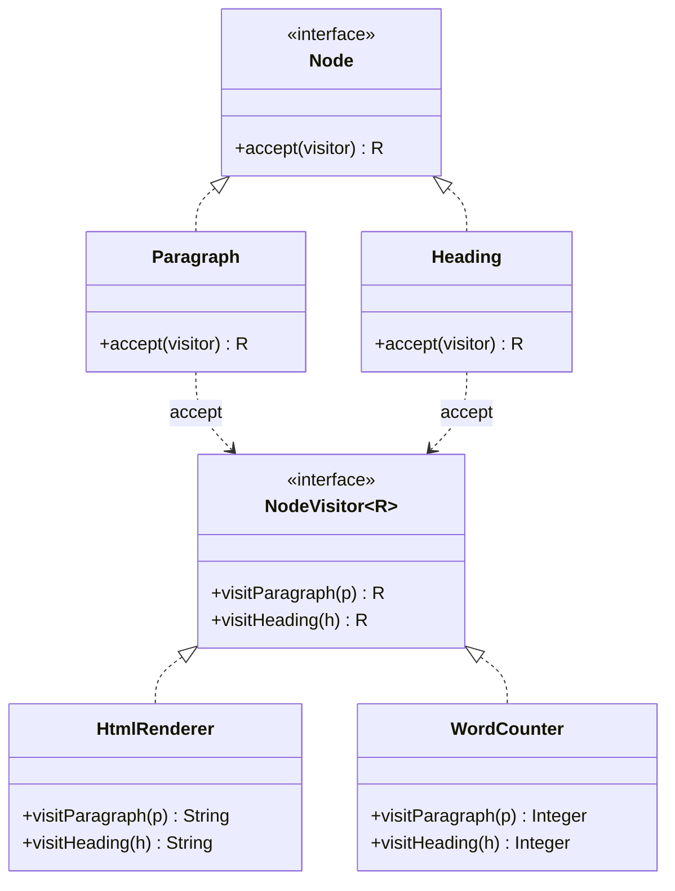

# Visitor

> **Amaç:** Bir nesne yapısının sınıflarını değiştirmeden, o yapı üzerinde yeni
> işlemler tanımlayabilmek.
> **Kategori:** Behavioral

---

## 1. Problem

Elinde bir belge ağacı var: paragraflar, başlıklar, tablolar, resimler. Bu ağaç
üzerinde farklı işlemler yapılması gerekiyor: HTML'e çevir, düz metne çevir,
kelime say, geçerliliğini denetle.

İlk yaklaşım, her işlemi düğüm sınıflarına eklemektir:

```java
public class Paragraph implements Node {
    public String toHtml() { ... }
    public String toPlainText() { ... }
    public int wordCount() { ... }
    public List<Problem> validate() { ... }
    public String toMarkdown() { ... }      // dün eklendi
    public int estimatedReadTime() { ... }  // bugün eklendi
}
```

Sorunlar:

- Her yeni işlem **bütün düğüm sınıflarını** açtırıyor: 8 düğüm × yeni işlem
- Düğüm sınıfları şişiyor; HTML üretimi, doğrulama ve okuma süresi hesabı aynı
  sınıfta — SRP ihlali
- Belge modeli artık HTML'i, Markdown'ı ve doğrulama kurallarını tanıyor;
  altyapı domain'e sızmış

İkinci yaklaşım, işlemi dışarı almak ve tip ayrımı yapmaktır — daha da kötüsü:

```java
public String toHtml(Node node) {
    if (node instanceof Paragraph p) return "<p>" + p.text() + "</p>";
    else if (node instanceof Heading h) return "<h" + h.level() + ">" + ...;
    else if (node instanceof Table t) return renderTable(t);
    // yeni düğüm tipi eklendiğinde bu zinciri güncellemeyi unutursun
    throw new IllegalArgumentException("Bilinmeyen düğüm");
}
```

`instanceof` zinciri her işlemde tekrar eder ve yeni düğüm tipi eklendiğinde
**derleyici hiçbir şey söylemez** — çalışma zamanında patlar.

---

## 2. Çözüm

İşlemi bir nesneye al ve düğümlere "beni kabul et" metodu ekle. Hangi metodun
çağrılacağına düğümün kendi tipi karar versin.

```java
public interface NodeVisitor<R> {
    R visitParagraph(Paragraph paragraph);
    R visitHeading(Heading heading);
    R visitTable(Table table);
}

public interface Node {
    <R> R accept(NodeVisitor<R> visitor);
}
```

Her düğüm tek satır yazar:

```java
public class Paragraph implements Node {
    @Override
    public <R> R accept(NodeVisitor<R> visitor) {
        return visitor.visitParagraph(this);   // kendi tipini bildirir
    }
}
```

Artık yeni bir işlem = **yeni bir visitor sınıfı**. Düğümlerin hiçbiri değişmez.

### Neden `instanceof` yerine bu?

Java tek yönlü dinamik bağlama yapar: `visitor.visit(node)` çağrısında hangi
`visit` aşırı yüklemesinin çalışacağı **derleme zamanında**, `node`'un statik
tipine göre seçilir. `accept` üzerinden geçmek bunu iki adıma böler
(**double dispatch**): önce düğümün gerçek tipi belirlenir, sonra visitor'ın
doğru metodu çağrılır.

---

## 3. Yapı



Dikkat: oklar **çift yönlüdür**. Düğüm visitor'ı, visitor da düğümü tanır. Bu
karşılıklı bağımlılık pattern'in bilinen bedelidir.

---

## 4. Kod

```java
public interface Node {
    <R> R accept(NodeVisitor<R> visitor);
}

public record Paragraph(String text) implements Node {
    @Override public <R> R accept(NodeVisitor<R> visitor) { return visitor.visitParagraph(this); }
}

public record Heading(int level, String text) implements Node {
    @Override public <R> R accept(NodeVisitor<R> visitor) { return visitor.visitHeading(this); }
}

public record Document(List<Node> children) implements Node {
    @Override public <R> R accept(NodeVisitor<R> visitor) { return visitor.visitDocument(this); }
}
```

İşlemler ayrı sınıflarda ve tek başına test edilebilir:

```java
public class HtmlRenderer implements NodeVisitor<String> {

    @Override
    public String visitParagraph(Paragraph paragraph) {
        return "<p>" + escape(paragraph.text()) + "</p>";
    }

    @Override
    public String visitHeading(Heading heading) {
        int level = heading.level();
        return "<h" + level + ">" + escape(heading.text()) + "</h" + level + ">";
    }

    @Override
    public String visitDocument(Document document) {
        // Özyineleme visitor'ın içinde: her çocuk kendi accept'ini çağırır
        return document.children().stream()
                .map(child -> child.accept(this))
                .collect(joining("\n"));
    }
}

public class WordCounter implements NodeVisitor<Integer> {

    @Override public Integer visitParagraph(Paragraph paragraph) { return count(paragraph.text()); }
    @Override public Integer visitHeading(Heading heading)       { return count(heading.text()); }

    @Override
    public Integer visitDocument(Document document) {
        return document.children().stream().mapToInt(child -> child.accept(this)).sum();
    }

    private int count(String text) {
        return text.isBlank() ? 0 : text.trim().split("\\s+").length;
    }
}
```

Kullanım:

```java
String html = document.accept(new HtmlRenderer());
int words   = document.accept(new WordCounter());
```

Üçüncü bir işlem eklemek için `Document`, `Paragraph`, `Heading` sınıflarına
**dokunulmaz**.

### Sealed + pattern matching — modern alternatif

Java 17'den beri, düğüm hiyerarşisi `sealed` ise aynı sonuca `accept` metodu
olmadan ulaşılabilir:

```java
public sealed interface Node permits Paragraph, Heading, Document { }

String render(Node node) {
    return switch (node) {
        case Paragraph p -> "<p>" + p.text() + "</p>";
        case Heading h   -> "<h" + h.level() + ">" + h.text() + "</h" + h.level() + ">";
        case Document d  -> d.children().stream().map(this::render).collect(joining("\n"));
    };
}
```

`sealed` sayesinde derleyici bütün alt tiplerin ele alındığını **doğrular**;
yeni bir düğüm tipi eklendiğinde bu `switch` derlenmez. Yani Visitor'ın asıl
kazancı (eksik durum yakalama) dilin kendisine geçmiştir.

> Pratik kural: hiyerarşi `sealed` yapılabiliyorsa ve aynı modüldeyse, pattern
> matching daha az koda mal olur. Visitor, hiyerarşiyi `sealed` yapamadığın
> (üçüncü parti, eklenti tabanlı) veya işlemlerin çok sayıda ve karmaşık olduğu
> durumlarda hâlâ kazanır.

---

## 5. Sektörde

| Nerede | Nasıl |
|---|---|
| **`javax.lang.model.element.ElementVisitor`** | Annotation processor'lar kaynak kod ağacını böyle gezer |
| **`java.nio.file.FileVisitor`** | `Files.walkFileTree()` dizin ağacını gezerken çağırır |
| **Derleyici / linter AST'leri** | Her denetim ayrı bir visitor |
| **ASM, ByteBuddy** | Bytecode üzerinde gezinme ve dönüştürme |
| **XML/JSON ağaç işleyicileri** | Aynı ağaç üzerinde doğrulama, dönüştürme, çıkarım |

`FileVisitor` en tanıdık olanıdır: dizin ağacını gezme mantığı JDK'da, ne
yapılacağı sende.

---

## 6. Ne zaman kullanılmaz

| Durum | Neden |
|---|---|
| Düğüm tipleri sık değişiyorsa | Her yeni tip **bütün** visitor'ları açtırır — pattern'in zayıf ekseni budur |
| İşlem sayısı azsa ve sabitse | `sealed` + `switch` daha az kod |
| Hiyerarşi `sealed` yapılabiliyorsa | Derleyici zaten eksik durumu yakalar |
| Basit bir gezinme yeterliyse | Iterator veya `Stream` daha okunur |
| Ekip pattern'e yabancıysa | `accept`/`visit` dolaylılığı okumayı zorlaştırır |

### Yön asimetrisi — pattern'in özü

| Ne eklemek kolay | Ne eklemek zor |
|---|---|
| Yeni **işlem** (yeni visitor) | Yeni **düğüm tipi** (tüm visitor'lar değişir) |

Bu, Abstract Factory'deki "yeni aile kolay, yeni ürün zor" asimetrisinin
aynısıdır. Doğru soru şudur: **hangisi daha sık değişecek?** Düğümler sabit ve
işlemler artıyorsa Visitor doğru karardır; tersi ise yanlış.

### Kapsülleme bedeli

Visitor'ın iş yapabilmesi için düğümün verisine erişmesi gerekir. Bu, düğüm
sınıflarını gereğinden fazla açmaya iter — `record` kullanmak bu baskıyı
azaltır ama tamamen ortadan kaldırmaz.

---

## 7. İlgili ve karıştırılan pattern'ler

| Pattern | Fark |
|---|---|
| **Iterator** | Iterator elemanları **verir**, ne yapılacağına istemci karar verir; Visitor işlemi elemanlara **taşır** ve tipe göre ayrışır. Ağaç gezerken sık birlikte kullanılırlar. |
| **Composite** | Visitor neredeyse her zaman bir Composite ağacı üzerinde çalışır; ikisi birbirini tamamlar. |
| **Strategy** | Strategy tek bir davranışı değiştirir; Visitor bir işlemi **tip ailesine** yayar. |
| **Interpreter** | Interpreter bir dilin ağacını tanımlar; o ağaç üzerindeki işlemler (yorumlama, optimizasyon, yazdırma) genelde Visitor ile yazılır. |
| **Double dispatch** | Visitor bir pattern değil, bir teknik olarak da anılır: `accept` + `visit` ikilisi Java'nın tek yönlü dinamik bağlamasını iki adıma böler. |

---

## Prensip bağlantısı

- **OCP** — yeni işlem eklemek düğüm sınıflarını değiştirmez (ama yeni düğüm tipi
  visitor'ları değiştirir; OCP tek eksende sağlanır)
- **SRP** — her işlem kendi sınıfında; belge modeli HTML üretmeyi bilmez
- **Separation of Concerns** — domain modeli sunum ve doğrulama kurallarından ayrılır
- **LSP / eksiksizlik** — `sealed` hiyerarşide derleyici tüm tiplerin ele
  alındığını garanti eder; Visitor'da bu garanti arayüzün kendisinden gelir

> Visitor, "sınıfa dokunmadan işlem ekleme" sözü verir ve bunu "işlem eklerken
> sınıf ekleyememe" bedeliyle öder. Java 17'den sonra bu takası yapmadan önce
> `sealed` + `switch` alternatifini ölç.
