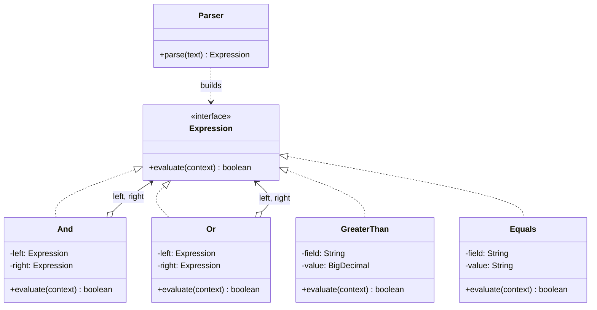

# Interpreter

> **Amaç:** Küçük bir dilin dilbilgisini sınıflarla temsil edip, o dilde yazılmış
> ifadeleri değerlendirmek.
> **Kategori:** Behavioral

---

## 1. Problem

Kullanıcılar kendi indirim kurallarını tanımlayabilmeli:

```
tutar > 500 VE musteri.seviye = "GOLD"
sepet.adet >= 3 VEYA kupon = "BAHAR"
```

Bu kuralları koda gömemezsin: her yeni kural için sürüm çıkmak gerekir. İlk
refleks, metni her seferinde elle çözümlemektir:

```java
public boolean evaluate(String rule, Context context) {
    if (rule.contains("VE")) {
        String[] parts = rule.split("VE");
        return evaluate(parts[0], context) && evaluate(parts[1], context);
    }
    if (rule.contains(">")) {
        String[] parts = rule.split(">");
        return context.number(parts[0].trim()) > Double.parseDouble(parts[1].trim());
    }
    // ... her operatör için yeni dal, her çağrıda yeniden ayrıştırma
}
```

Sorunlar:

- Ayrıştırma ile değerlendirme iç içe; her çalıştırmada metin baştan çözülüyor
- Öncelik kuralları (`VE`, `VEYA`'dan önce gelir) ve parantez desteği yok
- Yeni operatör eklemek bu metodu açtırıyor
- Hata mesajı üretilemiyor: kural yanlışsa nerede yanlış olduğu bilinmiyor
- Test etmek imkânsıza yakın; her senaryo metin üzerinden kurulur

---

## 2. Çözüm

Dilbilgisinin her kuralını bir sınıfa çevir. İfade, bu sınıflardan oluşan bir
**ağaca** dönüşsün; değerlendirme de ağacı gezmek olsun.

```
tutar > 500 VE seviye = "GOLD"

            And
           ╱    ╲
   GreaterThan   Equals
    ╱     ╲       ╱    ╲
 tutar    500  seviye "GOLD"
```

Her düğüm tek bir şey bilir: kendini nasıl değerlendireceğini.

```java
public interface Expression {
    boolean evaluate(Context context);
}
```

Ayrıştırma **bir kez** yapılır, ortaya çıkan ağaç tekrar tekrar çalıştırılır.

---

## 3. Yapı



`And` ve `Or` kendi içlerinde başka ifadeler tutar — bu, Composite'in ta
kendisidir. Interpreter neredeyse her zaman bir Composite ağacı üzerinde çalışır.

---

## 4. Kod

```java
public interface Expression {
    boolean evaluate(Context context);
}

/** Değerlendirme sırasında alanların değerini sağlayan kaynak. */
public interface Context {
    BigDecimal number(String field);
    String text(String field);
}
```

Terminal ifadeler — dilbilgisinin yaprakları:

```java
public record GreaterThan(String field, BigDecimal value) implements Expression {
    @Override
    public boolean evaluate(Context context) {
        return context.number(field).compareTo(value) > 0;
    }
}

public record Equals(String field, String value) implements Expression {
    @Override
    public boolean evaluate(Context context) {
        return value.equals(context.text(field));
    }
}
```

Terminal olmayan ifadeler — dallar:

```java
public record And(Expression left, Expression right) implements Expression {
    @Override
    public boolean evaluate(Context context) {
        return left.evaluate(context) && right.evaluate(context);
    }
}

public record Or(Expression left, Expression right) implements Expression {
    @Override
    public boolean evaluate(Context context) {
        return left.evaluate(context) || right.evaluate(context);
    }
}

public record Not(Expression inner) implements Expression {
    @Override
    public boolean evaluate(Context context) {
        return !inner.evaluate(context);
    }
}
```

Her sınıf birkaç satır ve **tek başına test edilebilir**:

```java
@Test
void and_shouldBeFalse_whenRightSideFails() {
    Expression rule = new And(
            new GreaterThan("tutar", new BigDecimal("500")),
            new Equals("seviye", "GOLD"));

    assertThat(rule.evaluate(context("tutar", "900", "seviye", "SILVER"))).isFalse();
}
```

Kural bir kez ayrıştırılır, sonra sınırsız kez çalıştırılır:

```java
Expression rule = parser.parse("tutar > 500 VE seviye = \"GOLD\"");   // bir kez

for (Order order : orders) {
    if (rule.evaluate(new OrderContext(order))) {                     // çok kez
        applyDiscount(order);
    }
}
```

### Ayrıştırıcı pattern'in parçası değildir

GoF'un tarifinde Interpreter yalnızca **ağacın değerlendirilmesini** kapsar.
Metni ağaca çevirmek ayrı bir iştir ve asıl zorluk oradadır: öncelik, parantez,
hata mesajları, konum bilgisi. Basit dillerde elle yazılabilir; ötesinde ANTLR
gibi bir araç ya da hazır bir ifade dili tercih edilir.

---

## 5. Sektörde

| Nerede | Nasıl |
|---|---|
| **`java.util.regex.Pattern`** | Düzenli ifade derlenip yeniden kullanılabilir bir yapıya çevrilir |
| **Spring Expression Language (SpEL)** | `#{user.age > 18}` ifadeleri çalışma zamanında değerlendirilir |
| **JPA Criteria API** | Sorgu, nesne ağacı olarak kurulur ve SQL'e çevrilir |
| **Kural motorları (Drools vb.)** | İş kuralları veriden okunur, ağaca çevrilir |
| **Şablon motorları** | Thymeleaf, Freemarker ifadeleri |
| **SQL ayrıştırıcıları** | Sorgu ağacı kurulup optimize edilir |

`Pattern.compile()` en tanıdık örnektir ve pattern'in ana fikrini de gösterir:
**bir kez derle, çok kez çalıştır.**

---

## 6. Ne zaman kullanılmaz

| Durum | Neden |
|---|---|
| Dilbilgisi karmaşıksa | Sınıf sayısı patlar; ANTLR gibi bir üreteç kullan |
| Hazır bir ifade dili yeterliyse | SpEL, JEXL, MVEL varken kendi dilini yazma |
| Kurallar geliştirici tarafından yazılıyorsa | Kod zaten bir dildir; ayrı bir dil icat etme |
| Performans kritikse | Ağaç gezme, derlenmiş koddan yavaştır |
| Kullanıcı girdisi güvenilmezse | Rastgele ifade değerlendirmek ciddi bir güvenlik yüzeyidir |

### Güvenlik: en çok gözden kaçan madde

Kullanıcının yazdığı bir ifadeyi değerlendiren her sistem bir saldırı yüzeyidir.
Kendi küçük dilini yazmanın en büyük avantajı da budur: **yalnızca izin
verdiğin işlemler vardır.** Genel amaçlı bir ifade motorunu (özellikle script
motorlarını) kullanıcı girdisiyle çalıştırmak, dilbilgisini sıkı sıkıya
kısıtlamadıkça tehlikelidir.

Ayrıca değerlendirme maliyeti sınırlanmalıdır: derinliği sınırsız bir ifade
ağacı `StackOverflowError` üretebilir.

### GoF'un en az kullanılan pattern'i

Interpreter, kataloğun en dar kullanım alanlı üyesidir. Çoğu proje ona hiç
ihtiyaç duymaz; ihtiyaç duyanların büyük kısmı ise hazır bir kütüphane ile daha
iyi durumda olur. Buna rağmen öğrenmeye değer, çünkü Composite ve Visitor'ın
birlikte nasıl çalıştığını en net gösteren örnektir.

---

## 7. İlgili ve karıştırılan pattern'ler

| Pattern | Fark |
|---|---|
| **Composite** | İfade ağacı bir Composite'tir: `And` kendi içinde başka ifadeler tutar. Interpreter, Composite'e "değerlendirme" davranışı ekler. |
| **Visitor** | Ağaç üzerinde birden çok işlem gerekiyorsa (değerlendir, yazdır, optimize et) bunlar Visitor ile yazılır; böylece ifade sınıfları şişmez. |
| **Strategy** | Strategy tek bir algoritmayı değiştirir; Interpreter bir **dil** tanımlar ve ifadeyi veriden kurar. |
| **Builder** | Karmaşık ifade ağaçlarını okunur şekilde kurmak için sık birlikte kullanılır (JPA Criteria'nın yaptığı budur). |
| **Iterator** | Ağacı gezmek gerektiğinde; ama değerlendirme genelde özyinelemeyle yapılır. |

---

## Prensip bağlantısı

- **SRP** — her dilbilgisi kuralı kendi sınıfında; ayrıştırma değerlendirmeden ayrı
- **OCP** — yeni operatör = yeni ifade sınıfı; mevcut ifadeler değişmez
- **Composition over Inheritance** — ifadeler birbirini içerir, kalıtımla değil
- **KISS** — pattern'in en büyük riski gereksiz uygulanmasıdır; hazır bir çözüm
  varken kendi dilini yazmak neredeyse her zaman yanlış karardır
- **Principle of Least Privilege** — kullanıcı ifadelerini değerlendiren dil,
  yalnızca gereken işlemlere izin vermelidir

> Interpreter'ın verdiği şey esneklik değil, **denetimli** esnekliktir: kullanıcı
> kural yazabilir ama yalnızca senin tanımladığın kelimelerle.
